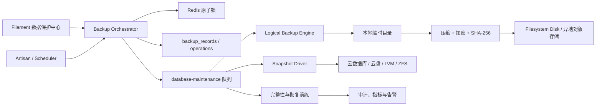

# 数据库备份、快照与恢复功能设计

> 状态：设计稿，暂不实施  
> 日期：2026-08-16  
> 适用范围：Laravel 13、MySQL 8、Filament 5、Redis 队列  
> 关联文档：[数据库管理优化评估](DATABASE_MANAGEMENT_OPTIMIZATION.md)

## 一、建议增加哪些功能

### 第一优先级：把现有备份做成可靠任务

1. **备份任务记录**：不再只扫描目录中的文件，数据库记录每次任务的状态、类型、范围、发起人、时间、大小、校验和和错误摘要。
2. **异步执行**：创建备份、上传、校验、恢复和恢复演练使用独立低优先级队列，Filament 页面只创建任务并展示进度。
3. **并发锁**：同一数据库同一时间只允许一个备份或恢复任务；恢复期间禁止新备份和其他恢复。
4. **完整性校验**：生成 SHA-256，上传后重新读取或使用对象存储校验信息验证。
5. **异地存储**：本地只做临时或短期副本，最终文件写入配置的 Laravel Filesystem disk。
6. **备份加密**：客户端先压缩再加密，密钥不与备份文件存放在一起，并记录密钥版本而不是密钥本身。
7. **失败告警**：自动备份失败、超过恢复点目标未成功备份、校验失败、容量不足时通知管理员。
8. **保留策略**：支持日/周/月分层保留、法定保留、手工锁定和过期清理预览。
9. **可下载控制**：下载使用短期授权链接或流式响应，记录审计日志；敏感备份默认禁止普通管理员下载。
10. **工具链预检**：检查 MySQL 客户端版本、磁盘空间、目标 disk 可写、加密工具、队列和调度器状态。

### 第二优先级：安全恢复与恢复演练

1. **恢复计划**：恢复前展示来源、目标、schema 版本、预计覆盖范围、依赖表和风险检查结果。
2. **恢复到隔离库**：默认把备份恢复到新数据库，而不是覆盖当前运行库。
3. **恢复演练**：按计划自动创建临时库、导入、执行校验、生成报告并销毁临时库。
4. **维护模式与排空**：确需原地恢复时，先进入维护模式，暂停写入 Job，等待活动写事务结束。
5. **双重确认**：生产恢复要求输入数据库名和一次性确认短语；可选增加第二审批人。
6. **恢复后校验**：检查表数量、关键表行数、migration 状态、外键、关键业务不变量和应用健康。
7. **失败处理**：恢复失败不得自动反复重试破坏性步骤；保留日志、临时文件和恢复前备份，由人工决定回滚或前向修复。
8. **恢复审计**：记录谁、何时、从哪份备份、恢复到哪里、审批人、校验结果和最终状态。

### 第三优先级：快照与时间点恢复

1. **快照驱动**：为云数据库、云盘或 LVM/ZFS 提供统一驱动接口；Laravel 只编排，不自行伪造物理快照。
2. **快照状态同步**：异步轮询供应商状态，记录外部快照 ID、生命周期和加密状态。
3. **克隆而非覆盖**：默认从快照创建新实例/新卷，验证后再切换连接或流量。
4. **MySQL binlog 归档**：持续归档 binlog，用最近全量备份 + binlog 恢复到指定时间或事务位置。
5. **恢复时间线预览**：展示可恢复时间范围、基准备份、binlog 缺口和预计恢复耗时。

## 二、先区分三个概念

| 能力 | 实现方式 | 优点 | 局限 | 当前建议 |
| --- | --- | --- | --- | --- |
| 逻辑备份 | `mysqldump` 输出 SQL，再压缩/加密 | 可移植、可查看、适合小中型库 | 大库慢，恢复也慢 | 作为 V1 主线 |
| 物理快照 | 云 RDS/磁盘/LVM/ZFS 快照 | 创建快、恢复快、适合大库 | 依赖平台，一致性和跨区复制需配置 | V3 通过驱动接入 |
| 时间点恢复 | 全量备份 + MySQL binlog | 可恢复到误操作前一刻 | 运维复杂，必须保证 binlog 连续 | 有真实生产需求时启用 |

“下载一个 `.sql.gz` 文件”是逻辑备份；“记录当前数据库状态并可瞬间克隆”才更接近物理快照。UI 可以统一叫“恢复点”，但后端必须保留真实类型，不能把两者混为一谈。

## 三、推荐架构

### 核心边界

- `BackupOrchestrator`：校验请求、授权、获取锁、创建操作记录和派发 Job，不执行重任务。
- `LogicalBackupEngine`：生成一致性 SQL 备份，仅处理 MySQL 工具调用。
- `BackupStorage`：基于 Laravel Filesystem 保存、读取、删除和生成临时下载链接。
- `BackupCipher`：流式加解密，管理密钥版本；不把密钥写入 metadata。
- `BackupVerifier`：校验哈希、解压可读性、manifest 和恢复演练结果。
- `RestoreOrchestrator`：执行恢复状态机和安全门禁。
- `SnapshotDriver`：定义创建、查询、克隆、删除快照的供应商适配接口。
- `PointInTimeRecoveryService`：选择基准备份、验证 binlog 连续性并生成恢复计划。

不要把上述能力继续堆进当前单一 `DatabaseBackupService`。它现在同时负责工具解析、命令拼装、文件管理、metadata、备份和恢复；继续扩展会让破坏性流程难以测试和审计。

## 四、建议的数据模型

### `database_backup_records`

一行代表一个可恢复资产。

| 字段 | 用途 |
| --- | --- |
| `id`、`uuid` | 内部主键与不可预测公开标识 |
| `connection_name`、`database_fingerprint` | 标识来源；fingerprint 不包含密码 |
| `kind` | `logical` / `physical_snapshot` / `pitr_base` |
| `scope` | `full` / `structure` / `data` / `tables` |
| `status` | `pending` / `running` / `uploading` / `verifying` / `ready` / `failed` / `expired` / `deleted` |
| `storage_disk`、`storage_path` | 存储位置；路径不可直接接受用户输入 |
| `external_snapshot_id` | 物理快照供应商 ID |
| `size_bytes`、`sha256` | 文件大小与完整性校验 |
| `encryption_algorithm`、`encryption_key_version` | 加密信息，不存密钥 |
| `manifest` | 表清单、schema/migration 信息、工具版本等 JSON 元数据 |
| `started_at`、`completed_at`、`verified_at` | 生命周期时间 |
| `expires_at`、`is_legal_hold` | 保留策略和禁止删除标记 |
| `created_by` | 发起人；自动任务可为空并记录来源 |
| `error_code`、`error_summary` | 脱敏错误；完整日志进入受控日志系统 |

建议索引：`uuid` 唯一；`(status, created_at)`；`(kind, completed_at)`；`(expires_at, is_legal_hold)`。实际建表前仍需按页面查询验证。

### `database_restore_operations`

一行代表一次恢复或演练。

- 关联 `backup_record_id`。
- `mode`：`sandbox_verify` / `clone` / `in_place` / `point_in_time`。
- `target_fingerprint`：目标标识，不保存凭据。
- 状态、发起人、审批人、确认时间。
- `requested_point_in_time` 和最终 binlog 位置。
- 维护模式、队列排空、恢复前备份等检查结果。
- 校验报告、开始/结束时间、脱敏错误。

### `database_backup_events`

追加写审计事件，例如 `requested`、`lock_acquired`、`dump_completed`、`uploaded`、`verified`、`restore_started`、`restore_failed`、`deleted`。事件不可由普通删除流程级联清除；保留期应比备份文件长。

### 为什么记录放数据库仍然合理

备份资产在对象存储，任务索引在业务库。如果业务库完全丢失，可通过对象存储中的独立 manifest 重建索引。因此每份备份旁边还要保存一个签名或校验过的 manifest，不能只依赖数据库记录。

## 五、逻辑备份开发流程

### 创建流程

1. 请求层验证范围、表名、文件名标签和权限；表名只能来自 schema 白名单。
2. Orchestrator 获取 `database-maintenance:{connection}` 原子锁并创建 `pending` 记录。
3. 派发唯一 Job 到 `database-maintenance` 队列；Job 的超时必须短于队列 `retry_after`。
4. Job 预检 MySQL 工具版本、临时空间、目标 disk、连接和 encryption key version。
5. 使用参数数组或安全的 option file 调用数据库工具，禁止拼接用户输入和将密码放入命令行。
6. 对 InnoDB 全量逻辑备份，评估并验证 `--single-transaction --quick`；非事务表必须单独报告一致性风险。
7. 备份流依次经过压缩、加密并计算 SHA-256，尽量避免生成多份明文临时文件。
8. 上传到最终 disk，写入独立 manifest，再做远端存在性和校验验证。
9. 状态更新为 `ready` 后才允许恢复和下载；失败则保留脱敏错误并清理不完整文件。
10. 释放锁、发送指标和通知；保留策略清理作为独立任务执行。

### 调度要求

- 定时任务使用 `withoutOverlapping()`；多实例部署再加 `onOneServer()`。
- 命令实现 Laravel `Isolatable` 或使用统一原子锁，覆盖 Web、CLI、Scheduler 三个入口。
- 长任务不在 Scheduler 进程中直接执行，只派发 Job。
- Job 具有明确 `timeout`、`tries`、退避和 `failed()`；备份任务不要无限重试。
- 调度器、队列 worker 和失败告警都要纳入健康检查。

## 六、恢复开发流程

### 默认：恢复到隔离数据库

1. 选择一份状态为 `ready` 且校验通过的恢复点。
2. 创建恢复计划，展示来源、目标、覆盖范围、依赖关系和预计空间。
3. 获取目标环境锁；目标数据库必须与来源生产库不同。
4. 下载、校验 SHA-256、解密和解压。
5. 创建临时数据库，导入结构和数据。
6. 检查 migration 列表、表数量、外键、关键行数和关键业务不变量。
7. 使用只读应用连接执行健康检查。
8. 生成演练报告；按策略保留或删除临时数据库。

这是最安全且最适合作为第一版的恢复方式。

### 原地恢复：仅作为受控高级功能

1. 要求生产恢复权限和二次确认/审批。
2. 验证最近可用备份与恢复前临时空间。
3. 进入维护模式，禁止新 Web 写入。
4. 暂停写入型调度任务与队列，等待进行中的写 Job 结束；备份队列自身需单独保留。
5. 创建并验证恢复前备份。如果失败，终止恢复。
6. 执行恢复；不要用一个长数据库事务包裹全库导入。
7. 恢复完成后运行校验，再逐步恢复队列和流量。
8. 校验失败时保持维护模式，不自动重复导入，由管理员选择恢复前备份或前向修复。

### 部分表恢复

部分表恢复比全库恢复更危险，因为外键、事件、缓存和跨表不变量可能不一致。建议 V1 不在生产提供任意选表恢复，而是：

- 先恢复到隔离库；
- 展示目标表的入向/出向外键依赖；
- 由领域专用导入服务把经过校验的数据迁回；
- 只有明确声明为“可独立恢复”的表组才允许自动原地恢复。

不能把全程关闭 `FOREIGN_KEY_CHECKS` 当作一致性方案；它只能解决导入顺序，不能修复业务引用。

## 七、物理快照开发方式

### 统一接口

快照驱动建议提供以下语义，不绑定具体供应商：

- `preflight()`：检查连接、权限、加密和目标位置。
- `create()`：请求创建快照并返回外部 ID。
- `status()`：查询异步状态和进度。
- `clone()`：从快照创建新实例或新卷。
- `delete()`：按保留策略删除；legal hold 时拒绝。
- `capabilities()`：声明是否支持一致性快照、跨区复制、PITR 和加密。

### 一致性边界

- 托管 MySQL 优先使用供应商原生快照/API。
- 自管 MySQL 的卷快照必须先确保文件系统与 InnoDB 一致性；简单复制 MySQL 数据目录不是可靠快照。
- 如果必须短暂停写，流程应明确记录停写开始/结束时间和失败恢复动作。
- 恢复默认通过“克隆新实例 → 验证 → 切换”，不要直接覆盖原实例。

### 不建议现在实现的内容

当前仓库是学习/Playground，数据量极小。暂不建议自行开发 MySQL 物理备份引擎、分布式备份协调器或跨云快照抽象。先完成逻辑备份可靠性，再按实际部署平台实现一个具体驱动。

## 八、时间点恢复（PITR）

PITR 适合“上午 10:03 误删，希望恢复到 10:02:59”这类场景。基本流程：

1. 启用 MySQL binlog，使用 ROW 格式并配置足够保留期。
2. 持续把 binlog 归档到独立、加密、不可变存储。
3. 每个全量备份 manifest 记录 binlog 文件与位置或 GTID 集。
4. 恢复时先导入目标时间之前最近的全量备份。
5. 验证 binlog 连续无缺口，再重放到目标时间/位置。
6. 在隔离实例验证后切换，不直接在当前生产库试错。

仅打开 binlog 不等于具备 PITR；必须持续验证归档连续性，并定期实际演练。

## 九、Filament 页面设计

建议将现有“数据库备份”升级为“数据保护中心”，分为：

### 恢复点

- 类型、范围、状态、来源、大小、创建时间、验证时间、过期时间。
- 操作：查看 manifest、验证、恢复到隔离库、受控下载、锁定保留、删除。
- `running`、`failed`、`ready` 清晰区分；文件存在不等于 `ready`。

### 操作记录

- 展示备份/恢复状态机、阶段耗时、发起人、审批人和脱敏错误。
- 支持查看失败阶段，但不在 UI 展示命令行、密码或完整数据库错误输出。

### 策略

- 全量备份频率、存储 disk、日/周/月保留、加密密钥版本、失败通知。
- PITR 与物理快照仅在驱动报告支持时展示。

### 恢复演练

- 最近演练时间、目标环境、校验项、耗时、结果和下次计划。

所有按钮的可见性和服务端授权必须同时存在；恢复、下载、删除、策略修改使用独立权限。

## 十、安全要求

- 禁止读取、显示、记录或提交 `.env` 中的数据库和对象存储秘密。
- 禁止将数据库密码拼入 shell 命令；避免通过进程列表暴露。
- 备份文件名和表名不能直接进入 shell；只接受服务端生成路径和 schema 白名单。
- 本地临时目录权限最小化，任务完成或失败都清理；明文文件生命周期越短越好。
- 备份、下载、恢复和删除全部写不可抵赖审计事件。
- 下载链接短期有效、单次使用更佳；备份不得放在 `public` 目录。
- 删除使用两阶段状态：先标记待删除，再删除对象，最后记录 tombstone；legal hold 永远优先。
- 恢复不得弱化受保护超级管理员、初始化幂等和服务端授权规则。

## 十一、测试策略

### 单元测试

- 状态机只允许合法迁移。
- 文件名、路径、表名白名单和命令参数构造。
- retention 选择、legal hold、manifest 和校验和。
- 各驱动使用 fake，不调用真实云服务。

### Feature 测试

- 每个操作的权限、失败路径、重复点击和并发锁。
- Filament 页面只显示允许的动作，服务层仍独立授权。
- Job 成功、失败、超时、重试和 `failed()` 状态。
- Storage fake 验证上传、删除和 manifest。

### 集成测试

- 使用独立 MySQL 测试库执行真实小型备份与恢复。
- 验证特殊字符、视图/触发器/存储例程（如果纳入范围）、外键和大字段。
- 中断上传、磁盘不足、校验错误和工具缺失。
- 原地恢复测试只能针对一次性测试数据库。

### 恢复演练验收

- 文件哈希一致。
- migration 状态符合 manifest。
- 关键表行数和抽样哈希符合预期。
- 外键检查通过。
- `app:initialize` 仍幂等，受保护管理员规则未被破坏。
- 应用健康接口和最小读操作通过。

## 十二、推荐迭代拆分

### V1：可靠逻辑备份

- 任务/资产数据表与审计事件。
- 队列、唯一任务、互斥锁和进度状态。
- 安全工具调用、一致性参数、SHA-256、manifest。
- Laravel Filesystem 存储、异地副本、加密和分层保留。
- 失败告警与数据保护中心列表。

### V1.1：安全恢复

- 恢复到隔离数据库。
- 自动恢复演练与报告。
- 原地恢复安全门禁、维护模式和恢复后校验。
- 暂停任意表恢复，只开放经过定义的表组。

### V2：部署平台快照

- 根据实际部署平台实现一个 `SnapshotDriver`。
- 从快照克隆环境、轮询状态和跨故障域复制。

### V3：PITR

- binlog 归档、连续性监控、恢复时间线和隔离恢复。

## 十三、开始编码前必须确认

1. 实际部署是本机 MySQL、Docker、自管服务器还是云 RDS。
2. 备份目标是本地磁盘、S3 兼容存储还是特定云存储。
3. 数据规模、日增长量、允许的备份窗口和恢复目标。
4. 是否允许生产库原地恢复，谁有权批准。
5. 是否包含邮件正文、Token、客户信息等敏感数据，密钥由谁管理。
6. 是否需要跨区域、不可变存储、legal hold 或合规保留。

在这些信息确认前，可以实现与平台无关的 V1 数据模型、状态机、队列编排、校验和 manifest；不应猜测云快照 API 或生产恢复流程。
