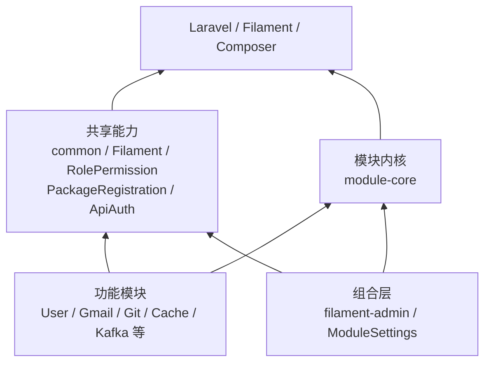
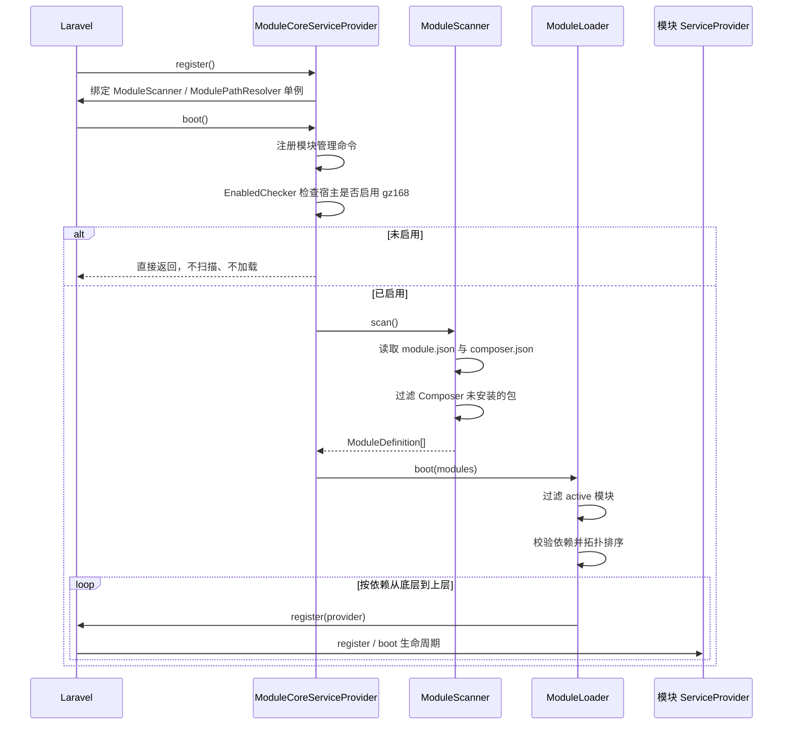
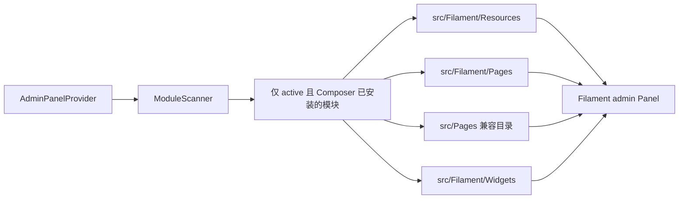
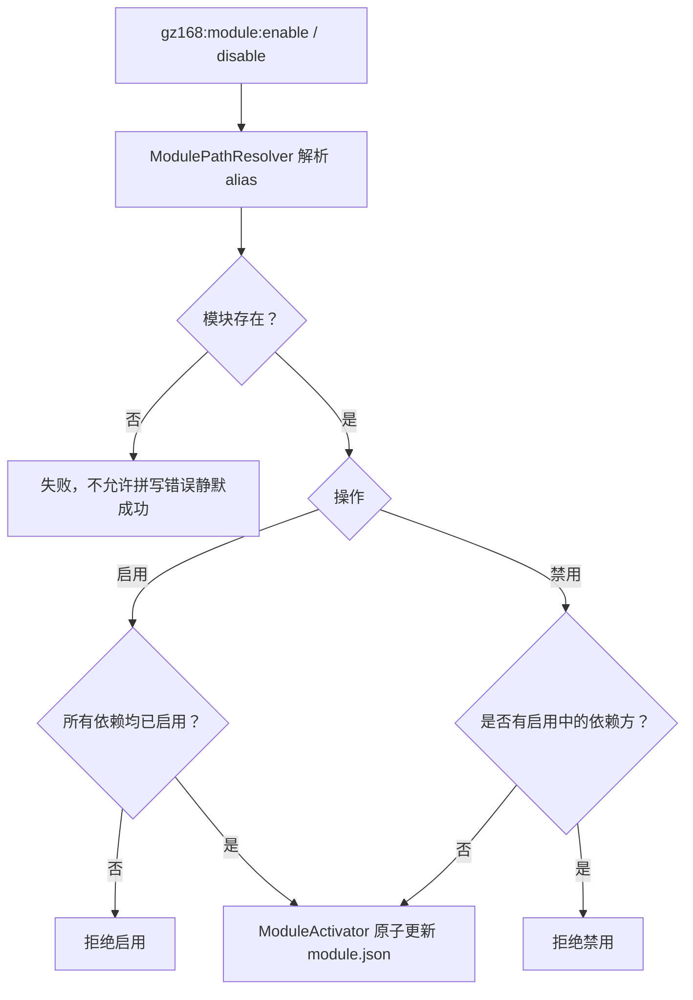
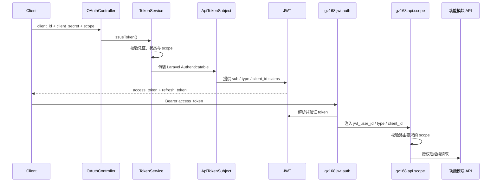

# gz168 模块结构与运行流程

本文描述 `gz168/` 当前的模块边界、依赖方向和运行流程。代码、各包的
`composer.json`、`module.json` 及 `bin/check-gz168-coupling.php` 是最终事实来源。

## 1. 设计目标

- **模块化**：每个模块独立声明包名、服务提供者、启用状态和依赖。
- **高内聚**：路由、模型、服务、配置、迁移、Filament 资源和测试尽量留在所属模块。
- **低耦合**：模块通过 Laravel 契约、配置、容器绑定和公开服务协作，不硬编码宿主实现。
- **单向依赖**：功能模块只能依赖更底层模块，基础模块不得反向引用功能模块。
- **可验证**：清单、Composer 依赖、PHP 命名空间引用和循环依赖由自动检查约束。

## 2. 总体结构

```text
Laravel 宿主
├── app/                         宿主模型、初始化与最终安全不变量
├── config/                      宿主配置
├── database/migrations/         宿主表结构
├── bin/check-gz168-coupling.php 模块边界检查
└── gz168/
    ├── module-core/             扫描、排序、加载、启停和检查
    ├── common/                  通用契约与基础能力
    ├── Filament/                Filament 通用封装
    ├── filament-admin/          后台 Panel 组合层
    ├── RolePermission/          权限基础设施
    ├── PackageRegistration/     包登记基础设施
    └── */                       独立功能模块
```

每个标准模块至少包含：

```text
gz168/ExampleModule/
├── composer.json                Composer 包与代码依赖
├── module.json                  模块元数据、状态、运行时依赖
├── src/                         模块实现
├── routes/                      模块路由（按需）
├── config/                      模块配置（按需）
├── database/                    迁移、Factory（按需）
├── resources/                   Blade / 前端资源（按需）
└── tests/                       模块独立回归测试
```

## 3. 分层与依赖方向



箭头表示“上层依赖下层”。不允许：

- `common`、`Filament`、`module-core` 反向依赖具体业务模块。
- 模块直接引用 `App\...`、宿主 `app/Filament` 或宿主 `User` 具体类。
- 未在 `composer.json` 和 `module.json` 声明的跨模块命名空间引用。
- 两个模块互相依赖，或形成更长的依赖环。

### 当前模块依赖

无内部依赖的基础模块：

- `common`
- `filament`
- `module-core`
- `role-permission`
- `package-registration`
- `system-settings`
- `cache-management`

有内部依赖的模块：

| 模块 | 依赖 |
| --- | --- |
| `filament-admin` | `module-core` |
| `api-auth` | `common`, `filament` |
| `attribute-management` | `common`, `filament` |
| `custom-config` | `common`, `filament`, `role-permission` |
| `database-backup` | `role-permission` |
| `export-management` | `filament` |
| `extension-data` | `filament` |
| `git-management` | `package-registration`, `role-permission` |
| `gmail-api` | `api-auth`（已从宿主退役，源码存档于 `gz168/GmailApi`，未安装） |
| `kafka-management` | `common`, `filament`, `role-permission` |
| `log-management` | `filament`, `package-registration` |
| `mail` | `api-auth`, `common`, `filament`, `role-permission` |
| `module-settings` | `common`, `filament`, `module-core`, `role-permission` |
| `redis-management` | `common`, `filament`, `role-permission` |
| `user-management` | `common`, `filament`, `role-permission`, `export-management`, `extension-data`, `api-auth` |
| `deepseek` | `filament` |

## 4. 清单职责

### `composer.json`

负责安装期事实：

- 包名和 PSR-4 自动加载。
- 第三方依赖和 gz168 内部包依赖。
- Laravel 包自动发现的服务提供者。

内部开发包统一使用明确的 `dev-master` 约束。源码目录存在不代表模块已安装；
`ModuleScanner` 会用 Composer `InstalledVersions` 过滤未安装包。

### `module.json`

负责运行期事实：

```json
{
  "name": "ExampleModule",
  "alias": "example-module",
  "description": "模块说明",
  "version": "1.0.0",
  "active": true,
  "providers": ["Gz168\\ExampleModule\\ExampleModuleServiceProvider"],
  "requires": ["gz168/common"]
}
```

- `name`：用于模块类名和 Filament 命名空间约定。
- `alias`：命令行与模块状态操作的稳定标识。
- `active`：是否参与本次运行时加载。
- `providers`：由 `ModuleLoader` 注册的提供者。
- `requires`：运行时拓扑排序依据，必须与 Composer 内部依赖一致。

## 5. 应用启动流程



关键保证：

1. 所有提供者先完成容器注册，再进入 Laravel 启动阶段。
2. 被依赖模块先于依赖方加载。
3. 依赖模块未启用、依赖包未安装或依赖成环时立即失败。
4. 同一提供者已注册时不会重复注册。

## 6. Filament 资源发现流程

`filament-admin` 是后台组合层，只依赖 `module-core`，不知道具体功能模块名称。



约束：

- 使用扫描得到的真实模块路径，不能由 alias 猜测目录名。
- 宿主 `app/Filament` 仍由宿主自行配置，gz168 不反向扫描宿主目录。
- 菜单或 Action 的可见性不是授权；页面和操作必须保留服务端权限校验。

## 7. 模块启停流程



`ModuleActivator` 使用原子替换并保留文件权限，避免并发或中断造成半写入 JSON。
状态变化在下一次应用启动或进程重载后生效。

## 8. API 认证流程

ApiAuth 对外提供 OAuth 客户端凭证和刷新令牌能力，但不要求宿主 `User` 实现 gz168
自定义接口。



中间件别名使用 `gz168.*` 前缀，避免与 `tymon/jwt-auth` 的 `jwt.auth` 全局别名冲突。
测试密钥仅位于 PHPUnit testing 环境，不得把真实 `.env` 密钥写入代码或文档。

## 9. 宿主与模块边界

宿主负责：

- 应用入口和最终配置。
- `User` 等宿主领域模型。
- 受保护超级管理员与幂等初始化等项目级安全不变量。
- 决定安装哪些 Composer 包以及是否启用 gz168。

模块负责：

- 自己的业务实现、配置、路由、迁移、Factory 和测试。
- 通过 `config('auth.providers.users.model')` 等稳定配置解析宿主模型。
- 在模块服务提供者内部注册自己的容器绑定、中间件别名和资源。
- 对外只暴露必要的契约、服务和数据对象。

## 10. 新增模块流程

1. 用模块生成命令或现有模块结构创建包。
2. 在 `composer.json` 声明真实代码依赖和 PSR-4 命名空间。
3. 在 `module.json` 声明相同的 gz168 内部依赖、provider 和 active 状态。
4. 将领域实现留在本模块；跨模块协作优先依赖契约或公开服务。
5. Filament 文件遵循约定目录，让组合层自动发现。
6. 为成功、失败、权限和边界场景增加 PHPUnit 测试。
7. 执行下方完整验证，确保没有反向引用、漏声明或依赖环。

## 11. 验证与维护

```shell
# 所有 gz168 包测试
php artisan test --compact gz168/*/tests

# 宿主回归测试
php artisan test --compact

# 依赖边界、清单一致性和循环依赖检查
php bin/check-gz168-coupling.php

# PHP 格式化（修改 PHP 后）
vendor/bin/pint --dirty --format agent

# Composer 配置检查（修改依赖后）
composer validate --no-check-publish
```

边界检查当前覆盖：

- 宿主 `App` 命名空间和宿主目录反向引用。
- `composer.json` 与 `module.json` 内部依赖不一致。
- 未知 gz168 包依赖。
- 未声明的跨模块命名空间引用。
- 模块循环依赖。

## 12. 当前验收基线

截至 2026-08-01：

- 22 个模块依赖图无环。
- gz168 包测试：157 个测试、323 个断言通过。
- 宿主测试：13 个测试、31 个断言通过。
- 边界检查：284 个 PHP 文件通过。
- Composer 配置验证通过。

