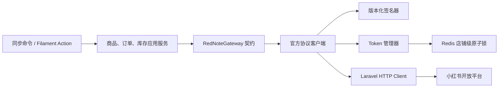
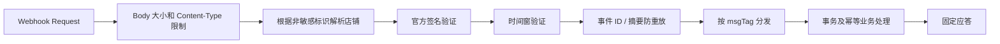

# 小红书电商开放平台集成整改设计

## 1. 文档状态

- 状态：第一阶段已实施（协议阻塞、生产 No-Go）
- 创建日期：2026-08-16
- 更新日期：2026-08-20
- 适用模块：`gz168/RedNote`
- 目标版本：Laravel 13、PHP 8.5、Filament 5
- 变更性质：现有小红书电商集成的协议校准、安全加固和可靠性整改

本文同时记录设计、实施状态和验收标准。第一阶段仅实施不依赖私有协议猜测的安全与兼容性整改；正式启用生产 API 或 Webhook 前，仍必须取得当前应用对应的小红书电商开放平台账号、环境和接口版本的官方文档，并完成第 4 节的协议冻结。

## 1B. 第一阶段实施状态（2026-08-20）

已完成：

- 凭据字段切换为 Laravel 原生 `encrypted` cast，并从模型序列化隐藏；Filament 编辑时不再回填或以空值覆盖现有凭据；
- API 异常只保留方法、错误码和 HTTP 状态，不再持有完整响应；
- HTTP 客户端增加独立连接超时；Token 自动刷新增加共享缓存原子锁和锁内二次检查；商品与订单同步增加按店铺互斥锁；
- 新增前向迁移，幂等修复旧环境订单明细的全局唯一索引，不再修改已部署迁移；
- Webhook 默认关闭且不注册路由；在官方验签与防重放实现前，配置为开启会直接失败，避免误暴露无认证入口；处理器限制请求体大小，未知店铺、未知事件和内部异常均失败关闭，日志不记录原始 Body；
- 通用 API 客户端默认只允许商品和订单查询；发货、库存及未知方法均在 HTTP 请求前失败关闭，库存适配器不再伪造“推送成功”；
- 所有出站 API 默认总开关关闭；只有明确启用 API 后才允许 OAuth 或只读同步，写操作还需通过独立的第二道开关；连接异常会转换为不保留请求、Token 或底层异常的通用错误；
- 模块发现测试移除硬编码总数，并明确验证 RedNote 与模块设置页扫描结果一致；
- RedNote 专项、索引迁移、同步命令与模块发现测试共 59 个测试、159 个断言通过，覆盖 API 默认关闭、连接异常脱敏、损坏密文失败关闭、Webhook 强制关闭、请求体上限、未实现事件拒绝、未知业务对象重试、Token 与同步锁竞争、出站写门禁、库存异常传播、命令失败退出码和旧索引升级。

仍阻塞：

- RN-01：官方协议、字段和签名尚未冻结；
- RN-06：官方 Webhook 验签、时间窗和事件级防重放规则尚未获得，因此生产 Webhook 仍禁止开启；
- RN-07：`infra`、`warehouse` 源码耦合仍未解决。直接声明依赖会触发 Composer 安装完整性校验，需单独批准根依赖变更或改造契约边界；
- 出站重试、写操作、未处理 Webhook 事件均不得在缺少官方幂等及应答语义时擅自实现。

最终本地验证结果：Pint、Composer 配置、差异格式检查及上述 59 个专项测试通过。项目全量测试为 130 个测试中 117 个通过，剩余 7 个失败和 6 个错误来自既有 FrontNav 权限测试、缺失 `storage/app/openapi/front-nav.yaml` 和测试库缺失角色表，不属于 RedNote 改动。RedNote 定向模块边界检查仍失败，需 RN-07 的依赖授权或契约解耦决策。

## 1A. 执行摘要

### 当前结论

RedNote 模块已经具备商品、订单、库存、后台页面和 Webhook 的原型能力，专项测试也全部通过，但当前仍为 **No-Go**，不得连接生产店铺或登记生产 Webhook。

阻塞生产启用的核心原因：

1. 当前 JSON-RPC、MD5、Token 和业务字段主要由现有代码及第三方 SDK 线索支撑，尚未得到当前官方账号文档确认；
2. Webhook 没有验签、防重放和真实路由安全测试；
3. 凭据仍可能被模型序列化或回填到 Filament 页面；
4. Token 刷新和同步缺少分布式并发锁，HTTP 韧性策略不完整；
5. 同一个 migration basename 在两个已提交版本间被直接改写，数据库环境可能出现不可见漂移；
6. RedNote 存在 10 项未声明跨模块依赖；
7. 项目全量测试和模块边界检查当前并非全绿。

### 推荐下一动作

唯一能解除协议阻塞的下一动作是由平台负责人提供当前账号内的官方接口文档或官方导出资料。资料必须先脱敏，至少覆盖：

- Token 获取与刷新；
- 商品查询；
- 订单查询及详情；
- 库存/可售状态更新；
- 发货等写操作；
- Webhook Envelope、验签、事件 ID、重试和应答。

在官方资料到位前，可以安全推进的工作仅限：数据库只读审计、前向迁移设计、凭据通用安全边界、模块依赖声明、失败测试和运维准备；不能继续固化接口字段或签名假设。

### 决策状态

| 决策 | 当前状态 | 解锁条件 |
| --- | --- | --- |
| 生产 API 协议 | 阻塞 | 当前官方账号文档确认 |
| Webhook 生产登记 | 禁止 | 官方验签协议及安全 Feature Test 通过 |
| 库存/发货写操作 | 禁止 | 幂等语义确认、沙箱通过、单店灰度批准 |
| 数据结构整改 | 可设计、待执行 | 获得数据库只读访问和备份确认 |
| 凭据安全整改 | 可实施 | 先建立泄漏与兼容失败测试 |
| 模块边界整改 | 可实施 | 决定声明正式依赖或改用已有契约 |
| 生产发布 | No-Go | 第 19 节全部满足 Go 条件 |

## 2. 背景与现状

现有 `gz168/RedNote` 模块已经具备以下能力：

- 店铺、商品、订单和订单明细模型；
- 商品与订单拉取同步；
- 库存渠道映射、库存推送和订单库存占用/扣减/释放；
- Filament 店铺、商品和订单管理页面；
- 商品、订单、渠道映射和条码匹配命令；
- 29 个模块单元测试，当前共 73 个断言通过。
- Webhook 控制器、处理器、订单状态枚举及部分事件处理。

检查发现以下问题：

| 编号 | 严重性 | 问题 | 影响 |
| --- | --- | --- | --- |
| RN-01 | 严重 | 当前请求头、时间戳、签名算法、响应包络和接口路径没有与正式平台文档建立可追溯映射 | 测试通过但真实请求可能全部鉴权失败，或误判业务错误 |
| RN-02 | 高 | 当前源码已改为订单内联合唯一键，但修改发生在原始迁移中，部署历史尚未确认 | 已执行旧迁移的环境不会自动获得修复；直接修改已部署迁移会造成环境漂移 |
| RN-03 | 高 | 凭据字段未从模型序列化隐藏，Filament 编辑表单可能回填完整明文 | 密钥可能进入页面状态、调试输出或意外 API 响应 |
| RN-04 | 中 | HTTP 客户端缺少连接超时、受控重试和 Token 刷新并发锁 | 短暂网络故障直接中断同步；并发刷新可能覆盖新 Token |
| RN-05 | 中 | 后台模块发现测试硬编码模块总数为 24，当前实际为 38 | 全量回归测试失败，新增模块会反复破坏测试 |
| RN-06 | 严重 | 公开 Webhook 路由没有可见的验签、防重放或请求限流；错误路径还可能记录原始 Body 并返回内部异常消息 | 任意来源可能伪造订单/库存事件、重复消费事件或利用错误响应和日志泄漏信息 |
| RN-07 | 中 | RedNote 直接引用 `gz168/infra` 和 `gz168/warehouse`，但 Composer 与 `module.json` 未完整声明 | 加载顺序和安装完整性没有保证，模块在不同安装组合中可能启动失败 |

## 3. 目标与非目标

### 3.1 目标

1. 让每个请求参数、签名步骤、接口路径和响应字段都能追溯到指定版本的官方文档。
2. 保证商品、订单和库存同步在重复执行、并发执行及多店铺场景下安全且幂等。
3. 保证凭据在数据库、模型序列化、Filament 页面、日志和异常中均不会以明文泄漏。
4. 为网络故障、限流、服务端故障、Token 失效和无效响应提供明确的恢复策略。
5. 恢复模块发现测试的长期稳定性，并补齐协议契约、安全及迁移测试。
6. Webhook 必须先通过来源认证、时间窗及防重放校验，才能进入任何业务处理。
7. RedNote 的代码依赖、Composer 依赖和运行时模块依赖保持一致。

### 3.2 非目标

- 不在本次整改中增加内容发布、笔记抓取、聚光或蒲公英接口。
- 不通过非官方网页抓取或逆向私有接口替代开放平台。
- 不在未确认官方协议前保留“猜测兼容”的多套字段名和路径。
- 不修改受保护超级管理员和 `app:initialize` 的既有不变量。
- 不在仓库、测试夹具或文档中保存真实 App Secret、Access Token、Refresh Token 或生产数据。

## 4. 协议冻结门禁

### 4.1 必需输入

实施 RN-01 前，平台负责人必须提供以下信息：

- 应用所属平台名称及控制台入口；
- 沙箱与生产环境 Host；
- API 版本和文档发布日期；
- App Key、App Secret、Access Token 和 Refresh Token 的职责及生命周期；
- 商品查询、订单查询、库存查询、库存更新、Token 获取/刷新接口文档；
- 签名算法、参与签名的字段、字段排序、字符编码、Body 规范和时间戳单位；
- 限流规则、重试要求、错误码表及回调验签规则。

凭据本身不得写入设计文档；只记录凭据在平台中的字段名称和语义。

### 4.2 当前公开资料与冲突

可公开访问的小红书大学旧版开放平台资料描述的是 ARK 协议：

- `timestamp`、`app-key`、`sign` 位于请求 Header；
- 时间戳单位为秒；
- 参数排序后与请求路径、App Secret 拼接，再计算 MD5；
- 公开商品列表路径示例为 `/ark/open_api/v1/items`；
- 响应示例使用 `success`、`error_code`、`error_msg`。

参考资料：

- <https://school.xiaohongshu.com/en/open/quick-start/system-parameter.html>
- <https://school.xiaohongshu.com/en/open/quick-start/sign.html>
- <https://school.xiaohongshu.com/en/open/product/item-list.html>
- <https://school.xiaohongshu.com/en/open/package/packages-list.html>

现有实现假设 `https://ark.xiaohongshu.com/ark/open_api/v3/common_controller` JSON-RPC 网关、Unix 秒、Body 内 `accessToken`，以及 `method?appId=...&timestamp=...&version=2.0{secret}` 的 MD5 签名。它与旧版公开资料的 Header、路径参与签名及资源路径形态并不一致，不能视为同一协议。旧版公开资料只能用于发现冲突，不能直接作为当前账号的生产实现依据。

### 4.3 协议冻结产物

在实现前形成一份经平台负责人确认的协议矩阵，至少包含：

| 业务动作 | Method | Path | 鉴权版本 | 请求字段 | 成功响应 | 业务错误 | 幂等性 |
| --- | --- | --- | --- | --- | --- | --- | --- |
| 获取/刷新 Token | 待确认 | 待确认 | 待确认 | 待确认 | 待确认 | 待确认 | 待确认 |
| 查询商品 | 待确认 | 待确认 | 待确认 | 待确认 | 待确认 | 待确认 | 只读 |
| 查询订单 | 待确认 | 待确认 | 待确认 | 待确认 | 待确认 | 待确认 | 只读 |
| 查询库存 | 待确认 | 待确认 | 待确认 | 待确认 | 待确认 | 待确认 | 只读 |
| 更新库存 | 待确认 | 待确认 | 待确认 | 待确认 | 待确认 | 待确认 | 待确认 |

未完成矩阵时，真实网络集成测试和生产启用必须保持关闭。

### 4.4 公开资料核验记录

2026-08-18 对当前官方站点进行了补充核验：

- 当前电商开放平台开发者文档入口仍为
  <https://open.xiaohongshu.com/document/developer/file/53>；
- 官方页面由前端动态加载，公开搜索只能读取平台标题和通用页面信息，不能取得商品、订单、库存和 Token 接口正文；
- 未登录环境直接读取该页面时无法在合理超时内得到接口内容；
- 官方帮助中心公开页面也没有提供足以确认签名、路径和响应字段的接口正文；
- 小红书大学的 ARK 文档可以正常公开读取，但其 Host、签名和接口形态与现有实现明显不同，且资料属于另一代协议。

2026-08-20 再次核验官方公开资料：

- 官方历史接入流程要求先申请沙箱、从 ARK 开发者页面取得 App Key/Secret、完成沙箱联调，再由官方技术支持协调生产测试：<https://school.xiaohongshu.com/en/open/quick-start/workflow.html>；
- 官方历史 Webhook 文档说明回调签名复用当时的 API 签名规则，仅将 URL 替换为 Webhook 地址；失败响应或超时会在约 10 秒、30 秒后重试：<https://school.xiaohongshu.com/en/open/callback.html>；
- 两页均带有 2014–2018 版权标识，无法证明规则适用于当前账号和 2026 平台版本；其应答字段也与当前代码的 `error_code` Envelope 不完全一致；
- 当前公开搜索仍未找到电商 API 的现行 Token、商品、订单、发货及 Webhook 验签正文。
- 通过应用内浏览器直接访问 ARK 首页及当前官方文档入口均在页面加载阶段超时；当前没有可连接的 Chrome 登录会话，因此无法从已登录控制台读取受限正文。

因此，RN-01 当前状态为“外部资料阻塞”，不是“设计完成”或“现有实现已验证”。后续不得根据搜索摘要、第三方博客、SDK 反编译结果或旧 ARK 文档填写当前协议矩阵。解除门禁仅接受以下证据之一：

1. 当前开放平台账号内可见的官方接口文档；
2. 从官方控制台导出的文档或官方提供的 PDF；
3. 官方工单对具体 Host、版本、签名和接口路径的书面确认。

提供资料时必须先移除 App Secret、Token、签名样例中的真实密钥、店铺信息和订单个人信息。

## 5. 目标架构



设计约束：

- 同步服务只依赖平台网关契约，不直接拼接接口路径或解析原始响应。
- 协议客户端负责请求构造、签名、错误映射和响应校验。
- 仅在确实需要同时支持两个官方版本时才创建两个版本化客户端；不能为了兼容猜测而做字段兜底。
- 对外返回模块自己的数据对象或规范化数组，不把平台原始响应扩散到业务层。
- HTTP 请求不得记录完整 Header、签名、Token、App Secret 或包含隐私的订单 Body。

## 6. RN-01：官方协议校准设计

### 6.1 请求构造

根据冻结后的协议矩阵，统一定义：

- Base URL 按环境配置，生产环境不得允许任意用户输入 Host；
- 固定路径由客户端内部维护，不接受调用方传入完整 URL；
- 时间戳单位、时区和允许偏差；
- Header、Query 和 JSON Body 各自允许的字段；
- JSON 编码选项和空 Body 表示；
- 签名字段的排序、拼接、编码和摘要算法。

签名器必须是无状态的纯计算组件。使用官方固定示例建立 golden test：给定固定时间、路径、参数、Body 和测试 Secret，签名必须与官方示例完全一致。

### 6.2 响应与错误

客户端将失败分为：

- 连接失败或超时；
- HTTP 4xx；
- HTTP 429；
- HTTP 5xx；
- 非 JSON 或响应结构不完整；
- 平台业务错误；
- Token 失效；
- 签名或时间戳错误。

每类错误使用稳定的模块异常类型，并保留非敏感的错误码、请求 ID、店铺内部 ID 和接口动作。异常消息不得包含凭据、签名或完整订单内容。

### 6.3 Token 行为

- Token 获取和刷新请求也必须来自正式文档，不假设 `/oauth/token`。
- 只有官方明确支持 Refresh Token 时才启用自动刷新。
- 收到明确的 Token 失效错误时，最多刷新一次并重放原请求一次，防止无限递归。
- 新 Refresh Token 写入成功后旧 Token 才失效；数据库更新失败时不得继续使用未持久化的新 Refresh Token。

## 7. RN-02：订单明细隔离与迁移设计

### 7.1 目标约束

订单明细的自然键调整为：

`(order_id, rednote_order_item_id)`

同步更新条件必须使用相同组合键。若官方明确保证明细 ID 只在店铺内唯一而不是订单内唯一，可改用 `(store_id, rednote_order_item_id)`，但需要把 `store_id` 固化到明细表；默认采用订单内联合唯一键，避免冗余字段。

### 7.2 前向迁移

不得修改已经存在的 `2026_08_15_000004_create_rednote_orders_tables`。新增迁移按以下顺序执行：

1. 预检同一订单内部是否存在重复明细 ID；
2. 若存在冲突，迁移立即失败并输出不含订单隐私的内部主键清单，禁止自动删数据；
3. 删除 `rednote_order_item_id` 的单列唯一索引；
4. 创建 `(order_id, rednote_order_item_id)` 复合唯一索引；
5. `down()` 恢复原索引前先检查跨订单重复值；无法安全恢复时明确终止回滚。

生产执行前必须备份相关表，并在只读查询中确认冲突数为零。

### 7.2A Git 历史证据与环境分类

`gz168` 是独立 Git 子模块，主仓库只记录子模块提交指针。子模块历史确认：

- `0b2ff41`（2026-08-16 06:40 +08:00）首次加入 RedNote 模块；该迁移使用 `rednote_order_item_id` 单列唯一索引，订单状态为字符串；
- `4a964f6`（2026-08-16 15:45 +08:00）直接改写同一个迁移，改为 `(order_id, rednote_order_item_id)` 联合唯一索引，并同时调整订单状态类型及多个字段；
- 主仓库当前锁定 `gz168` 子模块提交 `4a964f6`。

因此环境必须分为三类处理：

| 环境状态 | 判定方式 | 处理 |
| --- | --- | --- |
| 从未执行 RedNote 迁移 | migrations 表无该 basename，且 RedNote 表不存在 | 可直接使用当前创建迁移 |
| 在 `0b2ff41` 期间执行过 | migrations 表显示已执行，但实际列、类型或索引仍是旧结构 | 必须执行新的前向兼容迁移，不得重跑创建迁移 |
| 在 `4a964f6` 后首次执行 | migrations 表显示已执行，实际 schema 与当前目标一致 | 前向迁移应通过条件判断安全跳过或只记录完成状态 |

部署判断以实际数据库 schema 为准，不能只看 migrations 表：Laravel 只按 migration basename 判断是否执行，不会因文件内容后来改变而自动重跑。

### 7.2B 数据库只读审计清单

以下查询用于实施前人工审计，全部为只读 SQL。执行时使用项目配置的数据库连接，不在命令、工单或文档中粘贴连接密码。表名和 migration basename 在执行前仍需与目标环境核对。

确认 Laravel 是否登记过原始迁移：

```sql
SELECT migration, batch
FROM migrations
WHERE migration = '2026_08_15_000004_create_rednote_orders_tables';
```

确认订单及明细列的实际类型：

```sql
SELECT table_name, column_name, column_type, is_nullable
FROM information_schema.columns
WHERE table_schema = DATABASE()
  AND table_name IN ('rednote_orders', 'rednote_order_items')
ORDER BY table_name, ordinal_position;
```

确认索引实际组成，不依赖索引名称猜测：

```sql
SELECT table_name, index_name, non_unique, seq_in_index, column_name
FROM information_schema.statistics
WHERE table_schema = DATABASE()
  AND table_name IN ('rednote_orders', 'rednote_order_items')
ORDER BY table_name, index_name, seq_in_index;
```

确认目标联合键内部没有重复：

```sql
SELECT order_id, rednote_order_item_id, COUNT(*) AS duplicate_count
FROM rednote_order_items
GROUP BY order_id, rednote_order_item_id
HAVING COUNT(*) > 1;
```

确认是否存在跨订单复用的明细 ID；这类记录在目标结构中合法，但会阻止恢复旧的单列唯一索引：

```sql
SELECT rednote_order_item_id,
       COUNT(*) AS row_count,
       COUNT(DISTINCT order_id) AS order_count
FROM rednote_order_items
GROUP BY rednote_order_item_id
HAVING COUNT(DISTINCT order_id) > 1;
```

审计输出只保留内部主键、结构和计数，不导出订单地址、姓名、电话或其他个人数据。若表不存在、列处于新旧混合状态、索引与两种已知结构都不匹配，立即停止迁移并由人工评审，不自动猜测修复路径。

### 7.3 事务与并发

- 单个订单的主记录、明细更新和库存台账处理必须形成清晰的一致性边界。
- 库存台账天然幂等键应包含平台、订单、明细和动作类型，不能只依赖应用内计数字段。
- 同一店铺订单同步使用店铺级锁避免两个同步进程同时处理重叠时间窗。
- 保留重叠时间窗，通过联合唯一约束和幂等台账安全重复拉取。

## 8. RN-03：凭据保护设计

### 8.1 数据模型

- 使用 Laravel 原生 `encrypted` cast 取代自定义的透明解密 trait。
- 数据库字段继续使用 `TEXT`，适应不可预测的密文长度。
- `app_secret`、`access_token`、`refresh_token` 对应存储字段全部加入 `$hidden`。
- 解密失败必须抛出受控异常并将店铺标记为需要重新授权，不能把损坏密文当成明文继续发送。
- 旧明文兼容若确有历史数据需求，只能通过一次性迁移命令完成；运行时不得永久保留“解密失败即当明文”的逻辑。

### 8.2 Filament 表单

- 编辑页不回填任何现有密钥，三个密码框默认始终为空。
- 只有管理员输入非空新值时才更新对应凭据；空值表示保持原值，不表示清除。
- 清除 Token 使用单独、二次确认且有服务端权限校验的 Action。
- 创建和更新凭据要求 `manage_rednote` 权限；查看店铺列表不能获得凭据读取能力。
- 表单校验失败、Livewire 页面状态和浏览器 HTML 中均不得出现已有明文凭据。

### 8.3 日志与可观测性

允许记录：店铺内部 ID、平台错误码、请求 ID、接口动作、HTTP 状态和耗时。

禁止记录：App Secret、Token、签名、Authorization 类 Header、完整请求 URL 中的敏感 Query，以及收件人姓名、电话、地址等订单隐私。

## 9. RN-04：HTTP 韧性与并发设计

### 9.1 超时

配置拆分为：

- `connect_timeout`：建议默认 3 秒；
- `timeout`：普通接口建议默认 10 秒；平台明确说明大响应需要更长时间时，可对该动作单独配置，最大值需评审。

### 9.2 重试矩阵

| 情况 | 自动重试 | 策略 |
| --- | --- | --- |
| DNS、连接失败、连接超时 | 是 | 最多 3 次，指数退避并加入抖动 |
| HTTP 429 | 是 | 尊重 `Retry-After`，没有该 Header 时使用受限退避 |
| HTTP 500、502、503、504 | 是 | 只对文档确认安全的请求重试 |
| 其他 4xx | 否 | 立即返回平台错误 |
| 签名、参数错误 | 否 | 立即失败并告警 |
| Token 明确失效 | 条件重试 | 刷新一次后仅重放一次 |

库存更新属于写请求。只有官方接口具有幂等语义，或支持幂等键/绝对库存赋值时才允许自动重试；否则连接中断后的结果不确定，必须进入人工核对或平台库存回读流程。

### 9.3 Token 刷新锁

- 锁键：`rednote:token-refresh:{store_id}`；
- 使用所有应用节点共享的 Redis Cache Store；
- 锁 TTL 必须大于一次 Token 请求的最大执行时间；
- 未获得锁的进程短暂等待后重新读取店铺 Token，不直接再次刷新；
- 锁内再次检查过期时间，避免等待期间其他进程已经刷新仍重复调用；
- 保存 Token 后再释放锁。

### 9.4 同步锁和调度

- 商品同步锁：`rednote:sync-products:{store_id}`；
- 订单同步锁：`rednote:sync-orders:{store_id}`；
- 命令在无法取得锁时返回明确的“已有任务运行”状态，而不是标记店铺错误；
- 后续若改为队列 Job，使用唯一任务或 `WithoutOverlapping` 中间件保持同样语义。

## 10. RN-05：模块发现测试整改

模块发现测试不再硬编码全局模块数量。目标断言改为：

- 扫描结果非空；
- alias 唯一；
- 所有已安装模块均为 active；
- `rednote` 模块存在、已安装、active，Provider 可解析；
- RedNote 的三个 Filament Resource 被 Admin Panel 发现；
- RedNote 服务和四个命令已注册；
- 模块设置页返回的 alias 集合与扫描器返回的 alias 集合一致。

若确实需要固定模块清单，应维护显式 alias 列表，而不是只比较数量。这样缺少、重复或意外新增模块时都能给出可诊断的失败信息。

## 10A. RN-06：Webhook 安全与幂等设计

当前 `POST /rednote/webhook` 是公开路由。任何业务处理之前必须增加独立的 Webhook 安全中间层，处理顺序固定为：



### 10A.1 验签与来源认证

- 验签算法和参与字段必须来自当前账号的官方回调文档，不能复用出站 API 签名假设。
- 必须基于未经修改的原始 Body 验签；解析后的 JSON 不得重新编码后参与验签。
- 使用常量时间比较签名。
- 缺少签名、时间戳或店铺标识时直接拒绝，不进入 Handler。
- `sellerId` 只用于定位候选店铺，不能单独作为来源认证。
- 若平台支持固定出口 IP，可作为附加防护，不能替代密码学验签。

### 10A.2 防重放与幂等

- 优先使用官方事件唯一 ID；没有事件 ID 时，使用已验签的关键 Header、原始 Body 摘要和店铺 ID 生成稳定键。
- Redis 防重放键必须带模块命名空间和 TTL，TTL 不短于平台最大重试周期。
- 第一次处理完成后记录成功状态；处理中失败的事件不能永久标记为已完成。
- 数据库状态更新和库存台账仍必须自身幂等，Redis 只降低重复消费，不能作为唯一一致性保证。
- 同一订单事件乱序到达时，仅接受版本号或平台更新时间不早于当前记录的状态；终态倒退必须被拒绝并记录指标。

### 10A.3 输入边界与错误响应

- 限制 Body 最大尺寸，只接受官方声明的 Content-Type。
- 对 Envelope 和每种 `msgTag` 使用明确的字段验证；未知字段可忽略，缺失关键字段必须拒绝。
- 未实现的事件不能默认成功吞掉，除非业务明确接受数据丢失；建议记录事件并进入待处理状态，或返回平台定义的可重试失败。
- 未知店铺是否成功应答必须以官方重试策略为依据；默认不静默确认，以免配置错误导致永久丢失事件。
- 对外只返回固定、无内部细节的错误码和消息，绝不返回异常原文。
- 无效 JSON 日志只记录 Body 长度、摘要和请求 ID，不记录原始内容。
- 日志不得包含地址、电话、姓名、Token、签名或完整订单信息。

### 10A.4 路由防护

- Webhook 路径使用专用配置，不允许后台普通用户动态修改为任意路由。
- 使用独立限流器，按候选店铺和来源 IP 组合限流，并为平台合法重试预留容量。
- 明确 Webhook 不使用浏览器 CSRF，但仍经过 API 中间件、请求 ID、限流和安全校验。
- 路由名保持稳定，部署时通过 Laravel 的绝对 URL 生成能力向平台登记回调地址。

### 10A.5 Webhook 测试

- 正确签名成功；错误、缺失或过期签名失败；
- 修改 Body 后原签名失败；
- 相同事件重复发送只产生一次业务副作用；
- 首次处理失败后允许平台重试；
- 乱序状态不会使订单从终态退回处理中；
- 未知店铺、未知事件、无效 JSON、超大 Body 和限流行为符合协议；
- 响应、日志和异常不包含原始 Body、密钥、签名和个人信息；
- 使用 HTTP Feature Test 覆盖真实路由和中间件，不只直接调用 Handler。

## 11. 测试设计

### 11.1 协议契约测试

- 官方签名固定样例；
- Header、Query、Body 和时间戳位置及格式；
- 每个接口的 Method、Path 和请求字段；
- 成功响应映射；
- HTTP 错误、业务错误、无效 JSON 和缺字段响应；
- 所有测试启用 `Http::preventStrayRequests()`，禁止访问真实网络。

### 11.2 Token 与并发测试

- 未过期 Token 不刷新；
- 临近过期 Token 刷新一次；
- 多个并发请求只有一个执行刷新；
- 等待锁的请求重新读取新 Token；
- 刷新失败不覆盖旧凭据；
- Token 失效只刷新和重放一次；
- 日志及异常不包含测试 Secret 和 Token。

### 11.3 数据与幂等测试

- 两个订单使用相同明细 ID 时各自保留明细；
- 两个店铺使用相同订单或明细 ID 时互不污染；
- 同一响应重复同步不增加记录或库存台账；
- 重叠时间窗口重复同步安全；
- 取消、部分履约、完全履约的库存占用、释放和扣减正确；
- 同一订单并发同步不会重复写库存台账。

### 11.4 凭据测试

- 模型数组和 JSON 不包含密钥字段；
- 编辑页 HTML 和 Livewire 状态不包含现有明文密钥；
- 空密码框不会清除已有值；
- 新值被加密保存；
- 无权限用户不能更新或清除凭据；
- 损坏密文产生受控错误，且不会作为 API 凭据发送。

### 11.5 回归验证命令

实施完成后至少执行：

```shell
vendor/bin/pint --dirty --format agent
php artisan test --compact gz168/RedNote/tests
php artisan test --compact tests/Feature/AdminPanelModuleDiscoveryTest.php
php artisan test --compact
composer validate --no-check-publish
php bin/check-gz168-coupling.php
```

数据库迁移还需在与生产相同主版本的 MySQL 测试库执行 migrate、rollback、再次 migrate，并核验索引和外键。

## 12. 实施阶段

### 阶段 0：协议确认

- 收集当前账号的官方文档；
- 完成协议矩阵和官方签名 fixture；
- 明确当前 `RedNote` 数据是否为测试数据、是否已有生产同步；
- 决定旧 ARK 协议或当前电商开放平台协议，禁止混用。

退出条件：平台负责人和开发负责人共同确认协议矩阵。

### 阶段 1：先建立失败测试

- 增加官方签名契约测试；
- 增加跨订单、跨店铺明细冲突测试；
- 增加凭据序列化和表单泄漏测试；
- 增加并发 Token 刷新和重试边界测试；
- 修正模块发现测试的断言方式。

退出条件：新增测试能稳定复现 RN-01 至 RN-07。

### 阶段 2：协议与安全整改

- 引入网关契约、正式协议客户端、签名器和异常映射；
- 改用原生加密 cast、隐藏字段和只写凭据表单；
- 添加连接超时、受控重试和 Token 刷新锁。

退出条件：协议、安全和 HTTP 测试通过，代码中无猜测兼容字段。

### 阶段 3：数据约束与同步幂等

- 执行重复数据预检；
- 新增联合唯一索引迁移；
- 调整订单明细 upsert 键；
- 增加同步锁并确认库存台账幂等键。

退出条件：迁移往返测试、并发测试和库存状态测试通过。

### 阶段 4：沙箱验收与灰度

- 使用平台提供的沙箱测试店铺；
- 逐项验证 Token、商品、订单、库存查询和库存更新；
- 对比平台后台与本地数据；
- 生产先启用只读同步，再单店铺启用库存写入；
- 观察错误率、限流、Token 刷新次数、同步延迟和库存差异。

退出条件：连续观察期内无凭据泄漏、串店、重复台账或不可解释的库存差异。

## 13. 发布、回滚与运维

### 13.1 发布前检查

- 备份 `rednote_stores`、`rednote_products`、`rednote_orders`、`rednote_order_items` 和相关库存台账；
- 只读查询确认联合唯一键冲突数为零；
- Redis 可用且所有应用节点共享同一 Store；
- 沙箱协议测试完成；
- 生产凭据通过受控方式录入，不进入部署日志；
- 队列和定时任务在迁移期间暂停。

### 13.2 灰度开关

建议分别提供：

- 平台只读同步开关；
- 库存推送开关；
- Token 自动刷新开关；
- 单店铺启停状态。

默认先关闭库存推送。只读同步验证完成后，再按店铺逐步开启写操作。

### 13.3 回滚原则

- 协议客户端回滚不能回滚已经轮换的 Refresh Token；回滚版本必须读取数据库中的最新 Token。
- 联合唯一索引只有在不存在跨订单重复明细 ID 时才允许恢复单列唯一索引。
- 发现库存差异时先关闭库存推送，保留只读回读和审计能力。
- 不自动删除冲突订单或库存台账；数据修复必须形成可审计清单。

### 13.4 指标与告警

指标标签只允许使用店铺内部 ID、接口动作、结果类别和平台错误码。禁止将 Token、签名、订单号、SKU 名称、买家信息或完整 URL 作为标签，避免敏感信息泄漏和高基数。

| 指标 | 类型 | 建议告警 |
| --- | --- | --- |
| `rednote_api_requests_total{action,result}` | Counter | 5 分钟错误率超过约定阈值 |
| `rednote_api_duration_seconds{action}` | Histogram | P95 连续高于接口超时预算的 70% |
| `rednote_api_rate_limited_total{action}` | Counter | 出现持续 429 或超过平台配额预算 |
| `rednote_token_refresh_total{result}` | Counter | 任一店铺连续刷新失败，或刷新频率异常升高 |
| `rednote_sync_lag_seconds{domain}` | Gauge | 商品/订单同步延迟超过业务 SLA |
| `rednote_sync_lock_contention_total{domain}` | Counter | 持续抢锁失败，提示任务重叠或卡死 |
| `rednote_webhook_total{tag,result}` | Counter | 验签失败、过期、未知事件或处理失败异常增长 |
| `rednote_webhook_replay_total` | Counter | 出现重放，或短期异常突增 |
| `rednote_inventory_difference` | Gauge | 任意已映射 SKU 出现不可解释差异 |
| `rednote_unmapped_order_items_total` | Gauge | 未映射明细持续增长，库存无法正确处理 |

每次 API 请求和 Webhook 处理生成内部请求 ID，并贯穿日志、异常上报和队列上下文。平台返回请求 ID 时作为单独的脱敏字段保存，不能替代内部请求 ID。

### 13.5 故障处置

| 故障 | 立即动作 | 诊断 | 恢复条件 |
| --- | --- | --- | --- |
| 签名失败激增 | 关闭出站写操作，保留只读健康检查 | 核对时钟、协议版本、签名 fixture 和配置变更 | 沙箱及固定样例重新通过 |
| Token 刷新失败 | 暂停该店铺同步和写操作 | 检查平台错误码、过期时间、锁状态；不打印 Token | 完成重新授权或确认 Token 可刷新 |
| Webhook 验签失败 | 拒绝请求并告警，不进入业务处理 | 核对平台证书/Secret、时钟和原始 Body 代理链 | 官方测试事件验签通过 |
| Webhook 重放激增 | 保持防重放，限制来源速率 | 判断平台合法重试、网络重放或攻击 | 事件处理稳定且重试原因明确 |
| 同步延迟 | 禁止通过无限并发追赶 | 检查限流、锁、分页游标和队列积压 | 延迟回到 SLA 且无重复副作用 |
| 库存差异 | 立即关闭库存推送 | 冻结受影响店铺，比较平台回读、台账和订单事件 | 差异清单完成审计和人工确认 |
| 迁移异常 | 停止部署，不继续其他节点 | 比对 schema、索引、迁移登记和备份 | 明确前向修复方案并在副本验证 |
| 凭据疑似泄漏 | 禁用店铺并轮换所有相关凭据 | 审计访问日志、错误平台和页面状态 | 旧凭据失效、泄漏面清理、回归测试通过 |

故障处置不得通过删除日志、订单、库存台账或迁移记录来“恢复”。所有数据修复保留操作者、原因、前后值摘要和审批记录。

### 13.6 凭据轮换流程

1. 在平台创建或刷新新凭据，但不将其复制到聊天、工单或版本库；
2. 通过受权限控制的后台只写表单录入；
3. 保存后只显示“已配置”和掩码尾部，不显示完整值；
4. 使用无业务副作用的官方接口验证新凭据；
5. 确认所有应用节点已读取新值后，再撤销旧凭据；
6. 观察 Token 刷新、鉴权错误和同步延迟；
7. 记录轮换时间、店铺内部 ID、操作者和结果，不记录凭据内容。

紧急泄漏场景优先撤销旧凭据并暂停店铺；正常轮换优先验证新凭据再撤销旧值。若平台实行 Refresh Token 单次轮换，必须在数据库持久化成功后才允许后续请求继续，不能并行使用两个刷新流程。

## 14. 验收标准

以下条件全部满足才视为整改完成：

1. 协议矩阵经过确认，每个生产接口都有官方文档来源和契约测试。
2. 官方签名固定样例测试通过，真实沙箱请求通过。
3. 跨订单、跨店铺相同明细 ID 不会串单。
4. 重复及并发同步不会产生重复订单、明细或库存台账。
5. 模型 JSON、Filament 页面、日志和异常中不存在明文凭据。
6. Token 并发刷新最多执行一次，失败不会破坏已有可用凭据。
7. HTTP 重试符合第 9.2 节，不对结果不确定的写请求盲目重试。
8. RedNote 专项测试、模块发现测试、全量 PHPUnit、Composer 校验和模块耦合检查通过。
9. MySQL 迁移、回滚和再次迁移验证通过。
10. 沙箱验收完成，生产库存写入经过单店铺灰度并有可观测指标。
11. Webhook 的验签、防重放、乱序处理、限流和脱敏 Feature Test 全部通过后，才允许登记生产回调地址。
12. 指标、告警、故障开关和凭据轮换至少完成一次非生产演练，并保留不含敏感数据的结果记录。

## 15. 当前实现检查点

截至 2026-08-18 的只读检查结果：

| 检查项 | 结果 | 说明 |
| --- | --- | --- |
| RedNote 单元测试 | 通过 | 29 个测试、73 个断言 |
| Webhook 路由 | 已注册 | `POST /rednote/webhook`，路由名 `rednote.webhook` |
| 订单明细联合唯一键 | 当前源码已具备 | `(order_id, rednote_order_item_id)` |
| 订单明细 upsert | 当前源码已具备 | 使用与数据库相同的联合键 |
| Webhook 验签 | 未发现 | 不满足生产启用条件 |
| Webhook 防重放 | 未发现 | 不满足生产启用条件 |
| Webhook Feature Test | 未发现 | 现有测试直接调用 Handler，未覆盖真实路由与中间件 |
| 凭据 `$hidden` | 未发现 | RN-03 未解决 |
| 原生 `encrypted` cast | 未使用 | 仍使用自定义 `EncryptsSecrets` trait |
| Token 刷新锁 | 未发现 | RN-04 未解决 |
| HTTP `connectTimeout` | 未发现 | RN-04 未解决 |
| 官方协议矩阵 | 未完成 | RN-01 仍受官方后台资料阻塞 |
| 模块发现专项 | 失败 | 4 个测试中 2 个失败；固定期待 24，实际 38 |
| 模块耦合检查 | 失败 | 全仓库 337 项，其中 10 项涉及 RedNote 的未声明依赖 |
| Composer 校验 | 通过但有警告 | 包括 `gz168/rednote` 在内的多个 `@dev` 无界约束警告 |
| 全量 PHPUnit | 失败 | 104 个测试：89 通过、9 失败、6 错误、262 个断言；RedNote 专项未失败 |

测试通过只代表代码符合现有测试中的协议假设，不能替代官方协议验证或 Webhook 安全验收。

### 15.1 已知全量测试失败分类

2026-08-18 的全量测试失败按根因归类如下：

| 类别 | 数量 | 与本设计关系 |
| --- | ---: | --- |
| 模块数量固定为 24、实际为 38 | 2 个失败 | RN-05 直接处理 |
| FrontNav 测试使用不满足 Spatie `Authorizable` 要求的匿名用户 | 6 个失败 | 与 RedNote 无关，记录为既有基线 |
| `storage/app/openapi/front-nav.yaml` 缺失 | 1 个失败、5 个错误 | 与 RedNote 无关，记录为既有基线 |
| SQLite 测试缺少 `roles` 表 | 1 个错误 | 与 RedNote 无关，记录为既有基线 |

整改完成时必须确保 RedNote 不新增失败。项目级生产发布是否要求同时清零上述无关既有失败，由发布负责人决定；若暂不处理，必须建立显式基线清单，不能笼统声称“全量测试通过”。

## 16. 文件级实施清单

以下是预计影响范围。文件名描述目标职责，不要求一次性创建所有抽象；实施时仍遵循最小变更原则。

### 16.1 现有文件

| 文件 | 计划职责/变更 | 对应问题 |
| --- | --- | --- |
| `config/rednote.php` | 移除未经官方确认的协议声明和第三方 SDK 推断；增加连接超时、重试、锁、Webhook 时间窗及防重放配置 | RN-01、RN-04、RN-06 |
| `src/Services/RedNoteApiClient.php` | 只保留正式协议的请求构造、错误映射及受控重试；依赖签名器和 Token 管理器 | RN-01、RN-04 |
| `src/Models/RedNoteStore.php` | 使用原生加密 cast、隐藏凭据、移除解密失败降级 | RN-03 |
| `src/Concerns/EncryptsSecrets.php` | 完成数据兼容迁移后移除；不得继续作为运行时明文兼容层 | RN-03 |
| `src/Filament/Resources/RedNoteStoreResource/RedNoteStoreResource.php` | 凭据只写、不回填，空值保持，清除操作独立授权 | RN-03 |
| `src/Services/RedNoteOrderSyncService.php` | 保持联合键 upsert，增加店铺级同步锁和事件乱序保护 | RN-02、RN-04、RN-06 |
| `database/migrations/2026_08_15_000004_create_rednote_orders_tables.php` | 仅作为当前源码事实核对；若任何环境已执行，不再修改 | RN-02 |
| `src/Providers/RedNoteServiceProvider.php` | 注册契约、签名器、Token 管理器、Webhook 安全组件及专用限流器；避免在 Provider 中堆积路由细节 | RN-01、RN-04、RN-06 |
| `src/Http/Controllers/RedNoteWebhookController.php` | 保持薄控制器，只接收已通过安全中间层的规范化事件 | RN-06 |
| `src/Webhooks/RedNoteWebhookHandler.php` | 移除原始 Body 日志、异常原文响应和默认成功吞事件；增加幂等与乱序规则 | RN-06 |
| `src/Enums/RedNoteOrderStatus.php` | 用正式官方文档替换第三方 SDK 来源，并为未知状态定义兼容策略 | RN-01、RN-06 |
| `src/Enums/RedNoteAfterSalesStatus.php` | 用正式官方文档确认枚举值和状态转换 | RN-01、RN-06 |
| `composer.json` | 补齐 RedNote 直接使用的内部包依赖；版本约束策略需与仓库统一处理 | RN-07 |
| `module.json` | 与 Composer 内部依赖保持一致，保证运行时拓扑加载 | RN-07 |
| `tests/Feature/AdminPanelModuleDiscoveryTest.php` | 从固定数量断言调整为清单和集合一致性断言 | RN-05 |
| `tests/Unit/RedNoteApiClientTest.php` | 改为官方 golden fixture、失败分类、重试及 Token 并发测试 | RN-01、RN-04 |
| `tests/Unit/RedNoteOrderSyncServiceTest.php` | 增加多店铺、重复明细、并发和乱序测试 | RN-02、RN-06 |
| `tests/Unit/RedNoteWebhookHandlerTest.php` | 聚焦已认证事件的业务分发和幂等，不代替 HTTP Feature Test | RN-06 |

### 16.2 预计新增文件

| 目标文件 | 职责 | 创建门槛 |
| --- | --- | --- |
| `src/Contracts/RedNoteGateway.php` | 业务层依赖的稳定平台网关契约 | 协议矩阵确认后 |
| `src/Services/RedNoteRequestSigner.php` | 官方签名纯计算组件 | 官方签名算法及 fixture 确认后 |
| `src/Services/RedNoteTokenManager.php` | Token 生命周期、店铺级刷新锁和单次重放 | 官方 Token 文档确认后 |
| `src/Exceptions/*` | 区分连接、鉴权、限流、平台业务及无效响应 | 错误码表确认后；复用现有异常时可不拆分 |
| `src/Http/Middleware/VerifyRedNoteWebhook.php` | 原始 Body 验签、时间窗和候选店铺解析 | 官方回调验签文档确认后 |
| `src/Webhooks/RedNoteWebhookReplayGuard.php` | Redis 防重放和处理状态 | 官方事件 ID 与重试周期确认后 |
| `routes/api.php` | 集中声明模块 API 路由 | 确认符合现有模块路由加载约定后 |
| 新的前向 migration | 修正已部署环境的联合唯一索引或迁移旧明文凭据 | 数据库迁移历史确认后 |
| `tests/Feature/RedNoteWebhookTest.php` | 覆盖真实路由、验签、限流、防重放和脱敏 | Webhook 协议冻结后 |
| `tests/Fixtures/rednote/*` | 脱敏的官方固定请求/响应和签名样例 | 官方资料获得并完成脱敏后 |

### 16.3 需求到验证追踪

| 问题 | 主要实现证据 | 必须通过的测试 |
| --- | --- | --- |
| RN-01 | 已确认协议矩阵、签名器、规范化客户端 | 官方签名 fixture、每个 Method/Path/字段及错误包络契约测试 |
| RN-02 | 前向迁移或部署历史证明、联合键 upsert | 跨订单和跨店铺重复明细 ID、迁移往返测试 |
| RN-03 | 原生加密 cast、`$hidden`、只写表单 | JSON/HTML/Livewire/日志无凭据，空值不清除，损坏密文失败 |
| RN-04 | 连接超时、受控重试、刷新锁和同步锁 | 网络错误矩阵、并发只刷新一次、写请求不盲目重试 |
| RN-05 | alias/集合一致性断言 | 模块发现测试不依赖固定数量，RedNote 资源可发现 |
| RN-06 | 验签中间件、防重放、固定响应、幂等处理 | 真实路由验签、篡改、过期、重复、乱序、限流及脱敏测试 |
| RN-07 | Composer 与 module.json 声明和代码引用一致 | RedNote 定向耦合检查为零、模块独立安装与启动测试 |

## 17. 关键设计决策记录

### DR-01：协议证据优先于现有测试

- 决策：只有当前官方账号文档或官方书面确认可以冻结协议。
- 原因：`4a964f6` 的提交说明显示实现从 TikTok REST/HMAC 假设切换为 JSON-RPC/MD5，但源码注释仍引用第三方 Go SDK，公开官方正文无法验证这些细节。
- 后果：官方证据未获得前，现有 29 个测试只能作为回归基线，不能作为生产接入证明。

### DR-02：已发布 migration 视为不可变

- 决策：无论当前环境是否执行过旧版本，都新增前向迁移处理结构差异，不再继续修改原 migration。
- 原因：同一 migration basename 在 `0b2ff41` 与 `4a964f6` 中内容不同，Laravel 不会自动重跑已登记的迁移。
- 后果：前向迁移必须能够识别旧结构、目标结构和异常混合结构，并对异常情况失败关闭。

### DR-03：Webhook 先认证后解析业务

- 决策：验签、时间窗、防重放和输入上限在 Handler 之前完成。
- 原因：未经认证的数据不能用于修改订单、库存或决定成功应答。
- 后果：Handler 测试只验证业务分发；真实安全边界由 Feature Test 覆盖。

### DR-04：凭据只写，不从管理界面回读

- 决策：Filament 编辑页不显示已有密钥，空输入保持原值，清除使用独立授权操作。
- 原因：数据库加密不等于页面和序列化安全；回填会把明文带入 Livewire 状态和浏览器。
- 后果：管理员无法复制已有凭据，只能轮换或清除。

### DR-05：写请求重试必须证明幂等

- 决策：库存、发货及其他写操作默认不因响应超时自动重放。
- 原因：超时无法证明平台是否已经执行写入。
- 后果：只有官方幂等键、绝对值语义或可靠回读能够消除不确定性时才允许重试。

## 18. 实施任务包

| 任务包 | 内容 | 前置条件 | 完成证据 |
| --- | --- | --- | --- |
| WP-0 协议冻结 | 收集官方文档，完成出站 API 和 Webhook 协议矩阵 | 平台账号资料 | 经确认矩阵、脱敏官方 fixtures |
| WP-1 数据兼容 | schema 只读审计、前向迁移、冲突处理和迁移测试 | 数据库访问、备份 | 三类环境迁移测试和索引核验 |
| WP-2 凭据安全 | 原生 encrypted cast、隐藏字段、只写表单、日志脱敏 | 旧数据格式确认 | 安全测试及轮换演练 |
| WP-3 API 客户端 | 网关契约、签名器、错误映射、超时、受控重试 | WP-0 | golden fixture 和失败矩阵测试 |
| WP-4 Token 并发 | Token 管理器、刷新锁、一次重放 | WP-0、共享 Redis | 并发测试证明只刷新一次 |
| WP-5 Webhook 边界 | 验签、时间窗、防重放、限流、固定应答 | WP-0 | 真实路由 Feature Test |
| WP-6 同步幂等 | 商品/订单同步锁、乱序防护、库存台账幂等 | WP-1、WP-3、WP-5 | 重复、并发和乱序测试 |
| WP-7 测试与模块边界 | 修复模块发现测试，整理 fixtures，禁止 stray HTTP，补齐 RedNote 依赖声明 | 可并行 | RedNote 耦合项归零，专项及全量测试通过 |
| WP-8 沙箱与灰度 | 沙箱验收、只读生产灰度、单店库存写入 | WP-0 至 WP-7 | Go/No-Go 清单签署及观察记录 |

建议顺序为 `WP-0 → (WP-1, WP-2, WP-7) → (WP-3, WP-5) → (WP-4, WP-6) → WP-8`。WP-0 未完成时，其他任务只能建立失败测试、数据兼容和平台无关的安全边界，不能固化协议字段。

## 19. 生产 Go/No-Go 清单

出现任一 No-Go 条件时，不得登记生产 Webhook，也不得开启库存、发货等写操作。

| 检查项 | Go 条件 | No-Go 条件 |
| --- | --- | --- |
| 官方协议 | 当前账号文档和矩阵已确认 | 仅有旧 ARK 文档、第三方 SDK 或源码注释 |
| 数据结构 | 实际 schema 已核验并完成前向迁移 | 只检查 migrations 表，或存在未知混合结构 |
| 迁移数据 | 冲突为零或已有审计修复方案 | 自动删除、覆盖冲突订单明细 |
| 凭据 | 加密、隐藏、只写、日志脱敏均验证 | 页面、JSON、异常或日志可见明文 |
| Token | 并发刷新锁和失败恢复测试通过 | 多进程可能重复刷新或覆盖 Refresh Token |
| Webhook | 验签、防重放、限流、乱序测试通过 | 仅凭 sellerId 识别来源或默认吞掉事件 |
| HTTP | 超时和重试矩阵符合接口幂等性 | 写请求对连接超时盲目重放 |
| 测试 | 专项、模块发现、全量测试全部通过 | 依赖硬编码数量或存在失败测试 |
| 模块边界 | RedNote 定向耦合违规为零，且全仓库检查不新增违规 | RedNote 仍直接引用未声明模块 |
| 沙箱 | 所有目标动作完成端到端验证 | 只使用 `Http::fake()` 验证 |
| 灰度 | 只读优先、单店写入、可快速关闭 | 一次性全店启用写操作 |
| 可观测性 | 请求 ID、错误码、延迟、限流和差异指标可用 | 只能依赖包含敏感内容的原始日志排障 |

## 20. 待确认事项

1. 当前账号实际使用的小红书平台、API 版本及官方文档链接是什么？
2. 当前模块是否已经连接真实店铺，数据库中是否已有生产订单和库存台账？
3. 官方订单明细 ID 的唯一性范围是全平台、店铺还是订单？
4. 库存更新接口是否为绝对值赋值，是否提供幂等键或请求查询能力？
5. 是否支持 Refresh Token；刷新后旧 Refresh Token 是否立即失效？
6. 平台限流阈值和 `Retry-After` 行为是什么？
7. Webhook 官方验签字段、签名算法、事件唯一 ID、重试周期和成功应答格式是什么？
8. RedNote 对 `infra`、`warehouse` 的引用应改为已有契约，还是将两者声明为正式直接依赖？

## 21. 职责与审批点

本文使用角色而不是个人姓名，避免人员变化使设计失效。

| 角色 | 职责 | 必须审批的事项 |
| --- | --- | --- |
| 平台负责人 | 获取官方文档、沙箱权限、应用配置和平台工单答复 | 协议矩阵、Webhook 协议、平台限流和生产登记 |
| 后端负责人 | 客户端、Token、同步、迁移和模块边界设计 | 技术方案、迁移策略、幂等和回滚方案 |
| 安全负责人 | 凭据、验签、防重放、日志和权限边界 | Webhook 上线、凭据处理和泄漏处置流程 |
| 数据库负责人 | schema 审计、备份、前向迁移和恢复演练 | 生产迁移窗口、冲突数据处理和回滚条件 |
| 库存业务负责人 | 库存占用、释放、扣减和差异处理 | 写操作启用、差异容忍度和人工修复清单 |
| 测试负责人 | 契约、安全、并发、迁移和端到端验收 | 沙箱验收结果和回归基线 |
| 发布负责人 | 灰度开关、观察窗口、Go/No-Go 和回退协调 | 生产发布及扩大灰度范围 |

关键审批门：

1. 协议冻结：平台负责人 + 后端负责人；
2. Webhook 安全设计：安全负责人 + 后端负责人；
3. 数据迁移：数据库负责人 + 后端负责人；
4. 库存写入灰度：库存业务负责人 + 发布负责人；
5. 生产 Go：上述角色确认各自负责项，无单人绕过。

## 22. 文档变更记录

| 日期 | 变更 | 状态影响 |
| --- | --- | --- |
| 2026-08-16 | 建立整改设计，覆盖协议、数据、凭据、HTTP 和测试 | 生产 No-Go |
| 2026-08-18 | 核验官方公开资料不可读取接口正文，记录协议外部阻塞 | RN-01 保持阻塞 |
| 2026-08-18 | 纳入 Webhook 安全、模块依赖、Git 迁移历史和全量测试基线 | 增加 RN-06、RN-07 |
| 2026-08-19 | 增加数据库只读审计、指标告警、故障处置、凭据轮换和执行摘要 | 形成评审候选版 |
| 2026-08-20 | 从当前源码提取传输、方法、响应和 Webhook 协议假设登记表 | RN-01/RN-06 保持阻塞 |
| 2026-08-20 | 实施凭据保护、Token 刷新锁、连接超时、前向索引迁移、Webhook 默认关闭及模块发现测试整改 | RN-02/RN-03/RN-04/RN-05 已完成；RN-01/RN-06/RN-07 保持阻塞 |
| 2026-08-20 | 增加刷新锁竞争、Webhook 路由门禁、未知事件拒绝、敏感错误隔离及旧索引真实升级测试 | 第一阶段专项回归提升至 39 个测试、109 个断言 |
| 2026-08-20 | 为商品和订单同步增加按店铺分布式互斥锁，并清理测试夹具双重加密 | 专项回归提升至 41 个测试、113 个断言 |
| 2026-08-20 | 将通用 API 调用改为只读方法白名单，关闭发货与库存伪推送路径 | 专项回归提升至 43 个测试、118 个断言；生产写操作保持禁止 |
| 2026-08-20 | 移除未实现 Webhook 事件的静默成功，并拒绝无标识、未知订单和未知 SKU | 专项回归提升至 48 个测试、128 个断言；避免确认后永久丢数 |
| 2026-08-20 | 增加 Webhook 请求体上限，并禁止在未实现验签和防重放时通过配置误开启路由 | 专项回归提升至 50 个测试、133 个断言 |
| 2026-08-20 | 增加出站 API 总开关、OAuth 输入校验和连接异常脱敏 | 专项回归提升至 54 个测试、145 个断言；协议未冻结时 API 默认不可用 |
| 2026-08-20 | 移除第三方推断限流与明文解密兼容层，修正同步命令统计/退出码并让库存台账异常向上失败 | 最终专项回归 59 个测试、159 个断言；所有本地可验证整改完成 |
| 2026-08-20 | 再次核验官方历史沙箱与 Webhook 文档，修正文档中的当前实现事实描述 | 历史资料确认失败重试存在，但因版本过旧不能解除 RN-01/RN-06 |

后续每次更新必须记录：依据来源、受影响的 RN/WP、是否改变 Go/No-Go 状态，以及是否需要重新审批协议矩阵或迁移方案。

## 23. 当前协议假设登记表

本节只登记当前代码正在假设什么，不表示这些假设正确。所有条目默认状态为“未获当前官方账号文档确认”。获得官方资料后逐项标记为确认、修正或删除，并保存脱敏依据。

### 23.1 传输与签名假设

| 假设 | 当前实现 | 代码来源 | 验证状态 |
| --- | --- | --- | --- |
| 生产 Host | `https://ark.xiaohongshu.com` | `config/rednote.php` | 未确认 |
| 网关 Path | `/ark/open_api/v3/common_controller` | `config/rednote.php` | 未确认 |
| HTTP Method | 所有动作使用 POST JSON | `RedNoteApiClient` | 未确认 |
| 协议版本 | 固定 `2.0` | `RedNoteApiClient::PROTOCOL_VERSION` | 未确认 |
| 时间戳 | Unix 秒 | `now()->getTimestamp()` | 未确认 |
| 公共字段 | `appId`、`version`、`timestamp`、`method`、`accessToken`、`sign` | `RedNoteApiClient::call()` | 未确认 |
| 签名原文 | `method?appId={id}&timestamp={sec}&version=2.0{secret}` | `RedNoteApiClient::sign()` | 未确认 |
| 摘要算法 | MD5，未排序、未编码、Body 不参与 | `RedNoteApiClient::sign()` | 未确认 |
| Access Token 位置 | JSON Body | `RedNoteApiClient::call()` | 未确认 |
| Refresh Token 请求 | Body 同时包含 `appSecret` 和 `refreshToken` | `refreshAccessToken()` | 未确认，且需重点评审传输要求 |
| Content-Type | `application/json;charset=utf-8` | `RedNoteApiClient::call()` | 未确认 |

### 23.2 出站方法假设

| 业务动作 | 当前方法名 | 当前关键请求字段 | 当前使用状态 | 官方验证 |
| --- | --- | --- | --- | --- |
| 初始换 Token | `oauth.getAccessToken` | `code` | 已调用 | 未确认 |
| 刷新 Token | `oauth.refreshToken` | `appSecret`、`refreshToken` | 已调用 | 未确认 |
| 商品分页查询 | `product.searchItemList` | `pageNo`、`pageSize`、`searchParam` | 已调用 | 未确认 |
| 商品详情 SKU | `product.getDetailSkuList` | 未实现 | 仅注释声明，未调用 | 未确认 |
| 订单分页查询 | `order.getOrderList` | `startTime`、`endTime`、`timeType`、`pageNo`、`pageSize` | 已调用 | 未确认 |
| 发货 | `order.orderDeliver` | `orderId`、`expressCompanyCode`、`expressNo` | Filament Action 直接调用 | 未确认；写操作保持禁用 |
| 商品/库存更新 | `product.updateItem` | 未定义 | 仅作为潜在自定义渠道提及 | 未确认；不得据此实现 |

### 23.3 响应假设

| 范围 | 当前假设 | 风险 |
| --- | --- | --- |
| 通用 Envelope | `success`、`error_code`、`error_msg`、`data` | 字段或成功语义不符会误报成功/失败 |
| `data` 类型 | 可能是数组，也可能是 JSON 字符串 | 宽松解析可能掩盖协议漂移 |
| Token | `accessToken`、`refreshToken`、`accessTokenExpiresAt`、`refreshTokenExpiresAt` | 到期单位或字段不符会导致错误刷新 |
| 商品列表 | `itemList` 或多个 snake_case/嵌套别名 | 兼容分支缺少官方依据，可能静默跳过数据 |
| 商品分页 | `totalPage` 或 `total_page` | 缺失时依赖页大小停止，可能提前结束或多请求 |
| SKU | `skuList`、`skuDetailList`、`skuId`、`itemId`、`erpCode`、`scSkuCode` | 合成 SKU ID 可能与平台真实自然键冲突 |
| 订单状态 | 整数 1 至 10 | 枚举来源是第三方 SDK 线索，终态判断可能错误 |
| 售后状态 | 整数 1 至 6 | 未获得官方状态机确认 |
| 错误对象 | `RedNoteApiException` 仅保存方法、错误码和 HTTP 状态 | 已移除完整响应持有；仍需约束上游错误消息是否允许展示 |

协议冻结后必须删除没有官方依据的字段别名和静默 fallback。未知结构应产生可观察的协议错误，不能返回空集合并把店铺标记为同步成功。

### 23.4 Webhook 假设

| 类别 | 当前假设 | 当前行为 | 官方验证 |
| --- | --- | --- | --- |
| Envelope | `msgTag`、`sellerId`、`data` | 按 sellerId 找店铺 | 未确认 |
| `data` 编码 | JSON 字符串，也兼容 Base64 后的 JSON | 尝试两种方式解析 | 未确认 |
| 应答 | HTTP 200 + `success/error_code/error_msg` | 固定 JSON Envelope | 未确认 |
| 履约变更 | `msg_fulfillment_status_change` | 更新订单和库存 | 未确认 |
| 地址变更 | `msg_fulfillment_buyer_address_change` | 未实现，明确拒绝 | 未确认，生产禁止 |
| 备注变更 | `msg_fulfillment_seller_remark_change` | 未实现，明确拒绝 | 未确认 |
| 发货期限变更 | `msg_fulfillment_delivery_deadline_change` | 未实现，明确拒绝 | 未确认 |
| SKU 可售变化 | `msg_sku_buyable` | 更新本地 buyable | 未确认 |
| SPU 事件 | `msg_spu_create/delete/reject` | 未实现，明确拒绝 | 未确认 |
| 售后事件 | `msg_aftersale_create/type_change` | 未实现，明确拒绝 | 未确认，可能影响库存和订单状态 |
| 验签 | 未实现 | 任何来源都可进入 Handler | 未确认且生产禁止 |
| 防重放 | 未实现 | 重复事件依赖业务代码偶然幂等 | 未确认且生产禁止 |

### 23.5 官方资料到位后的核对步骤

1. 给每项官方资料记录文档标题、版本、发布日期和控制台路径，不记录登录信息；
2. 先核对 Transport、公共字段和签名，再核对每个业务方法；
3. 使用官方固定样例建立 golden fixture，禁止以当前测试输出反推预期；
4. 对每个字段标记 required、optional、类型、单位、枚举和隐私级别；
5. 删除不在官方文档中的别名、默认值和“兼容”分支；
6. 将未支持事件明确配置为拒绝、持久化待处理或官方允许的忽略策略；
7. 更新第 4.3 节协议矩阵和本登记表状态；
8. 协议矩阵由平台负责人和后端负责人共同签字后，才进入 WP-3/WP-5 实现。
