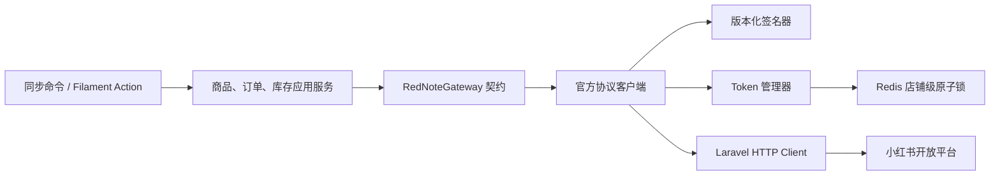

# 小红书电商开放平台集成整改设计

## 1. 文档状态

- 状态：待评审
- 日期：2026-08-16
- 适用模块：`gz168/RedNote`
- 目标版本：Laravel 13、PHP 8.5、Filament 5
- 变更性质：现有小红书电商集成的协议校准、安全加固和可靠性整改

本文只定义设计和验收标准，不包含代码变更。正式实施前，必须取得当前应用对应的小红书电商开放平台账号、环境和接口版本的官方文档，并完成第 4 节的协议冻结。

## 2. 背景与现状

现有 `gz168/RedNote` 模块已经具备以下能力：

- 店铺、商品、订单和订单明细模型；
- 商品与订单拉取同步；
- 库存渠道映射、库存推送和订单库存占用/扣减/释放；
- Filament 店铺、商品和订单管理页面；
- 商品、订单、渠道映射和条码匹配命令；
- 18 个模块单元测试，当前共 54 个断言通过。

检查发现以下问题：

| 编号 | 严重性 | 问题 | 影响 |
| --- | --- | --- | --- |
| RN-01 | 严重 | 当前请求头、时间戳、签名算法、响应包络和接口路径没有与正式平台文档建立可追溯映射 | 测试通过但真实请求可能全部鉴权失败，或误判业务错误 |
| RN-02 | 高 | `rednote_order_item_id` 被设置为全局唯一，同步也只按该字段更新 | 多店铺或跨订单 ID 重复时可能串单 |
| RN-03 | 高 | 凭据字段未从模型序列化隐藏，Filament 编辑表单可能回填完整明文 | 密钥可能进入页面状态、调试输出或意外 API 响应 |
| RN-04 | 中 | HTTP 客户端缺少连接超时、受控重试和 Token 刷新并发锁 | 短暂网络故障直接中断同步；并发刷新可能覆盖新 Token |
| RN-05 | 中 | 后台模块发现测试硬编码模块总数为 24，当前实际为 38 | 全量回归测试失败，新增模块会反复破坏测试 |

## 3. 目标与非目标

### 3.1 目标

1. 让每个请求参数、签名步骤、接口路径和响应字段都能追溯到指定版本的官方文档。
2. 保证商品、订单和库存同步在重复执行、并发执行及多店铺场景下安全且幂等。
3. 保证凭据在数据库、模型序列化、Filament 页面、日志和异常中均不会以明文泄漏。
4. 为网络故障、限流、服务端故障、Token 失效和无效响应提供明确的恢复策略。
5. 恢复模块发现测试的长期稳定性，并补齐协议契约、安全及迁移测试。

### 3.2 非目标

- 不在本次整改中增加内容发布、笔记抓取、聚光或蒲公英接口。
- 不通过非官方网页抓取或逆向私有接口替代开放平台。
- 不在未确认官方协议前保留“猜测兼容”的多套字段名和路径。
- 不修改受保护超级管理员和 `app:initialize` 的既有不变量。
- 不在仓库、测试夹具或文档中保存真实 App Secret、Access Token、Refresh Token 或生产数据。

## 4. 协议冻结门禁

### 4.1 必需输入

实施 RN-01 前，平台负责人必须提供以下信息：

- 应用所属平台名称及控制台入口；
- 沙箱与生产环境 Host；
- API 版本和文档发布日期；
- App Key、App Secret、Access Token 和 Refresh Token 的职责及生命周期；
- 商品查询、订单查询、库存查询、库存更新、Token 获取/刷新接口文档；
- 签名算法、参与签名的字段、字段排序、字符编码、Body 规范和时间戳单位；
- 限流规则、重试要求、错误码表及回调验签规则。

凭据本身不得写入设计文档；只记录凭据在平台中的字段名称和语义。

### 4.2 当前公开资料与冲突

可公开访问的小红书大学旧版开放平台资料描述的是 ARK 协议：

- `timestamp`、`app-key`、`sign` 位于请求 Header；
- 时间戳单位为秒；
- 参数排序后与请求路径、App Secret 拼接，再计算 MD5；
- 公开商品列表路径示例为 `/ark/open_api/v1/items`；
- 响应示例使用 `success`、`error_code`、`error_msg`。

参考资料：

- <https://school.xiaohongshu.com/en/open/quick-start/system-parameter.html>
- <https://school.xiaohongshu.com/en/open/quick-start/sign.html>
- <https://school.xiaohongshu.com/en/open/product/item-list.html>
- <https://school.xiaohongshu.com/en/open/package/packages-list.html>

现有实现使用 `openapi.xiaohongshu.com`、毫秒时间戳、Query 参数、HMAC-SHA256、`access-token` 和 `/product`、`/order` 路径。两者不能视为同一协议。旧版公开资料只能用于发现冲突，不能直接作为当前账号的生产实现依据。

### 4.3 协议冻结产物

在实现前形成一份经平台负责人确认的协议矩阵，至少包含：

| 业务动作 | Method | Path | 鉴权版本 | 请求字段 | 成功响应 | 业务错误 | 幂等性 |
| --- | --- | --- | --- | --- | --- | --- | --- |
| 获取/刷新 Token | 待确认 | 待确认 | 待确认 | 待确认 | 待确认 | 待确认 | 待确认 |
| 查询商品 | 待确认 | 待确认 | 待确认 | 待确认 | 待确认 | 待确认 | 只读 |
| 查询订单 | 待确认 | 待确认 | 待确认 | 待确认 | 待确认 | 待确认 | 只读 |
| 查询库存 | 待确认 | 待确认 | 待确认 | 待确认 | 待确认 | 待确认 | 只读 |
| 更新库存 | 待确认 | 待确认 | 待确认 | 待确认 | 待确认 | 待确认 | 待确认 |

未完成矩阵时，真实网络集成测试和生产启用必须保持关闭。

## 5. 目标架构



设计约束：

- 同步服务只依赖平台网关契约，不直接拼接接口路径或解析原始响应。
- 协议客户端负责请求构造、签名、错误映射和响应校验。
- 仅在确实需要同时支持两个官方版本时才创建两个版本化客户端；不能为了兼容猜测而做字段兜底。
- 对外返回模块自己的数据对象或规范化数组，不把平台原始响应扩散到业务层。
- HTTP 请求不得记录完整 Header、签名、Token、App Secret 或包含隐私的订单 Body。

## 6. RN-01：官方协议校准设计

### 6.1 请求构造

根据冻结后的协议矩阵，统一定义：

- Base URL 按环境配置，生产环境不得允许任意用户输入 Host；
- 固定路径由客户端内部维护，不接受调用方传入完整 URL；
- 时间戳单位、时区和允许偏差；
- Header、Query 和 JSON Body 各自允许的字段；
- JSON 编码选项和空 Body 表示；
- 签名字段的排序、拼接、编码和摘要算法。

签名器必须是无状态的纯计算组件。使用官方固定示例建立 golden test：给定固定时间、路径、参数、Body 和测试 Secret，签名必须与官方示例完全一致。

### 6.2 响应与错误

客户端将失败分为：

- 连接失败或超时；
- HTTP 4xx；
- HTTP 429；
- HTTP 5xx；
- 非 JSON 或响应结构不完整；
- 平台业务错误；
- Token 失效；
- 签名或时间戳错误。

每类错误使用稳定的模块异常类型，并保留非敏感的错误码、请求 ID、店铺内部 ID 和接口动作。异常消息不得包含凭据、签名或完整订单内容。

### 6.3 Token 行为

- Token 获取和刷新请求也必须来自正式文档，不假设 `/oauth/token`。
- 只有官方明确支持 Refresh Token 时才启用自动刷新。
- 收到明确的 Token 失效错误时，最多刷新一次并重放原请求一次，防止无限递归。
- 新 Refresh Token 写入成功后旧 Token 才失效；数据库更新失败时不得继续使用未持久化的新 Refresh Token。

## 7. RN-02：订单明细隔离与迁移设计

### 7.1 目标约束

订单明细的自然键调整为：

`(order_id, rednote_order_item_id)`

同步更新条件必须使用相同组合键。若官方明确保证明细 ID 只在店铺内唯一而不是订单内唯一，可改用 `(store_id, rednote_order_item_id)`，但需要把 `store_id` 固化到明细表；默认采用订单内联合唯一键，避免冗余字段。

### 7.2 前向迁移

不得修改已经存在的 `2026_08_15_000004_create_rednote_orders_tables`。新增迁移按以下顺序执行：

1. 预检同一订单内部是否存在重复明细 ID；
2. 若存在冲突，迁移立即失败并输出不含订单隐私的内部主键清单，禁止自动删数据；
3. 删除 `rednote_order_item_id` 的单列唯一索引；
4. 创建 `(order_id, rednote_order_item_id)` 复合唯一索引；
5. `down()` 恢复原索引前先检查跨订单重复值；无法安全恢复时明确终止回滚。

生产执行前必须备份相关表，并在只读查询中确认冲突数为零。

### 7.3 事务与并发

- 单个订单的主记录、明细更新和库存台账处理必须形成清晰的一致性边界。
- 库存台账天然幂等键应包含平台、订单、明细和动作类型，不能只依赖应用内计数字段。
- 同一店铺订单同步使用店铺级锁避免两个同步进程同时处理重叠时间窗。
- 保留重叠时间窗，通过联合唯一约束和幂等台账安全重复拉取。

## 8. RN-03：凭据保护设计

### 8.1 数据模型

- 使用 Laravel 原生 `encrypted` cast 取代自定义的透明解密 trait。
- 数据库字段继续使用 `TEXT`，适应不可预测的密文长度。
- `app_secret`、`access_token`、`refresh_token` 对应存储字段全部加入 `$hidden`。
- 解密失败必须抛出受控异常并将店铺标记为需要重新授权，不能把损坏密文当成明文继续发送。
- 旧明文兼容若确有历史数据需求，只能通过一次性迁移命令完成；运行时不得永久保留“解密失败即当明文”的逻辑。

### 8.2 Filament 表单

- 编辑页不回填任何现有密钥，三个密码框默认始终为空。
- 只有管理员输入非空新值时才更新对应凭据；空值表示保持原值，不表示清除。
- 清除 Token 使用单独、二次确认且有服务端权限校验的 Action。
- 创建和更新凭据要求 `manage_rednote` 权限；查看店铺列表不能获得凭据读取能力。
- 表单校验失败、Livewire 页面状态和浏览器 HTML 中均不得出现已有明文凭据。

### 8.3 日志与可观测性

允许记录：店铺内部 ID、平台错误码、请求 ID、接口动作、HTTP 状态和耗时。

禁止记录：App Secret、Token、签名、Authorization 类 Header、完整请求 URL 中的敏感 Query，以及收件人姓名、电话、地址等订单隐私。

## 9. RN-04：HTTP 韧性与并发设计

### 9.1 超时

配置拆分为：

- `connect_timeout`：建议默认 3 秒；
- `timeout`：普通接口建议默认 10 秒；平台明确说明大响应需要更长时间时，可对该动作单独配置，最大值需评审。

### 9.2 重试矩阵

| 情况 | 自动重试 | 策略 |
| --- | --- | --- |
| DNS、连接失败、连接超时 | 是 | 最多 3 次，指数退避并加入抖动 |
| HTTP 429 | 是 | 尊重 `Retry-After`，没有该 Header 时使用受限退避 |
| HTTP 500、502、503、504 | 是 | 只对文档确认安全的请求重试 |
| 其他 4xx | 否 | 立即返回平台错误 |
| 签名、参数错误 | 否 | 立即失败并告警 |
| Token 明确失效 | 条件重试 | 刷新一次后仅重放一次 |

库存更新属于写请求。只有官方接口具有幂等语义，或支持幂等键/绝对库存赋值时才允许自动重试；否则连接中断后的结果不确定，必须进入人工核对或平台库存回读流程。

### 9.3 Token 刷新锁

- 锁键：`rednote:token-refresh:{store_id}`；
- 使用所有应用节点共享的 Redis Cache Store；
- 锁 TTL 必须大于一次 Token 请求的最大执行时间；
- 未获得锁的进程短暂等待后重新读取店铺 Token，不直接再次刷新；
- 锁内再次检查过期时间，避免等待期间其他进程已经刷新仍重复调用；
- 保存 Token 后再释放锁。

### 9.4 同步锁和调度

- 商品同步锁：`rednote:sync-products:{store_id}`；
- 订单同步锁：`rednote:sync-orders:{store_id}`；
- 命令在无法取得锁时返回明确的“已有任务运行”状态，而不是标记店铺错误；
- 后续若改为队列 Job，使用唯一任务或 `WithoutOverlapping` 中间件保持同样语义。

## 10. RN-05：模块发现测试整改

模块发现测试不再硬编码全局模块数量。目标断言改为：

- 扫描结果非空；
- alias 唯一；
- 所有已安装模块均为 active；
- `rednote` 模块存在、已安装、active，Provider 可解析；
- RedNote 的三个 Filament Resource 被 Admin Panel 发现；
- RedNote 服务和四个命令已注册；
- 模块设置页返回的 alias 集合与扫描器返回的 alias 集合一致。

若确实需要固定模块清单，应维护显式 alias 列表，而不是只比较数量。这样缺少、重复或意外新增模块时都能给出可诊断的失败信息。

## 11. 测试设计

### 11.1 协议契约测试

- 官方签名固定样例；
- Header、Query、Body 和时间戳位置及格式；
- 每个接口的 Method、Path 和请求字段；
- 成功响应映射；
- HTTP 错误、业务错误、无效 JSON 和缺字段响应；
- 所有测试启用 `Http::preventStrayRequests()`，禁止访问真实网络。

### 11.2 Token 与并发测试

- 未过期 Token 不刷新；
- 临近过期 Token 刷新一次；
- 多个并发请求只有一个执行刷新；
- 等待锁的请求重新读取新 Token；
- 刷新失败不覆盖旧凭据；
- Token 失效只刷新和重放一次；
- 日志及异常不包含测试 Secret 和 Token。

### 11.3 数据与幂等测试

- 两个订单使用相同明细 ID 时各自保留明细；
- 两个店铺使用相同订单或明细 ID 时互不污染；
- 同一响应重复同步不增加记录或库存台账；
- 重叠时间窗口重复同步安全；
- 取消、部分履约、完全履约的库存占用、释放和扣减正确；
- 同一订单并发同步不会重复写库存台账。

### 11.4 凭据测试

- 模型数组和 JSON 不包含密钥字段；
- 编辑页 HTML 和 Livewire 状态不包含现有明文密钥；
- 空密码框不会清除已有值；
- 新值被加密保存；
- 无权限用户不能更新或清除凭据；
- 损坏密文产生受控错误，且不会作为 API 凭据发送。

### 11.5 回归验证命令

实施完成后至少执行：

```shell
vendor/bin/pint --dirty --format agent
php artisan test --compact gz168/RedNote/tests
php artisan test --compact tests/Feature/AdminPanelModuleDiscoveryTest.php
php artisan test --compact
composer validate --no-check-publish
php bin/check-gz168-coupling.php
```

数据库迁移还需在与生产相同主版本的 MySQL 测试库执行 migrate、rollback、再次 migrate，并核验索引和外键。

## 12. 实施阶段

### 阶段 0：协议确认

- 收集当前账号的官方文档；
- 完成协议矩阵和官方签名 fixture；
- 明确当前 `RedNote` 数据是否为测试数据、是否已有生产同步；
- 决定旧 ARK 协议或当前电商开放平台协议，禁止混用。

退出条件：平台负责人和开发负责人共同确认协议矩阵。

### 阶段 1：先建立失败测试

- 增加官方签名契约测试；
- 增加跨订单、跨店铺明细冲突测试；
- 增加凭据序列化和表单泄漏测试；
- 增加并发 Token 刷新和重试边界测试；
- 修正模块发现测试的断言方式。

退出条件：新增测试能稳定复现 RN-01 至 RN-05。

### 阶段 2：协议与安全整改

- 引入网关契约、正式协议客户端、签名器和异常映射；
- 改用原生加密 cast、隐藏字段和只写凭据表单；
- 添加连接超时、受控重试和 Token 刷新锁。

退出条件：协议、安全和 HTTP 测试通过，代码中无猜测兼容字段。

### 阶段 3：数据约束与同步幂等

- 执行重复数据预检；
- 新增联合唯一索引迁移；
- 调整订单明细 upsert 键；
- 增加同步锁并确认库存台账幂等键。

退出条件：迁移往返测试、并发测试和库存状态测试通过。

### 阶段 4：沙箱验收与灰度

- 使用平台提供的沙箱测试店铺；
- 逐项验证 Token、商品、订单、库存查询和库存更新；
- 对比平台后台与本地数据；
- 生产先启用只读同步，再单店铺启用库存写入；
- 观察错误率、限流、Token 刷新次数、同步延迟和库存差异。

退出条件：连续观察期内无凭据泄漏、串店、重复台账或不可解释的库存差异。

## 13. 发布、回滚与运维

### 13.1 发布前检查

- 备份 `rednote_stores`、`rednote_products`、`rednote_orders`、`rednote_order_items` 和相关库存台账；
- 只读查询确认联合唯一键冲突数为零；
- Redis 可用且所有应用节点共享同一 Store；
- 沙箱协议测试完成；
- 生产凭据通过受控方式录入，不进入部署日志；
- 队列和定时任务在迁移期间暂停。

### 13.2 灰度开关

建议分别提供：

- 平台只读同步开关；
- 库存推送开关；
- Token 自动刷新开关；
- 单店铺启停状态。

默认先关闭库存推送。只读同步验证完成后，再按店铺逐步开启写操作。

### 13.3 回滚原则

- 协议客户端回滚不能回滚已经轮换的 Refresh Token；回滚版本必须读取数据库中的最新 Token。
- 联合唯一索引只有在不存在跨订单重复明细 ID 时才允许恢复单列唯一索引。
- 发现库存差异时先关闭库存推送，保留只读回读和审计能力。
- 不自动删除冲突订单或库存台账；数据修复必须形成可审计清单。

## 14. 验收标准

以下条件全部满足才视为整改完成：

1. 协议矩阵经过确认，每个生产接口都有官方文档来源和契约测试。
2. 官方签名固定样例测试通过，真实沙箱请求通过。
3. 跨订单、跨店铺相同明细 ID 不会串单。
4. 重复及并发同步不会产生重复订单、明细或库存台账。
5. 模型 JSON、Filament 页面、日志和异常中不存在明文凭据。
6. Token 并发刷新最多执行一次，失败不会破坏已有可用凭据。
7. HTTP 重试符合第 9.2 节，不对结果不确定的写请求盲目重试。
8. RedNote 专项测试、模块发现测试、全量 PHPUnit、Composer 校验和模块耦合检查通过。
9. MySQL 迁移、回滚和再次迁移验证通过。
10. 沙箱验收完成，生产库存写入经过单店铺灰度并有可观测指标。

## 15. 待确认事项

1. 当前账号实际使用的小红书平台、API 版本及官方文档链接是什么？
2. 当前模块是否已经连接真实店铺，数据库中是否已有生产订单和库存台账？
3. 官方订单明细 ID 的唯一性范围是全平台、店铺还是订单？
4. 库存更新接口是否为绝对值赋值，是否提供幂等键或请求查询能力？
5. 是否支持 Refresh Token；刷新后旧 Refresh Token 是否立即失效？
6. 平台限流阈值和 `Retry-After` 行为是什么？
7. 是否需要接入订单创建、取消等回调；若需要，需另行设计验签、防重放和幂等消费。
