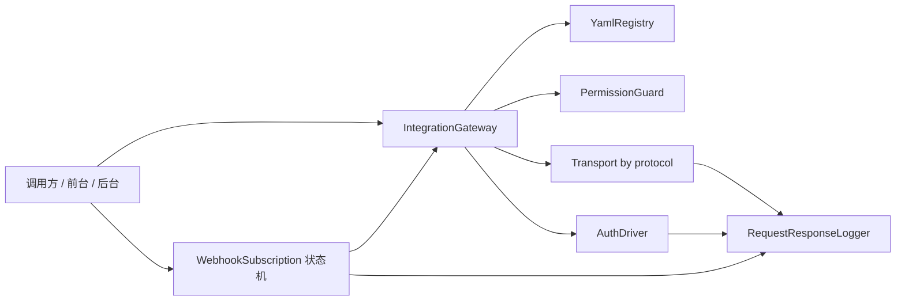
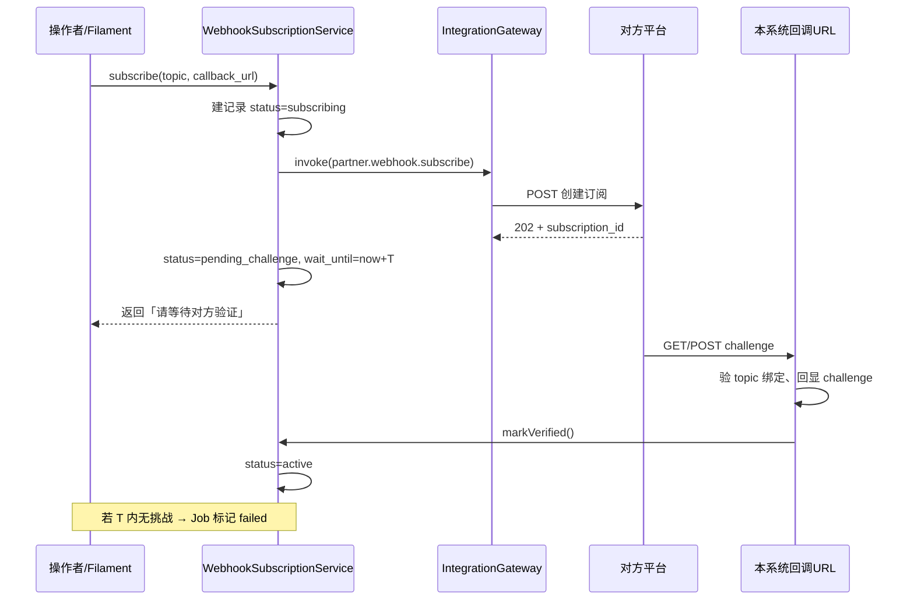
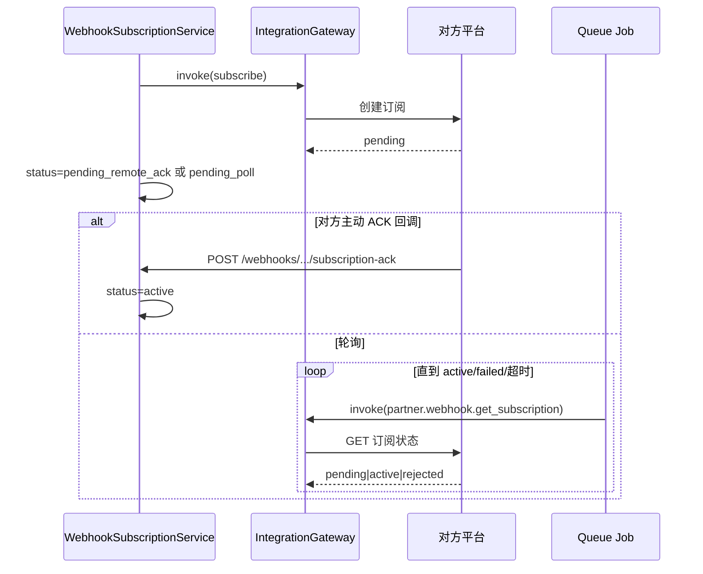

# API 整合模块 (gz168/api-integration) 开发文档

> 本文档为 `gz168/ApiIntegration` 的实施规划。**当前阶段只产出开发文档，不写实现代码。**  
> **本期不改动任何其他模块**；存量业务迁入为本模块之后的独立计划。

## 1. 背景与目标

### 1.1 要解决什么

- 出站 HTTP、入站 Webhook、前台 / 后台 API 的鉴权、日志、重试散落各处，规则不统一。
- 调用方直接依赖具体 Client / Driver 类，耦合高，无法用 YAML 描述与治理。
- 缺少与权限模块统一的「谁可以调哪个 operation」控制。

### 1.2 目标

新建独立模块（实现包 + 契约包），提供 **YAML 驱动的统一 API 整合层**，覆盖：

| 通道 | 方向 | 说明 |
| --- | --- | --- |
| `external` | 出站 | 调外部第三方 API |
| `internal` | 出站或进程内 | 调本系统内部 HTTP，或进程内 handler |
| `webhook` | 双向 | **整套能力**：主题订阅 / 等待确认 / 验签入站 / 幂等 / 投递记录 / 退订（见第 5 节） |
| `frontend` | 入站 | 前台 Client 经统一网关 |
| `backend` | 入站 | 后台 / Admin API 经统一网关，**必须结合权限模块** |

能力清单：

| 能力 | 说明 |
| --- | --- |
| YAML 定义 | 连接、操作、鉴权、协议、超时、重试、脱敏、权限码均在 YAML |
| 禁止直接 `use` 实现 | 调用方只依赖 Contracts + `operation` 字符串 |
| 请求 / 返回日志 | 每次调用记录请求侧与返回侧（脱敏） |
| 多鉴权 | OAuth2.0、API Key、Basic、Bearer、HMAC、JWT 入站、mTLS 等 |
| 多 API 方式 | 见第 5 节（REST / Form / Multipart / SOAP / GraphQL / gRPC-Web / 文件流等） |
| 权限结合 | YAML 声明 `permission.driver` + slug；**不** `use` role-permission |
| Webhook 订阅套件 | 创建订阅 → **等待对方确认 / 挑战校验** → 生效 → 收事件 → 退订；超时与重试可配 |
| 零侵入存量 | **不修改其他模块代码**；接入仅为文档约定，由后续计划自愿迁入 |

### 1.3 非目标

- 不改其他模块的路由、Service、Composer 依赖（另案处理）。
- 不替换 Kong / Traefik 等基础设施网关。
- YAML 内禁止 PHP 闭包 / 可执行脚本。
- 文档与测试不用真实密钥；不削弱受保护超级管理员与初始化幂等。

### 1.4 强约束

1. 允许：`use Gz168\ApiIntegrationContracts\...`  
   禁止：`use Gz168\ApiIntegration\...`（实现层）。
2. 调用形态：`app(IntegrationGatewayInterface::class)->invoke('demo.resource.create', $context)`。
3. **实现包亦不硬依赖、不 `use` `gz168/role-permission` 与 `gz168/api-auth`**；权限与入站鉴权一律 **YAML 选 driver + 字符串中间件别名 / 鸭式调用**，见第 3 节。
4. 实现可依赖 `common`、`filament`；**不得**依赖任何业务功能模块。
5. 接入示例一律用抽象码（`demo.*` / `partner.*`），**文档不出现具体业务模块名**。

---

## 2. 架构（仅本模块）

### 2.1 包划分

| 包 | Composer | 命名空间 | 职责 |
| --- | --- | --- | --- |
| 契约 | `gz168/api-integration-contracts` | `Gz168\ApiIntegrationContracts` | 接口 / DTO / Enum / 事件 |
| 实现 | `gz168/api-integration` | `Gz168\ApiIntegration` | YAML、鉴权、传输、日志、Filament |

### 2.2 依赖方向

```text
（可选）调用方 ──► api-integration-contracts
                         ▲
ApiIntegration ──────────┘
    ├── common
    ├── filament
    └── 第三方 Composer 包（OAuth 客户端等，见第 7 节）

# 运行时由 YAML 选择的「软协作」（无 Composer require、无 PHP use）:
#   permission.driver: has_permission_method  → 鸭式调用 user->hasPermission()
#   auth.middlewares: [gz168.jwt.auth, ...] → 只写字符串别名（由已安装的 api-auth 注册）
```

### 2.3 数据流


### 2.4 与权限、鉴权基础设施的关系

| 能力 | 协作方式 | 本模块是否 `use` / Composer require |
| --- | --- | --- |
| 权限 slug 判定 | YAML `permission.driver` + 鸭式方法或容器契约 | **否**（见第 3.1 节） |
| 入站 JWT / scope | YAML `middlewares:` **字符串别名** | **否**（见第 3.2 节） |
| 出站第三方 OAuth2 | 本模块自有 `oauth2_*` driver | 本模块自有 |
| 应用文件日志 | 与 LogManagement 菜单并列 | 否 |

**结论：可以不 `use`、不 require `gz168/role-permission` 与 `gz168/api-auth`，全部用 YAML 声明如何协作。**  
运行时只要宿主已安装并注册了对应中间件 / User 上有 `hasPermission` 方法即可；未安装则对应 driver 在 boot 时给出明确配置错误。

---

## 3. 权限与入站鉴权：YAML 驱动（零 `use` 那两包）

> 目标与「业务不 `use` ApiIntegration 实现」同一原则：  
> **ApiIntegration 源码里也不出现** `use Gz168\RolePermission\...`、`use Gz168\ApiAuth\...`，  
> **composer.json / module.json 的 requires 也不写**这两包。

### 3.0 总原则

| 做法 | 允许？ |
| --- | --- |
| YAML 写 `permission.driver: has_permission_method` | ✅ |
| YAML 写 `middlewares: [gz168.jwt.auth, gz168.api.scope:admin_user]` | ✅ |
| PHP `use Gz168\RolePermission\Contracts\Authorizable` | ❌ |
| PHP `use Gz168\ApiAuth\Http\Middleware\JwtAuthenticate` | ❌ |
| `composer require gz168/role-permission`（本模块） | ❌ |
| 鸭式：`method_exists($user, 'hasPermission') && $user->hasPermission($slug)` | ✅ |
| 容器契约：`PermissionCheckerInterface`（定义在 **ApiIntegrationContracts**）由宿主 bind | ✅ 可选增强 |

宿主若已装 RolePermission / ApiAuth，只需保证：

1. User 带有 `hasPermission(string): bool`（RolePermission 的 `HasRoles` 已提供）；
2. 中间件别名 `gz168.jwt.auth` / `gz168.api.scope` 已由 ApiAuth 的 ServiceProvider 注册。

本模块只认 **YAML 配置 + 字符串 + 鸭式/契约**，不认那两包的命名空间。

---

### 3.1 权限：YAML + 鸭式（对接 RolePermission 但不 use）

#### 3.1.1 全局 / 通道默认（本模块 YAML）

```yaml
# resources/integrations/permission.yaml
permission:
  driver: has_permission_method   # 见 drivers 表
  method: hasPermission           # 鸭式方法名，可改
  # 可选：容器契约（宿主 bind 时优先）
  # driver: container
  # contract: Gz168\ApiIntegrationContracts\PermissionCheckerInterface
```

| driver 码 | 行为 | 是否需要 RolePermission 包在运行时存在 |
| --- | --- | --- |
| `none` | 不检查 slug | 否 |
| `has_permission_method` | 对 actor 用户调用 `$user->{$method}($slug)` | **语义上需要** User 实现该方法（通常由 RolePermission Trait 提供），但本模块 **不 use 其类** |
| `container` | `app(PermissionCheckerInterface::class)->allows(...)` | 宿主自己 bind 实现（实现里可以 use RolePermission，那是宿主的事） |
| `deny_all` | 凡声明了 permissions 的一律拒绝（测试用） | 否 |

#### 3.1.2 Operation 上声明 slug（仍 YAML）

```yaml
# operations/demo.resource.create.yaml
code: demo.resource.create
channel: backend
permissions:
  - api-integration.logs.view   # 只是字符串 slug
permission_mode: all            # all | any
```

#### 3.1.3 实现内 PermissionGuard（无 RolePermission import）

```php
namespace Gz168\ApiIntegration\Permission;

final class PermissionGuard
{
    public function __construct(
        private array $permissionConfig, // 来自 YAML
    ) {}

    /**
     * @param  list<string>  $slugs
     */
    public function allows(?object $user, array $slugs, string $mode = 'all'): bool
    {
        if ($slugs === []) {
            return true;
        }

        $driver = $this->permissionConfig['driver'] ?? 'has_permission_method';

        return match ($driver) {
            'none' => true,
            'deny_all' => false,
            'container' => $this->viaContainer($user, $slugs, $mode),
            default => $this->viaDuckMethod($user, $slugs, $mode),
        };
    }

    private function viaDuckMethod(?object $user, array $slugs, string $mode): bool
    {
        $method = $this->permissionConfig['method'] ?? 'hasPermission';

        if ($user === null || ! is_object($user) || ! method_exists($user, $method)) {
            return false;
        }

        $checks = array_map(
            fn (string $slug): bool => (bool) $user->{$method}($slug),
            $slugs,
        );

        return $mode === 'any'
            ? in_array(true, $checks, true)
            : ! in_array(false, $checks, true);
    }

    private function viaContainer(?object $user, array $slugs, string $mode): bool
    {
        $contract = $this->permissionConfig['contract']
            ?? \Gz168\ApiIntegrationContracts\PermissionCheckerInterface::class;

        return app($contract)->allows($user, $slugs, $mode);
    }
}
```

说明：

- **零** `use Gz168\RolePermission\...`
- 运行时若 User 来自已装 RolePermission 的宿主，`hasPermission` 行为与今天完全一致（含超管短路），只是调用方式变成鸭式
- Filament 页面同样：`$user = Filament::auth()->user();` 后鸭式调用，或走同一 `PermissionGuard`

#### 3.1.4 Contracts 可选增强（仍不依赖 RolePermission）

```php
namespace Gz168\ApiIntegrationContracts;

interface PermissionCheckerInterface
{
    /** @param  list<string>  $slugs */
    public function allows(?object $user, array $slugs, string $mode = 'all'): bool;
}
```

宿主（或极薄的 `gz168/api-integration-host-bindings` 另案）可以：

```php
$this->app->bind(PermissionCheckerInterface::class, HostRolePermissionChecker::class);
```

`HostRolePermissionChecker` **可以** `use` RolePermission——那是宿主适配器，**不属于** ApiIntegration 包。本期默认用 YAML `has_permission_method` 即可，不必新建宿主包。

#### 3.1.5 权限 slug 数据从哪来

本模块 Seeder 仍向 `permissions` 表 `firstOrCreate` 写入 `api-integration.*` 行（表结构由宿主/RolePermission 迁移创建）。  
这是 **数据协作**，不是 PHP 命名空间依赖：若表不存在，Seeder 跳过并打日志，不 fatal 到装不了模块。

---

### 3.2 入站鉴权：YAML 中间件字符串（对接 ApiAuth 但不 use）

#### 3.2.1 职责边界

| 能力 | 谁做 | ApiIntegration 如何引用 |
| --- | --- | --- |
| 签发 token | 已安装的 ApiAuth 路由 `POST /api/oauth/token` | 文档说明 URL；**不调用**其 TokenService 类 |
| 校验 Bearer JWT | 中间件别名 `gz168.jwt.auth` | **YAML 字符串**挂到路由 |
| 校验 scope | `gz168.api.scope:admin_user` | **YAML 字符串** |
| 出站第三方 OAuth2 | 本模块 driver | 与 ApiAuth 无关 |

#### 3.2.2 Auth YAML（只写别名与参数，不写 FQCN）

```yaml
# auth/jwt_inbound_admin.yaml
code: auth.jwt_inbound.admin
driver: middleware_stack          # 本模块内置 driver 码
middlewares:
  - gz168.jwt.auth                # 字符串；由运行时已注册的别名解析
  - gz168.api.scope:admin_user
actor:
  user_id_from: request.jwt_user_id      # JwtAuthenticate 写入的字段名
  scope_from: request.jwt_user_type
  client_id_from: request.jwt_client_id
```

```yaml
# auth/jwt_inbound_front.yaml
code: auth.jwt_inbound.front
driver: middleware_stack
middlewares:
  - gz168.jwt.auth
  - gz168.api.scope:front_user
actor:
  user_id_from: request.jwt_user_id
  scope_from: request.jwt_user_type
```

```yaml
# auth/none.yaml
code: auth.none
driver: none
```

#### 3.2.3 Operation / 通道引用 auth code

```yaml
code: backend.demo.resource.create
channel: backend
auth: auth.jwt_inbound.admin      # 只引用 code
permissions:
  - demo.resource.create
permission_mode: all
route:
  method: POST
  path: /api/integrations/backend/demo/resources
```

路由注册器（实现内）伪代码：

```php
$middlewares = ['api', ...$authYaml['middlewares']]; // 纯字符串
Route::middleware($middlewares)
    ->match([$method], $path, InboundGatewayController::class);
```

**禁止：**

```php
use Gz168\ApiAuth\Http\Middleware\JwtAuthenticate; // ❌
$router->aliasMiddleware(...); // ❌ 别名由 ApiAuth 自己注册，本模块不重复
```

#### 3.2.4 boot 时软检测（友好失败）

```text
若 YAML 引用了 gz168.jwt.auth
  且 Router 上该别名未注册
  → 打 error 日志 / 健康检查失败
  → 不注册对应入站路由（或注册后一律 503）
  提示：请启用已安装的 api-auth 模块，或改 YAML 换其他 auth driver
```

不把 api-auth 写进 `requires`，避免「没装 api-auth 就装不了 api-integration」。

#### 3.2.5 请求进入后的顺序（逻辑上仍等同以前）

```text
Request
  → YAML 声明的 middleware 字符串（通常即 ApiAuth 已注册的别名）
  → 读取 request 上的 jwt_* 字段组装 Actor（字段名也来自 YAML）
  → PermissionGuard（YAML permission.driver）
  → Gateway / Handler
  → Logger
```

#### 3.2.6 外部拿 Token（联调说明，仍走 ApiAuth HTTP，不 use 类）

```http
POST /api/oauth/token
Content-Type: application/json

{
  "grant_type": "client_credentials",
  "client_id": "<approved-client-id>",
  "client_secret": "<secret>",
  "scope": "admin_user"
}
```

然后：

```http
POST /api/integrations/backend/demo/resources
Authorization: Bearer <access_token>
```

本模块文档只描述 URL；**不** `app(TokenService::class)`。

#### 3.2.7 本模块权限 slug（Seeder 字符串，供角色勾选）

| slug | 用途 |
| --- | --- |
| `api-integration.logs.view` | 查看请求/返回日志 |
| `api-integration.logs.export` | 导出 |
| `api-integration.logs.configure` | 改保留天数、备份 |
| `api-integration.logs.backup` | 触发/下载备份 |
| `api-integration.credentials.manage` | 凭据 |
| `api-integration.reload` | 重载 YAML |
| `api-integration.invoke` | 底线 invoke（可选） |
| `api-integration.smoke` | 探测 |
| `api-integration.webhooks.view` / `.subscribe` / `.unsubscribe` / `.manage` | Webhook |

Filament 授权同样走 `PermissionGuard` / 鸭式，**不** `use Authorizable`。

---

### 3.3 对比：硬依赖 vs YAML 软协作

| | 旧方案（已废弃） | 现行方案 |
| --- | --- | --- |
| `composer.json` | require role-permission、api-auth | **不写** |
| PHP `use` | Authorizable、JwtAuthenticate | **禁止** |
| 权限 | 接口类型约束 | YAML `permission.driver` + 鸭式/契约 |
| JWT | 代码写死中间件类 | YAML `middlewares: [别名…]` |
| 没装那两包时 | 装不上本模块 | 本模块可装；相关通道按 YAML 降级/报配置错 |

---

### 3.4 依赖声明（实现包）

```text
# module.json / composer.json — 仅硬依赖
requires: gz168/common, gz168/filament
# 明确不写: gz168/role-permission, gz168/api-auth
```

`suggest`（Composer suggest，非强制）可注明：

```text
gz168/role-permission: 提供 User::hasPermission，供 permission.driver=has_permission_method
gz168/api-auth: 注册 gz168.jwt.auth / gz168.api.scope，供 auth.jwt_inbound.* YAML
```

---

## 4. 其他模块如何接入（方法级示例）

> 以下为**约定写法**。本期**不要求、不修改**任何现有模块；接入动作留给后续迁移计划。

### 4.1 接入步骤（调用方侧，未来自愿做）

1. Composer 仅增加：`gz168/api-integration-contracts`（不要 require 实现包）。
2. 在本侧增加 `resources/integrations/usage.yaml`，声明允许的 `operation` 码。
3. 需要进程内处理时：实现 `OperationHandlerInterface`，在本侧 ServiceProvider 里 `register(logicalName, Handler::class)`。
4. 业务方法里只调用 `IntegrationGatewayInterface::invoke(...)`。
5. **禁止** `use` 实现命名空间下的任何类。

### 4.2 出站：同步调用外部 REST

**YAML（放在本整合模块的 resources 中，由平台维护）：**

```yaml
# connections/partner.api.yaml
code: conn.partner.api
channel: external
protocol: rest_json
base_url: https://api.partner.example
auth: auth.oauth2.partner_cc
timeout_ms: 15000

# operations/partner.order.create.yaml
code: partner.order.create
connection: conn.partner.api
method: POST
path: /v1/orders
permissions: []          # 出站无用户上下文时可空；有后台触发时可填
logging:
  enabled: true
  log_request_body: true
  log_response_body: true
```

**调用方方法（示意，类名随意）：**

```php
use Gz168\ApiIntegrationContracts\IntegrationContext;
use Gz168\ApiIntegrationContracts\IntegrationGatewayInterface;

final class CreateRemoteOrder
{
    public function __construct(
        private IntegrationGatewayInterface $gateway,
    ) {}

    public function handle(array $payload): array
    {
        $result = $this->gateway->invoke(
            'partner.order.create',
            new IntegrationContext(
                body: $payload,
                correlationId: (string) \Illuminate\Support\Str::uuid(),
            ),
        );

        if (! $result->ok) {
            throw new \RuntimeException($result->errorMessage ?? 'remote_failed');
        }

        return (array) $result->body;
    }
}
```

### 4.3 出站：带当前用户权限的后台触发

```php
public function syncNow(User $actor): void
{
    $this->gateway->invoke(
        'partner.catalog.sync',
        new IntegrationContext(
            body: ['full' => false],
            actor: ActorRef::user($actor->id),
            correlationId: (string) Str::uuid(),
        ),
    );
}
```

对应 YAML：

```yaml
code: partner.catalog.sync
connection: conn.partner.api
method: POST
path: /v1/catalog/sync
permissions:
  - api-integration.invoke   # 或业务侧自有 slug（由业务自己的 Seeder 维护，非本期改权限模块）
permission_mode: all
```

### 4.4 进程内 internal（无 HTTP）

```yaml
code: internal.demo.recompute
channel: internal
transport: in_process
handler: demo.recompute
permissions:
  - demo.recompute
logging:
  enabled: true
```

```php
use Gz168\ApiIntegrationContracts\OperationHandlerInterface;
use Gz168\ApiIntegrationContracts\OperationHandlerRegistryInterface;

// ServiceProvider::boot
$registry->register('demo.recompute', DemoRecomputeHandler::class);

final class DemoRecomputeHandler implements OperationHandlerInterface
{
    public function handle(IntegrationContext $context): IntegrationResult
    {
        // 纯业务计算…
        return IntegrationResult::ok(['recomputed' => true]);
    }
}
```

### 4.5 Webhook

Webhook **不是**「只收一条 POST」。完整能力（订阅、等待确认、入站、退订、Filament）见 **第 5 节**。此处仅保留调用方听事件的最小写法：

```php
use Gz168\ApiIntegrationContracts\Events\WebhookReceived;

public function handle(WebhookReceived $event): void
{
    if ($event->topic !== 'partner.order.status') {
        return;
    }
    // 处理 $event->payload …
}
```

### 4.6 入站 frontend / backend

```yaml
code: backend.demo.resource.create
channel: backend
route:
  method: POST
  path: /api/integrations/backend/demo/resources
auth: auth.jwt_inbound
permissions:
  - demo.resource.create
dispatch:
  handler_ref: internal.demo.resource.create
```

调用方无需写 Controller；网关鉴权 → 权限 → 转发 internal → 日志。

### 4.7 usage.yaml（调用方声明白名单）

```yaml
# 放在调用方自己的 resources/integrations/usage.yaml（未来迁移时添加）
allowed_operations:
  - partner.order.create
  - partner.catalog.sync
  - internal.demo.recompute
```

未声明的 `invoke` → `OperationNotAllowedException`。

### 4.8 错误示范（Review 拒绝）

```php
use Gz168\ApiIntegration\Http\OutboundHttpTransport; // 禁止
use Gz168\ApiIntegration\Auth\Drivers\OAuth2ClientCredentialsDriver; // 禁止

Http::withToken($token)->post('https://api.partner.example/...'); // 新代码禁止绕过网关
```

---

## 5. Webhook 整套能力（订阅 / 等待 / 收件 / 退订）

> 目标：把「向对方登记回调 → **等待对方确认** → 开始收事件 → 运维可查可退」做成一等公民，而不是只写一个入站路由。

### 5.1 能力总览

| 能力 | 说明 |
| --- | --- |
| 主题 (topic) 目录 | YAML 声明可订主题、所需权限、回调 path、验签方式 |
| 订阅 (subscribe) | 出站调用对方「创建订阅」API（走本模块 Gateway） |
| **等待确认 (wait)** | 订阅后进入 `pending_*`；等到挑战通过 / 对方回执 / 超时失败 |
| 挑战校验 (challenge) | 对方 GET/POST 带 `hub.challenge` 等，本系统原样回显后才激活 |
| 入站投递 | 验签 → 幂等 → 记投递 → 派发契约事件 |
| 投递确认策略 | 立即 200 / 业务成功后再 200（可配）；失败可让对方重试 |
| 退订 / 暂停 / 恢复 | 出站调对方 API + 本地状态机 |
| 续期 | 对方要求定期续订时，到期前自动或手动续订并再次进入等待 |
| 可观测 | Filament：订阅列表、等待倒计时、投递日志、人工重试订阅 |
| 权限 | 订阅 / 退订 / 查看均走 `api-integration.webhooks.*` |

### 5.2 状态机

```text
draft
  │ subscribe()
  ▼
subscribing          ← 正在调对方「创建订阅」API（同步等待 HTTP 返回）
  │ HTTP 成功且对方要求确认
  ▼
pending_challenge    ← 等对方打挑战 URL（常见：hub.verify）
pending_remote_ack   ← 等对方异步回调「订阅已批准」（无挑战的平台）
pending_poll         ← 按间隔轮询对方「订阅状态」接口直到 active/failed
  │ 确认成功 / 挑战通过
  ▼
active               ← 可收业务事件
  │ pause / 连续投递失败超阈
  ▼
paused
  │ resume / 对方侧失效
  ▼
active | failed | expired
  │ unsubscribe()
  ▼
unsubscribed         ← 终态之一
failed               ← 订阅 API 失败或等待超时（可 retry_subscribe）
```

**「订阅时候需要等」指什么：**

| 等待类型 | 何时出现 | 用户侧表现 | 超时 |
| --- | --- | --- | --- |
| `wait_http` | 出站 subscribe 请求尚未返回 | UI「提交中」 | `subscribe_http_timeout_ms` |
| `wait_challenge` | 对方要验证回调可达 | UI「等待对方验证回调…」+ 剩余秒数 | `challenge_wait_seconds` |
| `wait_remote_ack` | 对方人工/异步审批订阅 | UI「等待对方确认订阅…」 | `remote_ack_wait_seconds` |
| `wait_poll` | 只能轮询订阅状态 | UI「同步订阅状态中…」 | `poll.max_wait_seconds` |

超时 → `status=failed`，`failure_reason=wait_timeout:<type>`，允许在权限下「重试订阅」。

### 5.3 时序：订阅并等待挑战



### 5.4 时序：订阅并等待远程确认 / 轮询



### 5.5 YAML：主题与订阅动作

```yaml
# topics/partner.order.status.yaml
code: topic.partner.order.status
channel: webhook
provider: partner.webhooks          # 对应下方 provider
topic: partner.order.status
inbound:
  route:
    method: POST
    path: /api/integrations/webhooks/partner/order-status
  auth: auth.webhook.partner_hmac
  idempotency:
    body_json_path: $.event_id
    ttl_seconds: 86400
  dispatch:
    event: Gz168\ApiIntegrationContracts\Events\WebhookReceived
subscription:
  enabled: true
  mode: challenge                   # challenge | remote_ack | poll | immediate
  operations:
    subscribe: partner.webhook.subscribe
    unsubscribe: partner.webhook.unsubscribe
    get_status: partner.webhook.get_subscription   # poll 模式必填
    renew: partner.webhook.renew                   # 可选
  wait:
    subscribe_http_timeout_ms: 15000
    challenge_wait_seconds: 300                     # 等挑战，默认 5 分钟
    remote_ack_wait_seconds: 3600
    poll:
      interval_seconds: 30
      max_wait_seconds: 1800
  challenge:
    # 对方验证回调时的入站（可与业务事件同 path，靠 query/字段区分）
    detect: query.hub.mode == "subscribe"
    respond: echo                              # echo | plain_token | custom_operation
    echo_from: query.hub.challenge
  callback:
    # 本系统对外 URL；可用占位符
    url_template: "${env:APP_URL}/api/integrations/webhooks/partner/order-status"
  renew:
    enabled: false
    before_expire_seconds: 86400
```

```yaml
# operations/partner.webhook.subscribe.yaml（出站）
code: partner.webhook.subscribe
connection: conn.partner.api
method: POST
path: /v1/webhooks/subscriptions
permissions:
  - api-integration.webhooks.subscribe
request:
  content_type: application/json
# body 由 SubscriptionService 组装：topic、callback_url、secret 等
```

### 5.6 契约 API（Webhook 专用，仍在 Contracts）

```php
namespace Gz168\ApiIntegrationContracts;

interface WebhookSubscriptionManagerInterface
{
    /** 发起订阅：可能立即 active，或进入 pending_*（调用方需等待） */
    public function subscribe(SubscribeWebhookRequest $request): WebhookSubscriptionResult;

    /** 查询当前状态（含 wait_until、wait_type，供 UI 轮询） */
    public function status(string $subscriptionId): WebhookSubscriptionStatus;

    public function unsubscribe(string $subscriptionId, ActorRef $actor): WebhookSubscriptionResult;

    public function pause(string $subscriptionId, ActorRef $actor): void;

    public function resume(string $subscriptionId, ActorRef $actor): void;

    /** 等待超时或失败后重试整段订阅流程 */
    public function retrySubscribe(string $subscriptionId, ActorRef $actor): WebhookSubscriptionResult;
}

/** 同步阻塞等待（仅 CLI/Job；Web 请求禁止长时间阻塞） */
interface WebhookSubscriptionWaiterInterface
{
    /**
     * 阻塞直到 active|failed|unsubscribed 或超时。
     * Web/Filament 应轮询 status()，不要调 waitUntilSettled。
     */
    public function waitUntilSettled(
        string $subscriptionId,
        int $timeoutSeconds,
        int $pollIntervalMs = 500,
    ): WebhookSubscriptionStatus;
}
```

`WebhookSubscriptionResult` 示意字段：

```text
subscriptionId
status                  # 见状态机
waitType                # null | challenge | remote_ack | poll | http
waitUntil               # ?Carbon
message                 # 已脱敏人类可读说明，如「等待对方验证回调，剩余 280 秒」
remoteSubscriptionId    # 对方侧 ID
logId                   # 关联请求日志
```

**接入约定：**

- HTTP / Filament：`subscribe()` 后立刻返回；前端 / 页面用 `status()` **轮询等待**（建议 2s 间隔），直到非 `pending_*` / `subscribing`。
- 队列 Job / Artisan：可用 `waitUntilSettled()`，但必须设超时。
- 调用方**不要**自己调对方订阅 API；只调 `WebhookSubscriptionManagerInterface`。

### 5.7 方法级接入示例

```php
use Gz168\ApiIntegrationContracts\SubscribeWebhookRequest;
use Gz168\ApiIntegrationContracts\WebhookSubscriptionManagerInterface;

final class EnsureOrderStatusWebhook
{
    public function __construct(
        private WebhookSubscriptionManagerInterface $webhooks,
    ) {}

    /** 后台 Action：发起订阅并让 UI 去轮询 */
    public function start(User $actor): WebhookSubscriptionResult
    {
        return $this->webhooks->subscribe(new SubscribeWebhookRequest(
            topicCode: 'topic.partner.order.status',
            actor: ActorRef::user($actor->id),
            // callbackUrl 可省略，用 YAML url_template
        ));
    }

    /** 页面轮询 */
    public function poll(string $id): WebhookSubscriptionStatus
    {
        return $this->webhooks->status($id);
    }
}
```

CLI 需要「订完再干下一件事」时：

```php
$result = $webhooks->subscribe($request);
$status = $waiter->waitUntilSettled($result->subscriptionId, timeoutSeconds: 300);
if ($status->status !== 'active') {
    throw new RuntimeException($status->message ?? 'subscribe_failed');
}
```

### 5.8 入站处理管线

1. 匹配 route → topic。
2. 若是 **challenge** 请求 → 按 YAML `challenge.respond` 回复，更新订阅为 `active`，写日志，**不**派发业务事件。
3. 若是 **subscription-ack** → 更新状态，写日志。
4. 若是业务事件：验签 → 幂等表 → 写 `webhook_deliveries` → 派发 `WebhookReceived` → 按策略返回 200/4xx/5xx。
5. 仅 `active`（或 YAML 允许 `paused` 仍收）的订阅才处理业务事件；否则 410/403 + 日志。

### 5.9 数据模型

#### `api_integration_webhook_subscriptions`

| 字段 | 说明 |
| --- | --- |
| `id` | uuid PK |
| `topic_code` | YAML topic code |
| `provider` | 对方提供方码 |
| `status` | 状态机枚举 |
| `wait_type` | null / challenge / remote_ack / poll / http |
| `wait_until` | 当前等待截止时间 |
| `callback_url` | 实际登记的回调 |
| `remote_subscription_id` | 对方返回的 ID |
| `secret_ref` | 验签密钥的 credential_ref |
| `expires_at` | 对方订阅过期（续期用） |
| `last_error` | 脱敏失败原因 |
| `created_by` | 用户 ID nullable |
| `subscribed_at` / `activated_at` / `unsubscribed_at` | |
| `meta` | json |
| `timestamps` | |

#### `api_integration_webhook_subscription_attempts`

每次 subscribe / retry / renew / unsubscribe 一条：关联 `request_log_id`、结果、耗时。

#### `api_integration_webhook_deliveries`

每次入站业务事件一条：`subscription_id`、`idempotency_key`、`request_log_id`、处理结果、是否挑战。

#### `api_integration_webhook_receipts`

保留幂等唯一键（可与 deliveries 合并；若合并则本表可省略）。

### 5.10 后台 Job / 命令

| 命令或 Job | 作用 |
| --- | --- |
| `WatchWebhookSubscriptionWaitJob` | 扫描 `wait_until < now` 且仍 pending → 标 `failed` |
| `PollWebhookSubscriptionStatusJob` | `pending_poll` 按间隔调 `get_status` |
| `RenewWebhookSubscriptionsJob` | 到期前续订（再进等待） |
| `api-integration:webhooks:watch` | 调度入口 |
| `api-integration:webhooks:subscribe {topic}` | CLI 发起并可选 `--wait=300` |

### 5.11 Filament

- **订阅列表**：topic、status、wait 倒计时、remote id、最后错误、操作者。
- 行 Action：`subscribe` / `retry` / `unsubscribe` / `pause` / `resume`（均鉴权）。
- 创建订阅后详情页 **自动轮询** `status`（Livewire polling），展示「等待对方验证回调，剩余 mm:ss」。
- Relation：投递记录、订阅尝试、关联请求日志。

### 5.12 安全要点（Webhook）

- 挑战响应不得泄露其他订阅的 secret。
- `pending_*` 期间只接受挑战 / ACK，不接受业务 payload（可配例外）。
- 回调 URL 必须落在本系统允许的 host（防 SSRF 式乱填外域当 callback）。
- 退订成功前本地可先 `unsubscribed`，出站失败则标记 `unsubscribe_pending` 并重试。

---

## 6. 支持的 API 方式（protocol）

YAML `protocol` 决定 Transport。默认 `rest_json`。

| protocol | 典型 Content-Type / 形态 | 阶段 | 说明 |
| --- | --- | --- | --- |
| `rest_json` | `application/json` | 1 | REST + JSON，主路径 |
| `rest_form` | `application/x-www-form-urlencoded` | 1 | OAuth token、部分支付回调 |
| `rest_multipart` | `multipart/form-data` | 2 | 文件上传 |
| `rest_raw` | `text/plain` / `application/octet-stream` | 2 | 原始 body / 二进制 |
| `rest_xml` | `application/xml` | 2 | XML REST |
| `soap` | SOAP 1.1 / 1.2 Envelope | 3 | WSDL 可选；请求用模板 |
| `graphql` | `application/json` + `query`/`variables` | 3 | POST GraphQL |
| `grpc_web` | gRPC-Web / protobuf | 4 | 可选；优先官方或成熟 PHP 客户端封装 |
| `xml_rpc` | XML-RPC | 4 | 遗留系统 |
| `sse_client` | `text/event-stream` 出站消费 | 4 | 长连接读事件（谨慎超时） |
| `webhook_form` | form 回调 | 2 | 入站 form 解析 |
| `file_download` | 流式下载落盘 / 流式返回 | 2 | 大文件不进日志全文 |

每种 protocol 的 operation YAML 可增加专用字段，例如：

```yaml
# GraphQL
protocol: graphql
graphql:
  query: |
    mutation ($input: OrderInput!) {
      createOrder(input: $input) { id status }
    }
  variables_from: body

# SOAP
protocol: soap
soap:
  version: "1.2"
  action: "CreateOrder"
  envelope_template: soap/create_order.xml.twig   # 仅模板文件，无逻辑
```

日志：非文本 / 超大 body 只记 `sha256` + `byte_length` + `truncated: true`。

---

## 7. 第三方插件 / 包配合

原则：**第三方包只出现在实现包 `composer.json`**，由 Driver / Transport 封装；Contracts 与调用方零感知。是否引入以「少依赖、可测、兼容 PHP 8.5 / Laravel 13」为准，落地前再 `composer require` 验证。

### 7.1 建议采用（实现内封装）

| 包 | 用途 | 备注 |
| --- | --- | --- |
| `league/oauth2-client` | 出站 OAuth2（GenericProvider） | 成熟、与框架无关；优先 |
| Laravel `Illuminate\Http\Client` | REST / Form / Multipart 传输 | 已随框架，无需新依赖 |
| `symfony/yaml` | 解析 YAML | Laravel 已间接依赖则可直接用 |
| Redis（项目已有） | OAuth access_token 缓存、幂等、单飞锁、订阅等待锁 | 无新包 |

### 7.2 可选评估（需要时再引入）

| 包 | 用途 | 决策门槛 |
| --- | --- | --- |
| `pelmered/laravel-http-client-auth-helper` | Http Client 上挂 refresh / client_credentials | 若自研 Driver 成本高再引入；注意与 YAML 配置模型对齐 |
| `antogkou/laravel-oauth2-client` | 多服务 OAuth2 Client Credentials | 评估维护活跃度与 Laravel 13 兼容后再定 |
| `saloonphp/saloon` | 结构化 API SDK 风格 | 仅当大量 REST 资源建模收益明显时；避免与 YAML 双轨 |
| SOAP：`ext-soap` 或纯 PHP SOAP 客户端 | `soap` protocol | 优先无扩展纯 PHP，避免部署差异 |
| GraphQL 客户端（如 `webonyx/graphql-php` 仅作工具） | 校验 query | 出站以 HTTP POST 即可，不必上完整服务端 |

### 7.3 明确不采用（本期）

| 方案 | 原因 |
| --- | --- |
| Laravel Passport / Sanctum 替代本模块 | 本仓库已有 `api-auth`；Passport 是**本系统发 token**，不是出站整合层 |
| 在调用方直接 `composer require` 上述 OAuth 包 | 破坏「只依赖 Contracts」约束 |
| 把第三方 Facade 暴露给调用方 | 等同于允许绕过 YAML |
| 独立 Webhook SaaS（Svix 等）强绑定 | 可作为后续 Transport 适配器；本期先自研状态机，避免核心流程外包 |

### 7.4 封装边界

```text
调用方 → IntegrationGatewayInterface
              → OAuth2RefreshTokenDriver   # 内部可用 league/oauth2-client
              → RestJsonTransport          # 内部可用 Http::…

调用方 → WebhookSubscriptionManagerInterface
              → 出站仍走 Gateway；等待/状态机在实现包内
```

调用方测试使用 `Http::fake()` 或对 Gateway / SubscriptionManager 做契约替身即可，不必 mock 第三方包。

---

## 8. YAML 布局（仅本模块目录）

```text
gz168/ApiIntegration/resources/integrations/
├── drivers.yaml
├── auth/
├── connections/
├── operations/
└── topics/                          # Webhook 主题 + 订阅/等待配置
    └── partner.order.status.yaml
```

加载：仅扫描**本模块** `resources/integrations/**`。  
调用方 `usage.yaml` 为**可选约定**（迁移计划再扫）；本期实现可先用配置开关 `api-integration.enforce_usage_whitelist=false`，避免尚未改其他模块时全站不可用。

`${env:VAR}` 仅服务端解析；禁止写入日志。

### 8.1 鉴权 driver 一览

| driver | 阶段 |
| --- | --- |
| `none` | 1 |
| `api_key` | 1 |
| `basic` | 1 |
| `bearer_static` | 1 |
| `oauth2_client_credentials` | 2 |
| `oauth2_refresh_token` | 2 |
| `oauth2_password` | 3（遗留；默认关闭） |
| `hmac` / `webhook_signature` | 2 |
| `jwt_inbound` / `middleware_stack` | 2（YAML 挂字符串中间件别名，不 use api-auth） |
| `mtls` | 4（证书路径来自配置，不进 Git） |

---

## 9. 契约 API

```php
namespace Gz168\ApiIntegrationContracts;

interface IntegrationGatewayInterface
{
    public function invoke(string $operationCode, IntegrationContext $context): IntegrationResult;
}

interface OperationHandlerRegistryInterface
{
    /** @param class-string<OperationHandlerInterface> $handlerClass */
    public function register(string $logicalName, string $handlerClass): void;
}

interface OperationHandlerInterface
{
    public function handle(IntegrationContext $context): IntegrationResult;
}

interface CredentialStoreInterface
{
    public function get(string $ref): ?string;
    public function put(string $ref, string $secret): void;
}

// Webhook：见第 5.6 节 WebhookSubscriptionManagerInterface / WaiterInterface
```

`IntegrationContext` / `IntegrationResult` 字段同前（correlationId、channel、actor、body、statusCode、logId、脱敏 errorMessage 等）。

---

## 10. 数据模型（实现包 migrations）

### 10.1 `api_integration_credentials`

| 字段 | 说明 |
| --- | --- |
| `ref` unique | YAML `credential_ref` |
| `value_encrypted` | `Crypt::encryptString` |
| `expires_at` nullable | |
| `meta` json nullable | 非敏感 |

### 10.2 `api_integration_request_logs`

单行含请求段 + 返回段；字段含 channel、operation_code、protocol、method、url、request_*、response_*、duration_ms、attempt、ok、error_*、actor_*、permission_slugs（json）、created_at。

### 10.3 Webhook 相关表

见 **第 5.9 节**：`webhook_subscriptions` / `webhook_subscription_attempts` / `webhook_deliveries`（及可选 `webhook_receipts`）。

### 10.4 日志配置与备份元数据

#### `api_integration_log_settings`（单行 id=1）

| 字段 | 类型 | 默认 | 说明 |
| --- | --- | --- | --- |
| `retain_days` | int | **30**（1 个月） | 热数据保留天数；后台可改 |
| `backup_enabled` | bool | false | 是否启用定期备份 |
| `backup_cron` | varchar | `0 3 * * *` | 备份调度（或走 Laravel Schedule 固定每日） |
| `backup_disk` | varchar | `s3` / `sftp` / `local` | Laravel filesystem disk 名 |
| `backup_path` | varchar | `api-integration/logs` | 远端/本地目录前缀 |
| `backup_before_prune` | bool | true | 裁剪前必须先备份成功 |
| `max_body_bytes` | int | 65536 | 单条 body 截断 |
| `updated_by` | bigint nullable | | |
| `timestamps` | | | |

也可用 `config/api-integration.php` + 标量配置二选一；**产品要求后台可配保留时间** → 优先表或 Filament Settings Page 写库。

#### `api_integration_log_backups`

| 字段 | 说明 |
| --- | --- |
| `id` | uuid |
| `period_from` / `period_to` | 备份覆盖的时间窗 |
| `status` | pending / running / success / failed |
| `disk` / `path` | 落地位置 |
| `bytes` / `sha256` | 包大小与校验 |
| `row_count` | 导出条数 |
| `triggered_by` | manual / schedule / before_prune |
| `error_message` | 脱敏 |
| `created_at` / `finished_at` | |

---

## 11. 请求日志：查询、保留、备份与第三方

> 此处的「日志」指本模块 **API 请求/返回日志表**（`api_integration_request_logs`），  
> 与 `gz168/LogManagement`（扫 `storage/logs/*.log` 文件）**并列、不互相替代**。

### 11.1 后台查询（Filament）

权限：`api-integration.logs.view`（经 `Authorizable::hasPermission`）。

| 筛选项 | 说明 |
| --- | --- |
| 时间范围 | `created_at` 区间，默认最近 24h |
| channel | external / internal / webhook / frontend / backend |
| operation_code | 精确 / 前缀 |
| ok / response_status | 成功失败、HTTP 状态 |
| correlation_id | 一次调用全链路 |
| actor | user id / client id |
| 关键词 | 对脱敏后的 url / error_message 模糊查（默认不做全文扫大 body） |

详情页分栏：**请求** | **返回**；敏感字段已脱敏；支持复制 `correlation_id`。

导出：权限 `api-integration.logs.export` → CSV/JSON（仍脱敏）；大导出走队列。

### 11.2 保留时间（默认 1 个月）

- 默认：`retain_days = 30`（约一个月）。
- Filament「日志设置」页可改（权限 `api-integration.logs.configure`），建议允许 7～365，超出需二次确认。
- 命令：`api-integration:prune-logs`
  - 删除 `created_at < now()->subDays(retain_days)` 的热数据
  - 若 `backup_before_prune=true`：先成功备份该窗口，失败则**不删**并告警

```text
Schedule（实现包注册）:
  daily 03:00  → BackupApiIntegrationLogsJob（若 backup_enabled）
  daily 04:00  → PruneApiIntegrationLogsCommand
```

### 11.3 备份机制

#### 11.3.1 备份包内容

- 格式：阶段 1 用 **jsonl.gz**
- 命名：`api-integration-logs_{from}_{to}_{utc}.jsonl.gz`
- 每行一条日志（库内已脱敏快照）；**禁止**写入未脱敏原文

#### 11.3.2 触发方式

| 触发 | 说明 |
| --- | --- |
| 定时 | `backup_enabled` + Schedule |
| 手动 | Filament Action「立即备份」（权限 `logs.backup`） |
| 裁剪前 | `backup_before_prune` |

#### 11.3.3 下载

- Filament 备份列表：对可生成临时 URL 或 local disk → **下载**按钮
- 流式下载；权限不足 → 403
- 记录审计：谁在何时下载了哪次备份

#### 11.3.4 同步到备份服务器

通过 Laravel `filesystems` disk，**不**在业务代码写死账号：

| disk 驱动 | 用途 |
| --- | --- |
| `s3`（含 MinIO / 兼容对象存储） | 推荐 |
| `sftp` | 传统备份机 |
| `local` | 本机落盘，再由运维 rsync |

```dotenv
API_INTEGRATION_BACKUP_DISK=s3
AWS_BUCKET=backup-example
AWS_ROOT=api-integration/logs
# 或
API_INTEGRATION_BACKUP_DISK=sftp
SFTP_HOST=backup.example.com
SFTP_USERNAME=backup
SFTP_PASSWORD=use-env-only
```

Filament 设置页只选 **已有 disk 名** + path 前缀，不录入密码。

```text
查时间窗内日志
  → 流式写临时 .jsonl.gz
  → Storage::disk($backup_disk)->put($path, ...)
  → 写 api_integration_log_backups(status=success, sha256, bytes)
  → 删临时文件
失败 → status=failed，不剪枝
```

### 11.4 与现有 `gz168/LogManagement` 的关系

| | ApiIntegration 请求日志 | LogManagement |
| --- | --- | --- |
| 数据源 | MySQL 表 | `storage/logs` 文件 |
| 内容 | 结构化 API 请求/返回 | Laravel / 应用文本日志 |
| 本期 | 自建查询 + 备份 | **不改**该模块；菜单可并列 |
| 联动 | 可选另案：按 correlation 深链 | — |

### 11.5 第三方日志管理（可选配合）

原则：第三方做观测/告警/长期检索；本模块表仍是可审计真相源之一。新依赖须批准；密钥不进仓库。

| 方案 | 类型 | 适合 | 配合方式 | 备注 |
| --- | --- | --- | --- | --- |
| **Laravel Telescope** | 本地调试 | 开发排障 | 并行，不替代 DB 请求日志 | 生产慎开 |
| **Sentry** / GlitchTip | 错误与性能 | 异常、慢请求告警 | `ok=false`/5xx 时脱敏上报 | 不上报全量 body |
| **Better Stack (Logtail)** / Papertrail / Axiom | 日志 SaaS | 云上检索、告警 | ship json 行或备份文件 | 按量计费 |
| **Grafana Loki** + Alloy/Promtail | 自建日志库 | 要自控数据 | 采 jsonl / Agent | 需运维 |
| **ELK / OpenSearch** | 自建搜索 | 超大规模检索 | Bulk 索引脱敏文档 | 偏重 |
| **Datadog / New Relic** | APM + Logs | 已有合同 | `correlation_id` 对齐 Trace | 成本高 |
| **Flare** | Laravel 异常 | 仅异常 | 与请求日志互补 | — |
| **Spatie Activitylog** | 模型审计 | 数据变更轨 | **不替代** HTTP 请求日志 | 用途不同 |

**本期建议默认（无强绑 SaaS）：**

1. MySQL 热数据 + Filament 查询  
2. `retain_days=30` + 定时 **jsonl.gz → S3/SFTP 备份服务器**  
3. 需要告警再加 **Sentry（仅失败）**  
4. 长期检索再评估 Loki / OpenSearch（另案）

实现预留 `LogShipperInterface`，默认 `NullShipper`；Sentry 等作可选 Driver，config 开关，调用方零感知。

### 11.6 日志相关权限与安全

- 分权：`logs.view` / `logs.export` / `logs.configure` / `logs.backup`（见第 3.2.7 节）。
- 备份包与界面同一套脱敏。
- 下载短时链接；`.env` 中对象存储/SFTP 密钥永不进日志行或备份 meta 明文。

---

## 12. 实现包内部结构（调用方不可 use）

```text
gz168/ApiIntegration/src/
├── Providers/ApiIntegrationServiceProvider.php
├── Registry/YamlIntegrationRegistry.php
├── Gateway/IntegrationGateway.php
├── Permission/PermissionGuard.php          # Authorizable::hasPermission
├── Auth/Drivers/...                        # 含 JwtInbound（配合 gz168.jwt.auth）
├── Transport/...
├── Webhook/
│   ├── WebhookSubscriptionService.php
│   ├── WebhookSubscriptionWaiter.php
│   ├── WebhookInboundPipeline.php
│   ├── ChallengeResponder.php
│   └── Jobs/{WatchWait,PollStatus,Renew}.php
├── Logging/
│   ├── RequestResponseLogger.php
│   ├── Redactor.php
│   ├── LogSettingsRepository.php
│   ├── LogBackupService.php
│   ├── LogPruneService.php
│   ├── Shippers/{Null,Sentry}Shipper.php
│   └── Jobs/BackupLogsJob.php
├── Http/Inbound*Controller.php / RouteRegistrar.php
├── Models/...
├── Filament/
│   ├── Resources/{RequestLog,WebhookSubscription,LogBackup}Resource.php
│   └── Pages/ApiIntegrationLogSettingsPage.php
├── Database/Seeders/ApiIntegrationPermissionSeeder.php
└── Console/{Reload,PruneLogs,BackupLogs,SmokeCall,WebhooksWatch,WebhooksSubscribe}.php
```

---

## 13. 安全

- 密钥只进 CredentialStore / env；日志与备份强制脱敏。
- 入站顺序：YAML `middlewares` 字符串 → PermissionGuard（YAML `permission.driver`）→ 业务；**源码不 use role-permission / api-auth**。
- Webhook：先验签 / 先挑战，再业务；回调 URL 白名单 host（第 5.12 节）。
- 授权只在服务端；Filament 可见性 ≠ 授权。
- `SmokeCallCommand` 默认仅 `local` / `staging`。
- Web 请求禁止调用 `waitUntilSettled()` 长阻塞。
- 备份 disk 凭证仅 `.env`；设置页只选 disk 名。

---

## 14. 分阶段计划（仍不改其他模块）

| 阶段 | 内容 |
| --- | --- |
| 0 | 本文档（当前） |
| 1 | 契约 + 骨架；YAML permission/auth 软协作（不 require 那两包）；日志查询；`retain_days=30` |
| 2 | OAuth2 出站；jwt_inbound；日志设置页；**备份 + 下载 + S3/SFTP 同步**；prune；multipart/raw/xml |
| 3 | Webhook 整套（订阅/等待/挑战/轮询）；Filament 订阅页 |
| 4 | SOAP/GraphQL；可选 Sentry Shipper；enforce_usage 可开 |
| 5 | gRPC-Web/SSE/mTLS；Loki/OpenSearch 等另案 |
| 另案 | 调用方迁移；**不改其他模块源码** |

---

## 15. 测试（本模块自测）

| 场景 | 类型 |
| --- | --- |
| YAML 加载与 protocol 解析 | Unit |
| 无 JWT（YAML 挂了 jwt 中间件别名）→ 401 | Feature |
| 有 JWT 但鸭式 hasPermission 失败 → 403 | Feature |
| 未注册中间件别名时 boot 软失败 / 不挂路由 | Feature |
| 源码与 composer 无 RolePermission/ApiAuth 引用（coupling/静态检查） | 脚本 |
| 有权限出站成功 + 请求/返回日志 | Feature |
| 脱敏无 token 明文 | Unit |
| OAuth2 换票失败不泄露 secret | Feature |
| retain_days 默认 30；prune 删过期 | Feature |
| backup_before_prune：备份失败不删 | Feature |
| 手动备份成功可下载；无权限不可下 | Feature |
| 订阅 → challenge → active；等待超时 failed | Feature |
| Webhook 验签失败 / 幂等 | Feature |
| 实现命名空间被误 use → coupling 失败 | 脚本 |

一律 `Http::fake()` / Storage fake；无真实第三方凭据。

---

## 16. 验证清单

```shell
php bin/check-gz168-coupling.php
php artisan test --compact gz168/ApiIntegration/tests
vendor/bin/pint --dirty --format agent
composer validate --no-check-publish
```

---

## 17. 风险

| 风险 | 缓解 |
| --- | --- |
| 未改其他模块时 whitelist 过严 | 默认 `enforce_usage_whitelist=false` |
| JWT 别名未注册 / User 无 hasPermission | boot 软检测；YAML 可改 `auth.none` / `permission.driver: none` 做降级联调 |
| 备份失败导致无法 prune | 告警 + 不删热数据 |
| 日志 / 备份膨胀 | retain 30 天 + gzip + body 截断 |
| 第三方 SaaS 泄露 body | 默认不上报 body；Shipper 强制 Redactor |
| 与 LogManagement 混淆 | 菜单文案区分「API 请求日志」vs「应用文件日志」 |
| 订阅空等无反馈 | status() 暴露 waitType + waitUntil；Watch Job 超时失败 |

---

## 18. 待确认

1. 模块名：`ApiIntegration` + `ApiIntegrationContracts` 是否敲定？
2. 权限/鉴权：确认采用 **YAML 软协作、本模块不 use / 不 require** role-permission 与 api-auth？
3. `permission.driver` 默认用 `has_permission_method` 还是强制宿主 bind `PermissionCheckerInterface`？
4. 第三方 OAuth：阶段 2 是否锁定 `league/oauth2-client`？
5. protocol 阶段 1 是否只做 `rest_json` + `rest_form`？
6. `enforce_usage_whitelist` 默认关闭是否同意？
7. Webhook：Filament 轮询 2s、`challenge_wait_seconds=300`；三种等待是否阶段 3 全做？
8. 日志：`retain_days` 默认 **30**？备份 disk 用 **S3 兼容** 还是 **SFTP**？是否上 Sentry Shipper？

---

## 19. 参考

- `docs/dev-laraval/GZ168_MODULE_ARCHITECTURE.md`
- `docs/patterns/02-strategy.md` / `03-factory-registry.md`
- `gz168/RolePermission` / `gz168/ApiAuth`（运行时软协作；本模块 YAML 引用，不 Composer require）
- `gz168/LogManagement`（应用文件日志；与本模块请求日志并列）
- `docs-host/AI_DEVELOPMENT.md`
