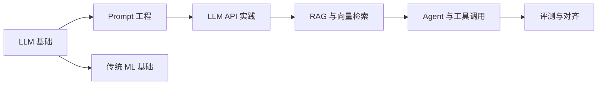

# MOC · AI

> AI / LLM / Prompt 工程 / 机器学习 学习索引。子主题在 [[10-Notes/95-AI-ML/MOC]]。

## 学习路径



## 推荐路线

1. **LLM 基础**：Transformer、注意力、上下文窗口、Token
2. **Prompt 工程**：角色、Few-shot、思维链、结构化输出
3. **API 实战**：OpenAI/Anthropic、Function Calling、流式响应
4. **RAG**：Embedding、向量库、检索增强、Chunk 策略
5. **Agent**：ReAct、工具调用、规划、记忆
6. **评测**：离线评测集、Online A/B、对齐与安全
7. **传统 ML（可选）**：回归、分类、树模型、模型评估

## 子主题入口

- [[10-Notes/95-AI-ML/MOC]]

## AI 相关原子笔记

```dataview
TABLE WITHOUT ID
  file.link AS "笔记",
  subtopic AS "子主题",
  confidence AS "掌握",
  next-review AS "下次复习"
FROM "10-Notes/95-AI-ML"
WHERE type = "atomic"
SORT confidence ASC, updated DESC
```

## 提示词提交规范（与 [07-Operations/知识库安全规范] 联动）

- 不发真实凭据、不发客户隐私、不发生产数据
- 长上下文用结构化 Prompt（任务 / 背景 / 输入 / 输出格式 / 约束）
- 复现问题时贴最小可运行示例
