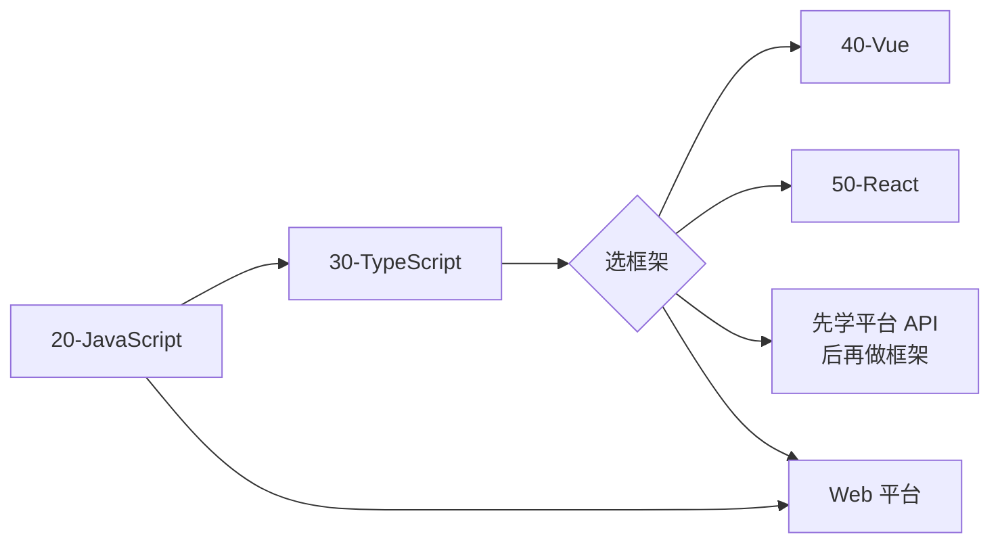

# MOC · 前端

> 这一页是「前端」主题的索引页（LYT 风格）。所有前端相关的原子笔记都集中挂在 [[10-Notes/20-JavaScript/MOC]]、[[10-Notes/30-TypeScript/MOC]]、[[10-Notes/40-Vue/MOC]]、[[10-Notes/50-React/MOC]] 下面。

## 学习路径



## 推荐路线

1. **JavaScript 基础** → 闭包、作用域、执行上下文、事件循环、Promise 与 async/await
2. **TypeScript** → 类型系统、泛型、类型守卫、声明文件
3. **框架选型**：Vue（渐进）或 React（生态）
4. **工程化**：Vite、构建、测试、E2E
5. **实战项目**：练手 SPA / SSR / 跨端

## 子主题入口

- [[10-Notes/20-JavaScript/MOC]]
- [[10-Notes/30-TypeScript/MOC]]
- [[10-Notes/40-Vue/MOC]]
- [[10-Notes/50-React/MOC]]

## 前端相关原子笔记

```dataview
TABLE WITHOUT ID
  file.link AS "笔记",
  subtopic AS "子主题",
  confidence AS "掌握",
  difficulty AS "难度",
  next-review AS "下次复习"
FROM "10-Notes"
WHERE topic = "javascript" OR topic = "typescript" OR topic = "vue" OR topic = "react"
SORT confidence ASC, updated DESC
```

## 复习优先级（掌握度低的先复习）

```dataview
TABLE WITHOUT ID
  file.link AS "笔记",
  confidence AS "掌握",
  next-review AS "下次复习"
FROM "10-Notes"
WHERE type = "atomic" AND startswith(file.folder, "10-Notes")
SORT confidence ASC, next-review ASC
LIMIT 10
```

## 关联资源

- [[30-Resources/books]] 下的前端书籍
- [[30-Resources/articles]] 下的前端文章
