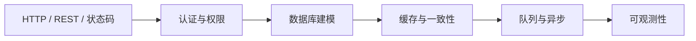

# MOC · 后端

> 后端主题的索引页。子主题含 PHP/Laravel、Python、Go，以及数据库（MySQL/Postgres/Redis）和消息队列。

## 学习路径



## 推荐路线

1. **HTTP 与 REST** → 请求/响应、状态码、幂等
2. **认证与权限** → Session、Token、Cookie、JWT、OAuth2
3. **数据库** → 范式与反范式、索引、事务、隔离级别
4. **缓存** → 缓存策略、一致性、击穿/雪崩/穿透
5. **异步与队列** → Job、Event、Outbox
6. **可观测性** → 日志、指标、链路追踪

## 子主题入口

- [[10-Notes/60-PHP-Laravel/MOC]]（当前项目主线：Laravel 13 + Filament 5）
- [[10-Notes/70-Python/MOC]]
- [[10-Notes/80-Go/MOC]]
- [[10-Notes/99-Cheat-Sheets/MOC]] 速查表（SQL、HTTP、Shell）

## 后端相关原子笔记

```dataview
TABLE WITHOUT ID
  file.link AS "笔记",
  subtopic AS "子主题",
  confidence AS "掌握",
  difficulty AS "难度"
FROM "10-Notes"
WHERE topic = "php" OR topic = "python" OR topic = "go" OR topic = "database"
SORT topic ASC, confidence ASC
```

## Laravel 13 当前主线

- 仓库根：`/Users/37user/Documents/dev-laraval`
- 后端：Laravel 13（PHP 8.5）
- 管理后台：Filament 5
- 已有项目复盘：[[20-Projects/laravel-dev-laraval/复盘]]
