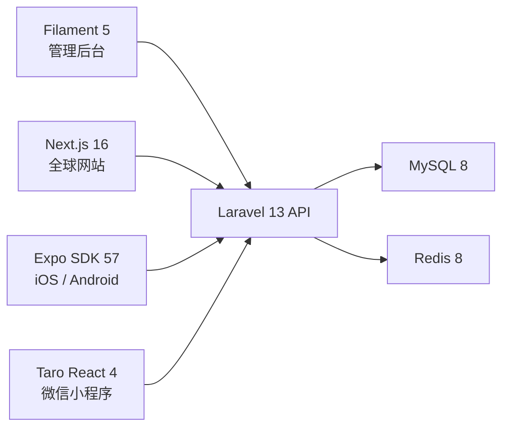

# 系统架构

## 边界

- Laravel API 是唯一业务事实来源。
- Filament 用于内部管理，不作为公共 API。
- Web 使用 Sanctum 第一方 Cookie 会话。
- APP 与小程序使用 Sanctum Token。
- 支付、地图、推送、登录、存储、邮件和短信通过服务接口隔离地区供应商。

代码仓库详细架构参见项目根目录 `docs/ARCHITECTURE.md`。
