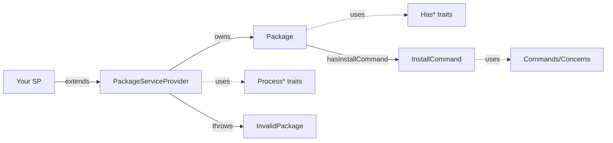

# Spatie Laravel Package Tools — 源码逐文件注解 / File-by-file source guide

> 版本：**1.93.1**。对 `src/` 下 **全部 34 个 PHP 文件** 做属性 / 方法级功能说明。  
> 概念与用法见姊妹篇：[[spatie-laravel-package-tools]]。  
> Companion to the architecture note; this page is the **code catalog**.

---

## 目录 / TOC

0. [总览与依赖图](#0-总览与依赖图)
1. [核心两类](#1-核心两类)
2. [Package · Has\* 声明 traits](#2-package--has-声明-traits)
3. [PackageServiceProvider · Process\* 执行 traits](#3-packageserviceprovider--process-执行-traits)
4. [InstallCommand 与 Concerns](#4-installcommand-与-concerns)
5. [Exceptions](#5-exceptions)
6. [调用关系速查](#6-调用关系速查)

---

## 0. 总览与依赖图

```text
src/
├── Package.php                          # 声明态 DTO（Fluent）
├── PackageServiceProvider.php           # 模板方法编排器
├── Exceptions/InvalidPackage.php
├── Commands/
│   ├── InstallCommand.php
│   └── Concerns/                        # Install 步骤拼装
└── Concerns/
    ├── Package/Has*.php                 # 只写状态
    └── PackageServiceProvider/Process*.php  # 只做副作用
```



| 文件数 | 角色 |
| --- | --- |
| 2 | 核心类 `Package` / `PackageServiceProvider` |
| 13 | `Has*` 声明 |
| 12 | `Process*` 执行 |
| 1+5 | `InstallCommand` + 其 Concerns |
| 1 | `InvalidPackage` |

---

## 1. 核心两类

### 1.1 `Package.php`

**职责 / Role**：包的「配置对象」。不访问容器、不 IO（除 `hasInstallCommand` 会 new 出 Command 实例并挂到 `$consoleCommands`）。所有 Fluent 方法 `return $this`。

| 成员 | 类型 | 功能说明 CN | Function EN |
| --- | --- | --- | --- |
| `use HasAssets` … `HasViewSharedData` | traits | 混入全部声明 API 与状态字段 | Mix in all declaration APIs |
| `$name` | `string` | 包全名；`configurePackage` 后必须非空 | Full package name; required after configure |
| `$basePath` | `string` | SP 推断出的路径锚点（通常 `…/src`） | Path anchor from SP location |
| `name($name)` | method | 赋值 `$name`，链式返回 | Sets name, fluent |
| `shortName()` | method | `Str::after($name, 'laravel-')`；无此前缀则返回原名 | Strip leading `laravel-` for tags/paths |
| `basePath($directory = null)` | method | 无参：返回根；有参：根 + `/` + 相对路径（去左斜杠） | Join optional relative path under base |
| `setBasePath($path)` | method | 由 Provider 在 `register` 开头注入 | Injected by provider at register start |

**注意**：`$name` / `$basePath` 未初始化默认值；在 `name()` / `setBasePath()` 前访问会 Error（正常流程不会）。

---

### 1.2 `PackageServiceProvider.php`

**职责 / Role**：抽象基类。定义 Laravel SP 生命周期模板，并把工作委托给 `Process*`。

#### 属性 / 抽象方法

| 成员 | 功能说明 CN | Function EN |
| --- | --- | --- |
| `use ProcessAssets` … `ProcessViewSharedData` | 混入全部执行逻辑 | Mix in all Process\* boot/register helpers |
| `protected Package $package` | 当前包配置实例 | Current package config object |
| `abstract configurePackage(Package $package): void` | **子类必须实现**：声明资源 | Subclass declares resources here |

#### `register()` — 逐步

| 步骤 | 代码 | 功能 |
| --- | --- | --- |
| 1 | `registeringPackage()` | 空钩子：merge 之前 |
| 2 | `$this->package = $this->newPackage()` | 创建 Package（可覆写换子类） |
| 3 | `$this->package->setBasePath($this->getPackageBaseDir())` | 锚定路径 |
| 4 | `$this->configurePackage($this->package)` | 调用你的声明 |
| 5 | `if (empty($this->package->name)) throw …` | 强制命名 |
| 6 | `$this->registerPackageConfigs()` | **唯一**在 register 的资源动作：merge config |
| 7 | `$this->packageRegistered()` | 空钩子：适合 bind/singleton |
| 8 | `return $this` | 链式友好（非 Laravel 必需） |

#### 钩子方法（默认空实现）

| 方法 | 调用时机 | 建议用途 |
| --- | --- | --- |
| `registeringPackage()` | register 最早 | 极少用；改 Package 创建前逻辑 |
| `packageRegistered()` | register 末尾（config 已 merge） | 容器绑定 |
| `bootingPackage()` | boot 最早（任何 Process 之前） | 需抢在 loadViews/routes 前的逻辑 |
| `packageBooted()` | boot 末尾 | 事件、Observer、菜单、Gate |
| `newPackage(): Package` | register 创建 Package 时 | 返回自定义 `Package` 子类 |

#### `boot()` — 流水线（顺序即优先级）

```text
bootingPackage
→ bootPackageAssets
→ bootPackageBladeComponents
→ bootPackageCommands
→ bootPackageConsoleCommands
→ bootPackageConfigs          // 仅 publishes
→ bootPackageInertia
→ bootPackageMigrations
→ bootPackageRoutes
→ bootPackageServiceProviders
→ bootPackageTranslations
→ bootPackageViews
→ bootPackageViewComposers
→ bootPackageViewSharedData
→ packageBooted
```

每步返回 `$this`，形成链式调用；任一步内部可早退（`return $this`）。

#### 辅助方法

| 方法 | 功能说明 CN | Function EN |
| --- | --- | --- |
| `getPackageBaseDir()` | `ReflectionClass` 取本类文件目录；若以 `…/Providers` 结尾则再 `dirname` 一级，使 `src/Providers/X.php` 与 `src/X.php` 的 base 都落在 `src/` | Resolve src-ish base; unwrap `Providers/` folder |
| `packageView(?string $namespace)` | `$namespace === null` → `shortName()`；否则 → `$package->viewNamespace`。供 Views/Inertia 算 publish 目录名与 tag | Resolve view-related namespace for tags/paths |

---

## 2. Package · Has\* 声明 traits

约定：每个 trait **只改 `Package` 上的公共属性**，不碰 Laravel。

### 2.1 `HasAssets.php`

| 成员 | 功能 |
| --- | --- |
| `bool $hasAssets = false` | 是否声明静态资源 |
| `hasAssets()` | 置 `true`；期望包内 `resources/dist/` |

→ 由 `ProcessAssets` 在 console 注册 publish。

### 2.2 `HasBladeComponents.php`

| 成员 | 功能 |
| --- | --- |
| `array $viewComponents = []` | 映射：`[ComponentClass => prefix]` |
| `hasViewComponent($prefix, $viewComponentName)` | 注册单个组件类与前缀（如 `spatie` + `Alert::class` → `<x-spatie-alert>`） |
| `hasViewComponents($prefix, ...$names)` | 同前缀批量注册 |

→ `ProcessBladeComponents`：`loadViewComponentsAs` + publish `src/Components`。

### 2.3 `HasCommands.php`

| 成员 | 功能 |
| --- | --- |
| `array $commands = []` | 始终注册的 Artisan 命令类 |
| `array $consoleCommands = []` | 仅 console 注册（含 InstallCommand） |
| `hasCommand($class)` / `hasCommands(...$classes)` | 追加到 `$commands`；`hasCommands` 支持嵌套数组 `flatten` |
| `hasConsoleCommand($class)` / `hasConsoleCommands(...$)` | 追加到 `$consoleCommands` |

### 2.4 `HasConfigs.php`

| 成员 | 功能 |
| --- | --- |
| `array $configFileNames = []` | 相对 `config/` 的文件名（无 `.php`） |
| `hasConfigFile($configFileName = null)` | `null` → 用 `shortName()`；字符串或数组；**整体赋值**（非 merge 追加——多次调用会覆盖上次列表） |

⚠️ **多次 `hasConfigFile` 会覆盖而非追加**。多文件请一次传入数组。

### 2.5 `HasInertia.php`

| 成员 | 功能 |
| --- | --- |
| `bool $hasInertiaComponents = false` | 是否声明 Inertia 页 |
| `hasInertiaComponents(?string $namespace = null)` | 置 true；可选写入 `$viewNamespace`（与 Views 共用字段） |

期望目录：`resources/js/Pages`。

### 2.6 `HasInstallCommand.php`

| 成员 | 功能 |
| --- | --- |
| `hasInstallCommand($callable)` | `new InstallCommand($this)` → 把 `$this`（Package）注入命令 → 执行闭包配置命令 → **push 到 `$consoleCommands`** |

副作用：在 `configurePackage` 阶段就实例化 Command（此时 Package 应已 `name()`）。

### 2.7 `HasMigrations.php`

| 成员 | 功能 |
| --- | --- |
| `bool $runsMigrations = false` | true → boot 时 `loadMigrationsFrom` |
| `bool $discoversMigrations = false` | true → 扫描目录，**忽略** `$migrationFileNames` |
| `?string $migrationsPath = null` | discover 相对包根的路径 |
| `runsMigrations($bool = true)` | 开关自动加载 |
| `hasMigration($fileName)` | 追加单个文件名（无扩展名） |
| `hasMigrations(...$names)` | 合并多个；支持 flatten |
| `discoversMigrations($on = true, $path = '/database/migrations')` | 开扫描并设路径 |

### 2.8 `HasRoutes.php`

| 成员 | 功能 |
| --- | --- |
| `array $routeFileNames = []` | 如 `web`、`api` → 对应 `routes/web.php` |
| `hasRoute($name)` / `hasRoutes(...$)` | 追加；`hasRoutes` 可 flatten |

无 publish；仅 load。

### 2.9 `HasServiceProviders.php`

| 成员 | 功能 |
| --- | --- |
| `?string $publishableProviderName = null` | stub 基名，如 `MyProvider` |
| `publishesServiceProvider($providerName)` | 设置名称；文件期望在 `resources/stubs/{Name}.php.stub` |

### 2.10 `HasTranslations.php`

| 成员 | 功能 |
| --- | --- |
| `bool $hasTranslations = false` | 开关 |
| `hasTranslations()` | 期望 `resources/lang/`（含 php 与 json） |

### 2.11 `HasViewComposers.php`

| 成员 | 功能 |
| --- | --- |
| `array $viewComposers = []` | `[viewName => composerClass\|Closure]` |
| `hasViewComposer($view, $viewComposer)` | `$view` 可为字符串或数组；对每个 viewName 写入同一 composer |

`'*'` 表示所有视图。

### 2.12 `HasViewSharedData.php`

| 成员 | 功能 |
| --- | --- |
| `array $sharedViewData = []` | `[varName => value]` |
| `sharesDataWithAllViews($name, $value)` | 等价日后 `View::share` |

### 2.13 `HasViews.php`

| 成员 | 功能 |
| --- | --- |
| `bool $hasViews = false` | 开关 |
| `?string $viewNamespace = null` | 自定义命名空间；null 则用 shortName |
| `hasViews(?string $namespace = null)` | 开 views；可选设 namespace |
| `viewNamespace(): string` | 返回 `$viewNamespace ?? shortName()` |

期望：`resources/views`。

---

## 3. PackageServiceProvider · Process\* 执行 traits

约定：方法名 `bootPackage*` / `registerPackage*`；早退返回 `$this`；publish 多包在 `runningInConsole()`。

### 3.1 `ProcessConfigs.php`

| 方法 | 阶段 | 功能说明 |
| --- | --- | --- |
| `registerPackageConfigs()` | **register** | 无 config 列表则返回。对每个名字：拼 `basePath/../config/{path}.php`；**仅当 .php 存在**才 `mergeConfigFrom`；key = 路径中 `/` `\` → `.` |
| `bootPackageConfigs()` | boot / console | 找 `.php` 或 `.php.stub`；`publishes` 到 `config_path("{path}.php")`；tag = `{shortName}-config` |
| `normalizeConfigKey($name)` | 私有 | 路径分隔符 → `.`（config 键） |
| `normalizeConfigPath($name)` | 私有 | 路径分隔符 → `DIRECTORY_SEPARATOR`（文件系统） |

**细节**：register 不处理 stub；只有真正的 `.php` 参与 merge。boot 里有一行 `$vendorConfig ;` 空语句后紧跟 if 赋值——等价于在条件里给 `$vendorConfig` 赋值，无额外逻辑。

### 3.2 `ProcessMigrations.php`

| 方法 | 功能说明 |
| --- | --- |
| `bootPackageMigrations()` | 若 `discoversMigrations` → `discoverPackageMigrations()` 并 return；否则遍历 `$migrationFileNames` |
| （显式分支） | 路径：`basePath/../database/migrations/{name}.php`，不存在则试 `.php.stub`。console：`publishes` 到 `generateMigrationName(...)`，tag `{short}-migrations`。若 `runsMigrations`：`loadMigrationsFrom($vendorMigration)` |
| `discoverPackageMigrations()` | `Filesystem::files(basePath/../{migrationsPath})`。每个文件 console 时 publish；`.php`/`.php.stub` 才 load；非迁移扩展只 publish 到同名路径 |
| `generateMigrationName($fileName, $now)` | 剥时间戳前缀；若 app `database/migrations` 已有同后缀文件则复用路径；否则 `{Y_m_d_His}_{snake}.php`。循环里 `$now->addSecond()` 避免同秒冲突 |
| `stripTimestampPrefix($filename)` | 正则去掉 `^\d{4}_\d{2}_\d{2}_\d{6}_` |

**关键分支**：`discoversMigrations === true` 时 **完全不读** `$migrationFileNames`。

### 3.3 `ProcessViews.php`

| 方法 | 功能 |
| --- | --- |
| `bootPackageViews()` | `$hasViews` 为 false 则退。路径 `resources/views`（`realpath` 兜底）。`loadViewsFrom($vendorViews, viewNamespace())`。console：`publishes` → `resources/views/vendor/{packageView(ns)}`，tag `{packageView}-views` |

`packageView($namespace)`：自定义 ns 时 tag/目录用 `$viewNamespace`，否则 shortName。

### 3.4 `ProcessRoutes.php`

| 方法 | 功能 |
| --- | --- |
| `bootPackageRoutes()` | 空列表则退。对每个名字：`loadRoutesFrom(basePath/../routes/{name}.php)` |

无 console 判断、无 publish。文件不存在会在 load 时由 Laravel 报错。

### 3.5 `ProcessCommands.php`

| 方法 | 功能 |
| --- | --- |
| `bootPackageCommands()` | 非空则 `$this->commands($package->commands)`（Web/CLI 都注册） |
| `bootPackageConsoleCommands()` | 非空 **且** `runningInConsole()` 才 `$this->commands($consoleCommands)` |

### 3.6 `ProcessAssets.php`

| 方法 | 功能 |
| --- | --- |
| `bootPackageAssets()` | 需 `$hasAssets` 且 console。`publishes`：`resources/dist` → `public/vendor/{shortName}`，tag `{short}-assets` |

**不**自动拷贝到 public；仅注册 publish 标签。

### 3.7 `ProcessBladeComponents.php`

| 方法 | 功能 |
| --- | --- |
| `bootPackageBladeComponents()` | 空则退。对每个 `class => prefix`：`loadViewComponentsAs($prefix, [$class])`。console：publish `basePath/Components` → `app/View/Components/vendor/{shortName}`，tag **`{name}-components`**（用完整 `name`，不是 shortName） |

### 3.8 `ProcessTranslations.php`

| 方法 | 功能 |
| --- | --- |
| `bootPackageTranslations()` | 需 `$hasTranslations`。`loadTranslationsFrom(resources/lang, shortName)`；`loadJsonTranslationsFrom` vendor 与 app `lang/vendor/{short}`。console：publish 到 `lang_path(...)` 或旧版 `resource_path('lang/vendor/...')`，tag `{short}-translations` |

### 3.9 `ProcessInertia.php`

| 方法 | 功能 |
| --- | --- |
| `bootPackageInertia()` | 需 `$hasInertiaComponents`。把 namespace/shortName 变成 Studly 去连字符作目录名。console：publish `resources/js/Pages` → `resources/js/Pages/{Studly}`，tag `{packageView}-inertia-components` |

不注册 Vite/Inertia 中间件；只 publish 源文件。

### 3.10 `ProcessServiceProviders.php`

| 方法 | 功能 |
| --- | --- |
| `bootPackageServiceProviders()` | 需 `$publishableProviderName` 且 console。publish stub：`resources/stubs/{Name}.php.stub` → `app/Providers/{Name}.php`，tag `{short}-provider` |

### 3.11 `ProcessViewComposers.php`

| 方法 | 功能 |
| --- | --- |
| `bootPackageViewComposers()` | 遍历 `$viewComposers`，`View::composer($viewName, $composer)` |

### 3.12 `ProcessViewSharedData.php`

| 方法 | 功能 |
| --- | --- |
| `bootPackageViewSharedData()` | 遍历 `$sharedViewData`，`View::share($name, $value)` |

---

## 4. InstallCommand 与 Concerns

### 4.1 `Commands/InstallCommand.php`

| 成员 | 功能 |
| --- | --- |
| `use` 五个 Concerns | 拼装安装步骤 |
| `__construct(Package $package)` | `signature = {shortName}:install`；`description = Install {name}`；`hidden = true`（不出现在 `artisan list` 默认列表）；再 `parent::__construct()` |
| `handle()` | 固定顺序执行下方 process\*，最后 `info` 成功文案 |

**handle 顺序**：

1. `processStartWith` — 用户闭包  
2. `processPublishes` — 静默 `vendor:publish`  
3. `processAskToRunMigrations` — 确认后 `migrate`  
4. `processCopyServiceProviderInApp` — publish stub + 改应用 providers 列表  
5. `processStarRepo` — 确认后用系统命令打开 GitHub  
6. `processEndWith` — 用户闭包  

### 4.2 `PublishesResources.php`

| 成员 | 功能 |
| --- | --- |
| `array $publishes = []` | 待发布的 **短 tag 后缀** 列表（如 `config`，不是全名） |
| `publish(...$tag)` | 合并后缀到列表 |
| `publishAssets()` | → `publish('assets')` |
| `publishConfigFile()` | → `publish('config')` |
| `publishInertiaComponents()` | → `publish('inertia-components')` |
| `publishMigrations()` | → `publish('migrations')` |
| `processPublishes()` | 对每个后缀：`comment` + `callSilently('vendor:publish', ['--tag' => "{short}-{tag}"])` |

### 4.3 `AskToRunMigrations.php`

| 成员 | 功能 |
| --- | --- |
| `bool $askToRunMigrations` | 开关 |
| `askToRunMigrations()` | 打开开关 |
| `processAskToRunMigrations()` | 若开：`confirm` 后 `$this->call('migrate')` |

### 4.4 `AskToStarRepoOnGitHub.php`

| 成员 | 功能 |
| --- | --- |
| `?string $starRepo` | `vendor/repo` |
| `bool $defaultStarAnswer` | confirm 默认值 |
| `askToStarRepoOnGitHub($vendorSlashRepo, $defaultAnswer = false)` | 记录仓库与默认答案（注意默认参数是 **false**，与属性初始 `true` 不同——以方法参数为准） |
| `processStarRepo()` | confirm 后按 OS：`open` / `start` / `xdg-open` 打开 GitHub URL |

### 4.5 `SupportsStartWithEndWith.php`

| 成员 | 功能 |
| --- | --- |
| `?Closure $startWith` / `$endWith` | 可选回调 |
| `startWith($callable)` / `endWith($callable)` | 存储 |
| `processStartWith()` / `processEndWith()` | 若有则 `($closure)($this)`，`$this` 为 InstallCommand |

### 4.6 `SupportsServiceProviderInApp.php`

| 成员 | 功能 |
| --- | --- |
| `bool $copyServiceProviderInApp` | 开关 |
| `copyAndRegisterServiceProviderInApp()` | 打开开关 |
| `processCopyServiceProviderInApp()` | 若开：调用 `copyServiceProviderInApp()` |
| `copyServiceProviderInApp()` | 无 `publishableProviderName` 则退。① `vendor:publish --tag={short}-provider` ② 读 `bootstrap/providers.php`（L11+）或 `config/app.php` ③ 若类已注册则退 ④ 在 `AppServiceProvider`/`BroadcastServiceProvider` 行后插入新 Provider::class ⑤ 把拷贝文件里的 `namespace App\Providers` 换成应用命名空间 |

**兼容**：`intval(app()->version()) < 11` 或没有 `bootstrap/providers.php` 时走旧 `config/app.php`。

---

## 5. Exceptions

### `Exceptions/InvalidPackage.php`

| 成员 | 功能 |
| --- | --- |
| `extends Exception` | 包配置非法 |
| `nameIsRequired(): self` | 静态工厂；文案提示用 `$package->name("yourName")` |

唯一抛点：`PackageServiceProvider::register()` 在 `configurePackage` 之后发现空 name。

---

## 6. 调用关系速查

### 6.1 声明 → 执行 → Laravel API

| Has\* 方法 | 状态字段 | Process 方法 | Laravel / 副作用 |
| --- | --- | --- | --- |
| `name` | `$name` | （校验） | throw if empty |
| `hasConfigFile` | `$configFileNames` | `registerPackageConfigs` / `bootPackageConfigs` | `mergeConfigFrom` / `publishes` |
| `hasMigration(s)` / `discoversMigrations` / `runsMigrations` | 见 HasMigrations | `bootPackageMigrations` | `publishes` / `loadMigrationsFrom` |
| `hasViews` | `$hasViews`, `$viewNamespace` | `bootPackageViews` | `loadViewsFrom` / `publishes` |
| `hasRoute(s)` | `$routeFileNames` | `bootPackageRoutes` | `loadRoutesFrom` |
| `hasCommand(s)` | `$commands` | `bootPackageCommands` | `$this->commands` |
| `hasConsoleCommand(s)` / `hasInstallCommand` | `$consoleCommands` | `bootPackageConsoleCommands` | `$this->commands` (console) |
| `hasAssets` | `$hasAssets` | `bootPackageAssets` | `publishes` |
| `hasTranslations` | `$hasTranslations` | `bootPackageTranslations` | `loadTranslationsFrom` / JSON / `publishes` |
| `hasViewComponent(s)` | `$viewComponents` | `bootPackageBladeComponents` | `loadViewComponentsAs` / `publishes` |
| `hasViewComposer` | `$viewComposers` | `bootPackageViewComposers` | `View::composer` |
| `sharesDataWithAllViews` | `$sharedViewData` | `bootPackageViewSharedData` | `View::share` |
| `hasInertiaComponents` | `$hasInertiaComponents` | `bootPackageInertia` | `publishes` only |
| `publishesServiceProvider` | `$publishableProviderName` | `bootPackageServiceProviders` | `publishes` stub |

### 6.2 路径拼装公式（相对 basePath）

| 资源 | 相对路径 |
| --- | --- |
| Config | `/../config/{file}.php` |
| Migrations | `/../database/migrations/{file}.php[.stub]` |
| Views | `/../resources/views` |
| Lang | `/../resources/lang` |
| Assets | `/../resources/dist` |
| Inertia | `/../resources/js/Pages` |
| Routes | `/../routes/{file}.php` |
| Blade Components 源 | `/Components`（在 basePath 下，即通常 `src/Components`） |
| Stub Provider | `/../resources/stubs/{Name}.php.stub` |

### 6.3 English — How to read the code

1. **`Package` + `Has*`** = data only (what the package has).  
2. **`PackageServiceProvider` + `Process*`** = side effects (when/how Laravel is called).  
3. **`InstallCommand` + Concerns** = CLI wizard over existing publish tags.  
4. **`InvalidPackage`** = fail fast if `name()` was forgotten.

阅读源码顺序建议：`PackageServiceProvider` → `Package` → `ProcessConfigs` + `ProcessMigrations` → 其余 `Process*` → `InstallCommand` → Concerns。

---

## 关联 / Related

- [[spatie-laravel-package-tools]] — 架构 / 流程 / 优缺点 / 用法 / 扩展  
- [[模板方法模式-导出骨架与ServiceProvider]]  
- 磁盘源码：`vendor/spatie/laravel-package-tools/src/`

---

## 修订记录

| 日期 | 变更 |
| --- | --- |
| 2026-09-24 | 初版：34 个 PHP 文件属性/方法级注解 |
