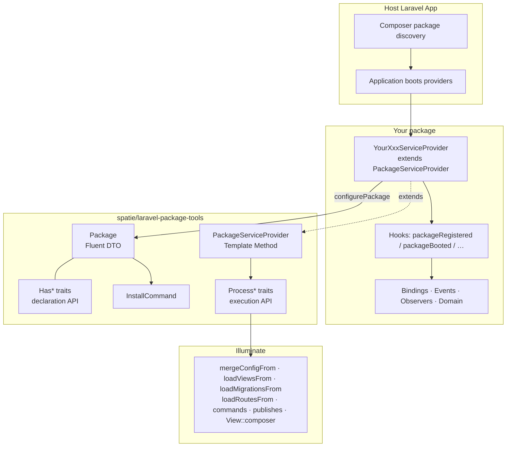
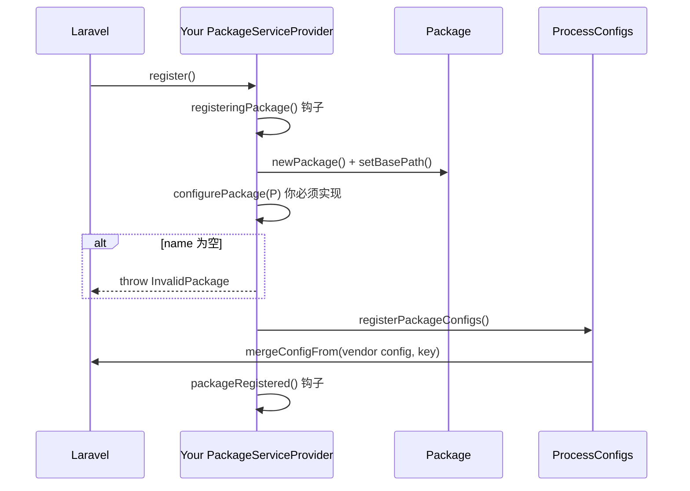
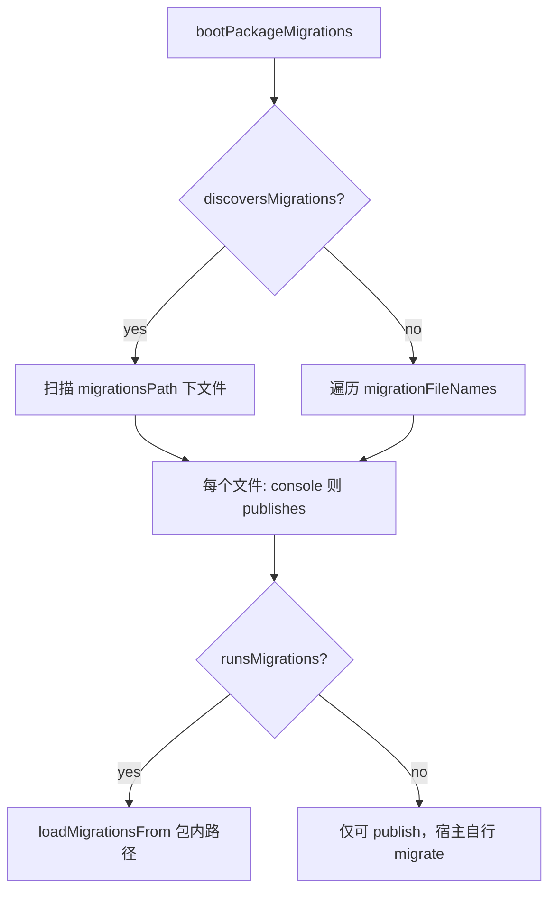

# Spatie Laravel Package Tools — 深度解读 / Deep Dive

> 锁定版本：**1.93.1**（`illuminate/contracts` `^10|^11|^12|^13`）。  
> 本仓库 gz168 约 80+ 模块 Provider 基于它。  
> 阅读建议：先读「架构 → 流程 → 核心逻辑」，再按需跳「用法 / 扩展 / 优缺点」。  
> **逐文件 / 逐方法源码注解**（全部 34 个 PHP）：[[spatie-laravel-package-tools-源码注解]]

---

## 目录 / TOC

1. [定位与一句话](#1-定位与一句话--positioning)
2. [架构](#2-架构--architecture)
3. [流程](#3-流程--runtime-flow)
4. [核心逻辑](#4-核心逻辑--core-logic)
5. [优缺点与边界](#5-优缺点与边界--pros-cons-boundaries)
6. [如何使用](#6-如何使用--how-to-use)
7. [如何扩展](#7-如何扩展--how-to-extend)
8. [本仓库落地对照](#8-本仓库落地对照--gz168-patterns)
9. [源码地图与排错](#9-源码地图与排错--source-map--debugging)
10. [Glossary](#10-glossary)

> 需要「每个类 / trait / 方法干什么」→ 打开 [[spatie-laravel-package-tools-源码注解]]。

---

## 1. 定位与一句话 / Positioning

### 中文

**它是什么**：面向 Laravel 包作者的「ServiceProvider 资源注册脚手架」。你用 Fluent API **声明**包有哪些 config / migration / view / route / command……父类按固定模板在 `register`/`boot` 里调用 Laravel 原生 API（`mergeConfigFrom`、`loadMigrationsFrom`、`publishes` 等）。

**它不是什么**：

- 不是模块总线 / 插件系统（不做依赖图、权限、热插拔）
- 不是 Filament Plugin / Livewire 组件注册器
- 不替代 Composer autoload、也不替代应用级架构设计

**一句话**：声明式资源清单 + 模板方法执行器。

### English

**What it is**: A ServiceProvider scaffolding library. You declare resources via a Fluent `Package` object; `PackageServiceProvider` executes Laravel’s native registration APIs in a fixed Template Method.

**What it is not**: A module bus, plugin runtime, Filament plugin API, or substitute for Composer / domain architecture.

**One-liner**: Declarative resource inventory + Template Method executor.

---

## 2. 架构 / Architecture

### 2.1 分层模型 / Layered model



| 层 Layer | 组件 | 职责 |
| --- | --- | --- |
| 声明层 Declaration | `Package` + `Has*` | 只存状态：名字、路径、文件列表、布尔开关 |
| 编排层 Orchestration | `PackageServiceProvider` | 固定 `register`/`boot` 顺序；调用钩子 |
| 执行层 Execution | `Process*` | 把状态翻译成 Laravel API；处理路径、tag、console 守卫 |
| 体验层 DX | `InstallCommand` + Concerns | 一键 publish / migrate / 拷贝 stub Provider |
| 业务层 Domain | 你的子类钩子 | 容器绑定、事件、策略——**包工具不管这里** |

### 2.2 两类 Trait 的对称设计 / Dual trait symmetry

Spatie 把「说什么」和「做什么」拆开：

| 声明 `Concerns/Package/HasX.php` | 执行 `Concerns/PackageServiceProvider/ProcessX.php` |
| --- | --- |
| `HasConfigs` → `$configFileNames` | `ProcessConfigs` → merge + publish |
| `HasMigrations` → flags + filenames | `ProcessMigrations` → discover / publish / load |
| `HasViews` → `$hasViews`, `$viewNamespace` | `ProcessViews` → loadViewsFrom + publish |
| `HasRoutes` → `$routeFileNames` | `ProcessRoutes` → loadRoutesFrom |
| `HasCommands` → `$commands` / `$consoleCommands` | `ProcessCommands` → `$this->commands()` |
| `HasAssets` / `HasTranslations` / `HasInertia` / … | 对应 `Process*` |

**设计意图**：`Package` 保持纯数据 + 链式 setter；所有副作用集中在 Provider 的 Process trait，便于测试与阅读。

**Design intent**: Keep `Package` as a fluent data bag; confine side effects to `Process*` on the provider.

### 2.3 路径根：`basePath` 约定 / Path root convention

```text
getPackageBaseDir()
  = dirname(ReflectionClass(YourSP)->getFileName())
  若目录以 .../Providers 结尾 → dirname 再上一级

典型：
  src/Providers/FooServiceProvider.php  → basePath = src/
  src/FooServiceProvider.php            → basePath = src/

之后几乎所有资源都是：
  $this->package->basePath('/../config/...')
  $this->package->basePath('/../database/migrations/...')
  $this->package->basePath('/../resources/views')
  $this->package->basePath('/../routes/web.php')
```

即：**以 SP 所在逻辑目录为锚点，跳到包根**。这就是官方 skeleton 强制 `src/` + 包根 `config/` 的原因。若把 SP 放在奇怪路径又不覆写 `getPackageBaseDir()` / `setBasePath()`，资源会全部找不到（静默 skip 或 load 失败）。

### 2.4 命名：`name` vs `shortName` / Naming

```php
$package->name('laravel-cool-package');
$package->shortName(); // 'cool-package'  — Str::after($name, 'laravel-')
```

| 用途 | 通常用 |
| --- | --- |
| 包标识、部分组件 publish tag | `name` |
| config 默认文件名、多数 publish tag、翻译 namespace、assets 目标目录 | `shortName` |
| view 默认 namespace | `shortName`（可被 `hasViews($ns)` 覆盖） |

**坑**：Blade 组件 publish tag 在源码里用的是 `{$package->name}-components`（完整 name），与 README 写的 shortName 不完全一致——以源码为准。

### 2.5 与 Laravel ServiceProvider 生命周期的关系 / Relation to Laravel SP

```text
Laravel Application
  ├── register() 所有 Provider          ← 此时其他 Provider 的 boot 尚未跑
  │     └── PackageServiceProvider::register
  │           ├── configurePackage（填 Package）
  │           ├── mergeConfigFrom          ← 唯一在 register 的资源动作
  │           └── packageRegistered 钩子
  └── boot() 所有 Provider
        └── PackageServiceProvider::boot
              ├── 大量 load* / publishes / commands
              └── packageBooted 钩子
```

**为何 config 单独放 register？**  
Laravel 约定：配置应在其他服务 boot 前可用。`mergeConfigFrom` 必须在 `register`；`publishes` 只在 console 有意义，可放 `boot`。

---

## 3. 流程 / Runtime flow

### 3.1 `register()` 逐步 / Step-by-step register



要点：

1. **`configurePackage` 在 merge 之前执行** —— 声明必须先完成。  
2. **只有 config 在 register 合并**；migration/view/route 全部在 boot。  
3. stub 配置（仅 `.php.stub`、没有 `.php`）**不会 merge**，只在 publish 时可用。

### 3.2 `boot()` 固定流水线 / Fixed boot pipeline

源码顺序（不可配置、不可插队，除非你覆写整个 `boot()`）：

```text
bootingPackage()                          // 钩子：boot 最前
→ bootPackageAssets()                     // console: publish dist
→ bootPackageBladeComponents()            // loadViewComponentsAs + publish
→ bootPackageCommands()                   // 始终注册 hasCommand*
→ bootPackageConsoleCommands()            // 仅 console：hasConsoleCommand* + InstallCommand
→ bootPackageConfigs()                    // console: publishes config
→ bootPackageInertia()                    // console: publish js/Pages
→ bootPackageMigrations()                 // publish ± loadMigrationsFrom
→ bootPackageRoutes()                     // loadRoutesFrom
→ bootPackageServiceProviders()           // console: publish stub provider
→ bootPackageTranslations()               // load + publish lang
→ bootPackageViews()                      // loadViewsFrom + publish
→ bootPackageViewComposers()              // View::composer
→ bootPackageViewSharedData()             // View::share
→ packageBooted()                         // 钩子：boot 最后
```

### 3.3 Console 守卫逻辑 / Console guards

多数 **publish** 动作包在 `if ($this->app->runningInConsole())` 里：

| 动作 | Web 请求 | Artisan / 队列 worker（视环境） |
| --- | --- | --- |
| `mergeConfigFrom` / `loadViewsFrom` / `loadRoutesFrom` / `loadMigrationsFrom` / `hasCommand` | ✅ | ✅ |
| `publishes(...)`（config/assets/migrations/…） | ❌ 跳过注册 | ✅ |
| `hasConsoleCommand` / `InstallCommand` | ❌ | ✅ |

含义：HTTP 进程不挂一堆无用的 publish 路径；但 **load 类动作在 Web 也必须发生**（否则线上视图/路由不可用）。

### 3.4 Install 命令流程 / Install command flow

```text
php artisan {shortName}:install
  → processStartWith()
  → processPublishes()          // 对每个 tag 调 vendor:publish --tag={short}-{tag}
  → processAskToRunMigrations() // 交互确认后 migrate
  → processCopyServiceProviderInApp()  // publish stub + 改 bootstrap/providers.php 或 config/app.php
  → processStarRepo()
  → processEndWith()
```

Laravel 11+ 优先写 `bootstrap/providers.php`；更老版本写 `config/app.php` 的 providers 数组。内部模块（gz168）通常 **不需要** install 命令。

### 3.5 English summary — Flow

1. Discovery loads your SP.  
2. `register`: build `Package` → validate name → merge configs → `packageRegistered`.  
3. `boot`: fixed Process* chain (publish mostly console-only) → `packageBooted`.  
4. Optional `{short}:install` orchestrates vendor:publish + migrate + stub provider copy.

---

## 4. 核心逻辑 / Core logic

### 4.1 Config：merge vs publish

```text
registerPackageConfigs:
  foreach configFileNames:
    path = basePath/../config/{normalized}.php
    if file missing → continue（静默）
    mergeConfigFrom(path, key)   // key: foo/bar → foo.bar

bootPackageConfigs (console only):
  foreach:
    找 .php 或 .php.stub
    publishes → config_path("{path}.php")
    tag = "{shortName}-config"
```

**逻辑要点**：

- 宿主若已 publish 并改过 config，Laravel 的 merge 语义保证 **应用已加载值优先**，包默认值补缺。  
- 多文件：`hasConfigFile(['a', 'b'])`。  
- 子目录配置文件合法，key 用点分。

### 4.2 Migrations：三条路径



| 能力 | API | 行为 |
| --- | --- | --- |
| 显式列表 | `hasMigration` / `hasMigrations` | 按文件名找 `.php` 或 `.php.stub` |
| 目录发现 | `discoversMigrations($on, $path)` | `Filesystem::files`；**此时忽略显式列表** |
| 自动执行 | `runsMigrations()` | `loadMigrationsFrom` —— `php artisan migrate` 直接跑包内文件 |
| 仅分发 | 不调用 `runsMigrations` | 用户 `vendor:publish --tag=*-migrations` 后再 migrate |

**publish 文件名生成**（`generateMigrationName`）：

1. 去掉已有 `YYYY_MM_DD_HHMMSS_` 前缀  
2. 若 `database/migrations` 里已有「同后缀」文件 → 返回已有路径（防重复 publish）  
3. 否则用「当前时间 +1 秒步进」生成新时间戳前缀  

**开源包常见组合**：`hasMigrations` + **不** `runsMigrations`（让用户控制迁移时机）。  
**内部模块常见组合**（本仓）：`discoversMigrations` + `runsMigrations`（模块安装即参与 migrate）。

### 4.3 Views / Translations / Routes

**Views**

- `loadViewsFrom(resources/views, namespace)`  
- namespace 默认 `shortName`，可 `hasViews('gz168-inventory')`  
- 调用：`view('gz168-inventory::folder.page')`  
- publish tag：`{namespace}-views`（自定义 namespace 时 tag 也变）

**Translations**

- PHP：`loadTranslationsFrom` → `trans('{short}::file.key')`  
- JSON：同时从 vendor 与 app 的 `lang/vendor/{short}` 加载  
- publish → `lang_path("vendor/{short}")`

**Routes**

- 仅 `loadRoutesFrom`；**没有**自动 publish 路由文件  
- 路由文件在加载时立即注册到 Router —— 注意中间件分组要在路由文件内自行 `Route::middleware(...)`

### 4.4 Commands 二分

| API | 注册时机 | 典型用途 |
| --- | --- | --- |
| `hasCommand` / `hasCommands` | 每次 boot | 业务命令（也可能被调度/调用） |
| `hasConsoleCommand(s)` | 仅 console | 纯 CLI、InstallCommand |

`hasInstallCommand($closure)`：在 `configurePackage` 里 **立即** `new InstallCommand($this)`，配置闭包，再推进 `$consoleCommands`。签名强制为 `{shortName}:install`，且 `hidden = true`。

### 4.5 Assets / Inertia / Publishable Provider

| 资源 | 包内路径 | 应用目标 | Tag |
| --- | --- | --- | --- |
| Assets | `resources/dist` | `public/vendor/{short}` | `{short}-assets` |
| Inertia | `resources/js/Pages` | `resources/js/Pages/{StudlyName}` | `{ns}-inertia-components` |
| Stub Provider | `resources/stubs/{Name}.php.stub` | `app/Providers/{Name}.php` | `{short}-provider` |

Inertia **不会**自动注册到 Vite；publish 后需宿主 JS 构建链路识别。Assets 同理，通常还要在布局里引用 `vendor/{short}/...`。

### 4.6 English summary — Logic

- Config merges early; publishes late (console).  
- Migrations: explicit list XOR directory discovery; `runsMigrations` toggles auto-load.  
- Views/translations/routes load at runtime; routes are not publishable by default.  
- Commands split by console-only vs always-on.  
- InstallCommand is sugar over `vendor:publish` tags derived from `shortName`.

---

## 5. 优缺点与边界 / Pros, cons, boundaries

### 5.1 优点 / Pros

| 优点 | 说明 |
| --- | --- |
| **样板归零** | 一个 `configurePackage` 替代几十行重复 SP 代码 |
| **约定统一** | 目录结构、publish tag 命名跨包一致，团队可扫读 |
| **模板方法清晰** | 钩子位置固定，新人知道绑定写哪、事件写哪 |
| **与 Laravel 同构** | 底层仍是官方 API，无「另起炉灶」的运行时 |
| **开源 DX** | InstallCommand、stub provider、ask to star 等开箱 |
| **轻依赖** | 仅依赖 `illuminate/contracts`，兼容 L10–L13 |
| **可组合** | Trait 对称，源码短（核心约数百行），易读 |

### 5.2 缺点 / Cons

| 缺点 | 说明 |
| --- | --- |
| **约定强、适配弱** | 偏离 skeleton 目录就要自己算 `../` 或覆写路径 |
| **boot 顺序写死** | 不能声明「先 route 后 migration」之类；复杂顺序靠钩子硬插 |
| **静默失败** | config/migration 文件缺失时常 `continue`，不易察觉 |
| **能力边界固定** | 无「条件注册」「按环境禁用某资源」「延迟 load」一等公民 API |
| **discover XOR 列表** | 开 discover 后显式 `hasMigrations` 不参与——易误判 |
| **tag 命名小不一致** | 个别资源用 `name` 而非 `shortName`（Blade components） |
| **不解决模块通信** | 仍需自建 Contract / Event / 服务容器约定 |
| **过度抽象风险** | 极简包硬上全套 Fluent，可读性不一定更好 |

### 5.3 适合 / 不适合

| 适合 ✅ | 不适合 ❌ |
| --- | --- |
| Composer 可发布包 | 单文件微包、只 register 一个 singleton |
| 多模块单体（如 gz168）统一 Provider 风格 | 需要动态启用/禁用模块资源的复杂插件平台（需自建层） |
| 希望 publish tag / install 体验标准化 | 路由必须按租户动态加载等高度定制场景（可配合钩子，但收益下降） |
| 团队已熟悉 Spatie skeleton | 目录结构被历史代码绑死且不愿调整 |

### 5.4 English — Trade-offs

**Pros**: less boilerplate, consistent conventions, thin wrapper over Laravel APIs, good OSS install UX.  
**Cons**: opinionated paths, fixed boot order, silent skips, no first-class conditional loading, does not design your module boundaries.

---

## 6. 如何使用 / How to use

### 6.1 安装

```bash
composer require spatie/laravel-package-tools
```

新包建议从 [package-skeleton-laravel](https://github.com/spatie/package-skeleton-laravel) 复制结构。

### 6.2 最小包（对外开源风格）

目录：

```text
acme-widget/
  composer.json          # extra.laravel.providers
  config/widget.php
  database/migrations/create_widgets_table.php.stub
  resources/views/...
  routes/web.php
  src/Commands/...
  src/Providers/WidgetServiceProvider.php
```

```php
<?php

namespace Acme\Widget\Providers;

use Acme\Widget\Commands\SyncWidgetsCommand;
use Spatie\LaravelPackageTools\Commands\InstallCommand;
use Spatie\LaravelPackageTools\Package;
use Spatie\LaravelPackageTools\PackageServiceProvider;

class WidgetServiceProvider extends PackageServiceProvider
{
    public function configurePackage(Package $package): void
    {
        $package
            ->name('laravel-acme-widget')   // shortName = acme-widget
            ->hasConfigFile('widget')      // 或 hasConfigFile() → acme-widget.php
            ->hasViews()
            ->hasTranslations()
            ->hasRoute('web')
            ->hasMigration('create_widgets_table')
            // 开源包通常不 runsMigrations，让用户 publish 后决定
            ->hasCommand(SyncWidgetsCommand::class)
            ->hasInstallCommand(function (InstallCommand $command): void {
                $command
                    ->publishConfigFile()
                    ->publishMigrations()
                    ->askToRunMigrations()
                    ->askToStarRepoOnGitHub('acme/laravel-acme-widget');
            });
    }

    public function packageRegistered(): void
    {
        // $this->app->singleton(WidgetManager::class, ...);
    }

    public function packageBooted(): void
    {
        // Event::listen(...);
    }
}
```

用户侧：

```bash
composer require acme/laravel-acme-widget
php artisan acme-widget:install
# 或手动：
php artisan vendor:publish --tag=acme-widget-config
php artisan vendor:publish --tag=acme-widget-migrations
php artisan migrate
```

### 6.3 内部模块风格（本仓库 gz168）

```php
public function configurePackage(Package $package): void
{
    $package
        ->name('inventory')
        ->hasConfigFile('inventory')
        ->hasViews('gz168-inventory')
        ->discoversMigrations()   // 或 hasMigrations([...])
        ->runsMigrations()        // 随应用 migrate
        ->hasCommands([...]);
}

public function register(): void
{
    parent::register();           // 必须
    $this->app->singleton(...);
}

public function boot(): void
{
    parent::boot();               // 必须
    Event::listen(...);
}
```

也可只用钩子、不覆写 `register`/`boot`：

```php
public function packageRegistered(): void { /* binds */ }
public function packageBooted(): void { /* events */ }
```

### 6.4 常用组合速查

| 场景 | 推荐声明 |
| --- | --- |
| API 模块 | `hasConfigFile` + `hasRoutes('api')` + discover/run migrations |
| 带 Blade UI 的模块 | `hasViews('gz168-xxx')` + commands |
| 纯领域核（大量 migration） | 显式 `hasMigrations([...])` + `runsMigrations`（可审计顺序） |
| 仅容器绑定 / 导航注册 | 只 `name()` + `packageBooted` |
| 对外包 | migrations **不** auto-run + `hasInstallCommand` |

### 6.5 Publish tag 一览（默认 shortName = `foo`）

```bash
php artisan vendor:publish --tag=foo-config
php artisan vendor:publish --tag=foo-migrations
php artisan vendor:publish --tag=foo-translations
php artisan vendor:publish --tag=foo-assets
php artisan vendor:publish --tag=foo-views          # 若自定义 ns，则为 {ns}-views
php artisan vendor:publish --tag=foo-inertia-components
php artisan vendor:publish --tag=foo-provider
# Blade components: 源码使用 {name}-components（注意 name 非 short）
```

### 6.6 钩子选用决策树

```text
需要改 Package 默认行为（换 Package 子类）？
  → 覆写 newPackage()

只需在 merge config 之前跑逻辑？
  → registeringPackage()

容器绑定、与 config 相关的 singleton？
  → packageRegistered() 或 register() 里 parent 之后

需要在 views/routes 已 load 之后注册事件/菜单？
  → packageBooted() 或 boot() 里 parent 之后

需要在 boot 流水线最前插入（甚至在 load 前）？
  → bootingPackage()
```

### 6.7 English — Usage checklist

1. Extend `PackageServiceProvider`, implement `configurePackage`.  
2. Always `name(...)`. Match skeleton directories or fix paths.  
3. Choose migration policy: publish-only vs `runsMigrations`.  
4. Put bindings in `packageRegistered`, runtime wiring in `packageBooted`.  
5. Never skip `parent::register/boot` if you override them.  
6. For OSS: add `hasInstallCommand`; for internal modules: auto-discover provider + `runsMigrations`.

---

## 7. 如何扩展 / How to extend

扩展分四档，由浅入深。

### 7.1 档 0：只使用钩子（推荐默认）

不改库、不改架构。90% 业务扩展应停在这里。

```php
public function packageRegistered(): void
{
    $this->app->bind(Contract::class, Impl::class);
}

public function packageBooted(): void
{
    Gate::policy(...);
    Event::listen(...);
}
```

### 7.2 档 1：覆写 `register` / `boot`（追加逻辑）

```php
public function boot(): void
{
    parent::boot(); // 保留全部 Process*

    $this->callAfterResolving('view', function ($view): void {
        $view->getFinder()->addLocation(__DIR__.'/../../resources/views');
    });
}
```

**规则**：先 `parent`，再追加。若必须「插在流水线中间」，见档 3。

### 7.3 档 2：扩展 `Package`（新声明 API）

当你想写：

```php
$package->hasGraphqlSchema()->hasMetricNamespace('inventory');
```

做法：

```php
namespace Gz168\Support\PackageTools;

use Spatie\LaravelPackageTools\Package;

class GzPackage extends Package
{
    public bool $hasGraphql = false;
    public ?string $metricNamespace = null;

    public function hasGraphqlSchema(bool $on = true): static
    {
        $this->hasGraphql = $on;

        return $this;
    }

    public function hasMetricNamespace(string $ns): static
    {
        $this->metricNamespace = $ns;

        return $this;
    }
}
```

在 Provider：

```php
public function newPackage(): Package
{
    return new GzPackage();
}

public function configurePackage(Package $package): void
{
    /** @var GzPackage $package */
    $package->name('inventory')->hasGraphqlSchema()->hasMetricNamespace('inv');
}
```

### 7.4 档 3：扩展 Provider —— 自定义 `Process*`

在子类增加处理方法，并 **覆写 `boot()`（或 `register()`）接到链上**：

```php
abstract class GzPackageServiceProvider extends PackageServiceProvider
{
    use RegistersGraphql; // 你的 Process 风格 trait

    public function newPackage(): Package
    {
        return new GzPackage();
    }

    public function boot()
    {
        $this->bootingPackage();

        $this
            ->bootPackageAssets()
            // ... 复制父类链，或调用 parent::boot 前后插入：
            ;

        // 更稳妥：先 parent，再追加（若顺序允许）
        parent::boot();
        $this->bootPackageGraphql();

        return $this;
    }

    // 若必须插在 routes 之前，只能复制父类 boot 链并在中间插入
}
```

自定义 Process trait 示例：

```php
trait ProcessGraphql
{
    protected function bootPackageGraphql(): self
    {
        /** @var GzPackage $package */
        $package = $this->package;

        if (! $package instanceof GzPackage || ! $package->hasGraphql) {
            return $this;
        }

        $schema = $this->package->basePath('/../graphql/schema.graphql');
        // 调用你自己的注册器...
        return $this;
    }
}
```

**注意**：父类 `boot()` 未设计「中间件式」插件点；要精确插队只能复制链式调用。评估收益后再做。

### 7.5 档 4：扩展 InstallCommand

```php
$package->hasInstallCommand(function (InstallCommand $command): void {
    $command
        ->startWith(function (InstallCommand $c): void {
            $c->info('Preparing Inventory module...');
        })
        ->publishConfigFile()
        ->publishMigrations()
        ->endWith(function (InstallCommand $c): void {
            $c->call('inventory:seed-defaults'); // 自定义 artisan
        });
});
```

更深扩展：继承 `InstallCommand`，在 `hasInstallCommand` 里不用默认类——但 `HasInstallCommand` trait **写死** `new InstallCommand($this)`，因此要换实现需要：

1. 自己的 `HasInstallCommand` trait / 覆写配置方法，或  
2. 在 `packageBooted` 里手动 `$this->commands([CustomInstallCommand::class])`

### 7.6 扩展路径决策 / Extension decision

```text
只是业务绑定/事件？ → 钩子（档 0）
追加 load 路径、观察者？ → parent::boot 后追加（档 1）
团队多个模块共享新「hasXxx」DSL？ → 子类 Package + 基类 Provider（档 2–3）
改变 publish/install UX？ → InstallCommand 闭包或自注册 Command（档 4）
需要替换整个生命周期？ → 考虑不用 Package Tools，直接写 ServiceProvider
```

### 7.7 English — Extension

- Prefer lifecycle hooks.  
- Subclass `Package` via `newPackage()` for new fluent flags.  
- Add `Process*` style traits on a project base provider; insert with care because boot order is fixed.  
- InstallCommand is closure-configurable; replacing the class needs bypassing `HasInstallCommand`.  
- If you fight the framework more than you use it, drop back to a plain `ServiceProvider`.

---

## 8. 本仓库落地对照 / gz168 patterns

| 模式 | 代表 | 声明要点 | 钩子要点 |
| --- | --- | --- | --- |
| 资源 + 领域服务 | `InventoryServiceProvider` | config / views / commands | `register` 绑定 dispatcher；`boot` 事件+Observer+兼容 view path |
| 显式迁移清单 | `ErpCoreServiceProvider` | 长列表 `hasMigrations` + `runsMigrations` | 少量绑定 |
| 目录发现迁移 | 多数 `Mall*` | `discoversMigrations` + `runsMigrations` | 精简 |
| API 模块 | `WechatAppServiceProvider` | config + `hasRoutes('api')` + discover/run | — |
| 纯集成 | `DemoConsumerServiceProvider` | 仅 `name` | `packageBooted` push FrontNav |
| 最小配置核 | `ModuleCoreServiceProvider` | `hasConfigFile('module-core')` | — |

**原则对齐**：

- Package Tools = **资源注册一致性**  
- Contract / Event / 单向依赖 = **模块边界**（工具替代不了）  
- 见 [[设计模式落地-gz168模块架构]]、[[模板方法模式-导出骨架与ServiceProvider]]

---

## 9. 源码地图与排错 / Source map & debugging

### 9.1 文件地图（1.93.1）

```text
src/
  Package.php                          # Fluent DTO
  PackageServiceProvider.php           # Template Method
  Exceptions/InvalidPackage.php
  Commands/InstallCommand.php
  Commands/Concerns/
    PublishesResources.php             # publish{Config,Migrations,...}
    AskToRunMigrations.php
    AskToStarRepoOnGitHub.php
    SupportsServiceProviderInApp.php   # L10/L11+ providers 写入
    SupportsStartWithEndWith.php
  Concerns/Package/Has*.php            # 声明
  Concerns/PackageServiceProvider/Process*.php  # 执行
```

建议阅读顺序：`PackageServiceProvider` → `ProcessConfigs` → `ProcessMigrations` → `ProcessViews` → `InstallCommand`。

### 9.2 排错清单

| 现象 | 排查 |
| --- | --- |
| `InvalidPackage` | 是否调用了 `name()` |
| config 为 null / 默认值不生效 | 文件是否在 `config/{name}.php`（非仅 stub）；key 是否点分正确 |
| migrate 看不到包迁移 | 是否 `runsMigrations`？或是否已 publish？discover 路径是否对？ |
| discover 了但显式列表没生效 | discover 为 true 时走扫描分支，列表被忽略 |
| view 找不到 | namespace 是否与 `hasViews` 一致；路径是否 `resources/views` |
| publish 无 tag | 是否在 console 跑的？`runningInConsole` 为 false 时未注册 publishes |
| 覆写 boot 后全失效 | 是否忘记 `parent::boot()` |
| 路径全错 | SP 是否在 `Providers/`？`basePath` 是否指向 `src/`？ |

调试 `basePath`：

```php
public function packageBooted(): void
{
    logger()->info('package base', ['base' => $this->package->basePath()]);
}
```

### 9.3 与手写 ServiceProvider 对照

| 手写 | Package Tools |
| --- | --- |
| `$this->mergeConfigFrom(__DIR__.'/../../config/foo.php', 'foo')` | `hasConfigFile('foo')` |
| `$this->loadMigrationsFrom(__DIR__.'/../../database/migrations')` | `discoversMigrations()->runsMigrations()` |
| `$this->publishes([...], 'foo-config')` | 自动，tag=`{short}-config` |
| `$this->loadViewsFrom(..., 'foo')` | `hasViews('foo')` |
| `$this->commands([Cmd::class])` | `hasCommands([Cmd::class])` |

---

## 10. Glossary

| 中文 | English | 含义 |
| --- | --- | --- |
| 声明层 | Declaration layer | `Package` + `Has*`，只描述资源 |
| 执行层 | Execution layer | `Process*`，产生副作用 |
| 短名 | shortName | 去掉 `laravel-` 前缀后的名字 |
| 合并配置 | mergeConfigFrom | register 期合并默认配置 |
| 发布 | publish / vendor:publish | 把包内文件拷到应用可改目录 |
| 自动跑迁移 | runsMigrations | loadMigrationsFrom 包内文件 |
| 发现迁移 | discoversMigrations | 扫描目录，忽略显式列表 |
| 生命周期钩子 | Lifecycle hooks | registering/registered/booting/booted |
| 安装命令 | InstallCommand | `{short}:install` |
| 包根锚点 | basePath | 由 SP 文件位置推断的路径根 |

---

## 关联 / Related

- [[spatie-laravel-package-tools-源码注解]] — 34 文件属性/方法级注解
- [[模板方法模式-导出骨架与ServiceProvider]]
- [[10-Notes/70-Design-Patterns/设计模式落地-gz168模块架构]]
- [[10-Notes/60-PHP-Laravel/MOC]]
- 官方 README：`vendor/spatie/laravel-package-tools/README.md`
- Skeleton：https://github.com/spatie/package-skeleton-laravel
- 仓库：https://github.com/spatie/laravel-package-tools

---

## 修订记录

| 日期 | 变更 |
| --- | --- |
| 2026-09-24 | 初版速查 |
| 2026-09-24 | 扩写：架构分层、时序、核心逻辑、优缺点、用法、四档扩展、排错 |
| 2026-09-24 | 拆出姊妹篇「源码逐文件注解」 |
