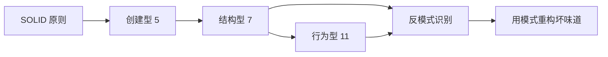

# MOC · 设计模式

> GoF 23 种设计模式 + SOLID 原则主题索引。理论以《深入设计模式》(Refactoring.Guru) 为底本，落地以本仓库 `gz168` 模块化 Laravel 项目为实例。**原则：模式是工具，不是目标；先用接口/组合解决问题，再对照模式命名。**

## 学习路径



## 推荐路线

1. **先立原则**：SOLID（S/O/L/I/D），特别是 O（开闭）与 D（依赖倒置）
2. **创建型**：Factory Method / Abstract Factory / Builder / Prototype / Singleton
3. **结构型**：Adapter / Bridge / Composite / **Decorator** / Facade / Flyweight / Proxy
4. **行为型**：Chain of Responsibility / Command / Iterator / Mediator / Memento / Observer / State / Strategy / Template Method / Visitor
5. **反模式**：识别上帝类、if-else 爆炸、过度抽象

## 本主题原子笔记

```dataview
TABLE WITHOUT ID
  file.link AS "笔记",
  subtopic AS "子主题",
  confidence AS "掌握",
  difficulty AS "难度",
  next-review AS "下次复习"
FROM "10-Notes/70-Design-Patterns"
WHERE type = "atomic"
SORT confidence ASC
```

## 已整理（结合 gz168 项目代码）

- [[10-Notes/70-Design-Patterns/装饰模式-Decorator]] — 理论 + `packages/front-nav` 前端装饰器 + 可见性策略链
- [[10-Notes/70-Design-Patterns/设计模式落地-gz168模块架构]] — 23 模式在本仓库模块化架构中的协同落点
- [[10-Notes/70-Design-Patterns/策略与适配器-多平台库存推送]] — `ChannelInventoryAdapter`：一套接口统一 Amazon/Shopify/TikTok 库存读写
- [[10-Notes/70-Design-Patterns/状态模式-采购状态机与三方匹配]] — PHP 8.1 enum + `resolveStatus()` 纯函数状态机
- [[10-Notes/70-Design-Patterns/观察者模式-Eloquent事件联动]] — Eloquent Observer 与 Event/Listener 两套实现
- [[10-Notes/70-Design-Patterns/桥接模式-标签打印双维解耦]] — `EntityBinderContract` × `LabelRendererContract` 双维正交解耦
- [[10-Notes/70-Design-Patterns/组合模式-导航树与标签模板]] — `NavItem.children` 树 + `LabelTemplate.elements` 整体-部分结构
- [[10-Notes/70-Design-Patterns/解释器模式-占位符DSL]] — `PlaceholderParser` 微型 DSL（正则 + match 求值）
- [[10-Notes/70-Design-Patterns/模板方法模式-导出骨架与ServiceProvider]] — `ExportService` 导出骨架 + `PackageServiceProvider` 生命周期钩子
- [[10-Notes/70-Design-Patterns/责任链模式-中间件管道]] — Laravel 中间件 = 框架内建责任链（`BaseMiddleware` + 业务中间件）
- [[10-Notes/70-Design-Patterns/备忘录模式-数据库备份与商品快照]] — `DatabaseBackup` + Amazon 快照表（save/restore/diff/prune）
- [[10-Notes/70-Design-Patterns/框架内建vs显式模式]] — Flyweight/Prototype 的框架级借用 + 框架内建模式速查
- [[10-Notes/70-Design-Patterns/SOLID原则-gz168落地]] — S/O/L/I/D 五原则在 gz168 真实代码中的体现（Mail ISP、ChannelInventoryAdapter OCP/DIP）

### 23 模式全景图（标注每个模式的落地状态）

```mermaid
flowchart TD
    subgraph 创建型
        F1[Factory<br/>显式·容器工厂] --> F2[Abstract Factory<br/>显式·容器工厂]
        F2 --> F3[Builder<br/>显式·NavItem.with]
        F3 --> F4[Prototype<br/>借用·NavItem.with 拷贝]
        F4 --> F5[Singleton<br/>显式·容器 singleton]
    end
    subgraph 结构型
        S1[Adapter<br/>显式·ChannelInventoryAdapter] --> S2[Bridge<br/>显式·Binder×Renderer]
        S2 --> S3[Composite<br/>显式·NavItem 树]
        S3 --> S4[Decorator<br/>显式·resolveLabels]
        S4 --> S5[Facade<br/>显式·ApiController]
        S5 --> S6[Flyweight<br/>借用·容器单例]
        S6 --> S7[Proxy<br/>显式·缓存/断路器]
    end
    subgraph 行为型
        B1[CoR<br/>显式·中间件] --> B2[Command<br/>显式·Artisan]
        B2 --> B3[Iterator<br/>显式·Collection]
        B3 --> B4[Mediator<br/>无证据]
        B4 --> B5[Memento<br/>显式·备份快照]
        B5 --> B6[Observer<br/>显式·Eloquent]
        B6 --> B7[State<br/>显式·enum]
        B7 --> B8[Strategy<br/>显式·可见性策略]
        B8 --> B9[Template Method<br/>显式·ServiceProvider]
        B9 --> B10[Interpreter<br/>显式·PlaceholderParser]
        B10 --> B11[Visitor<br/>无证据]
    end
```



### 23 模式覆盖进度

**显式落点（19）**：Factory / Abstract Factory / Singleton / Builder / Adapter / Bridge / Composite / Decorator / Facade / Proxy / Template Method / State / Strategy / Observer / Interpreter / Iterator / Command / Chain of Responsibility / Memento
**框架级借用（2）**：Flyweight（容器单例 + 注册表）、Prototype（`NavItem::with()` 拷贝定制）
**无强证据（2）**：Mediator / Visitor

详见 [[10-Notes/70-Design-Patterns/设计模式落地-gz168模块架构]]（落点速查表）与 [[10-Notes/70-Design-Patterns/框架内建vs显式模式]]（借用分析）。

## 参考资料

- 《深入设计模式》Dive Into Design Patterns（Alexander Shvets / Refactoring.Guru，中文版 v2020-1.20）→ 书摘：[[30-Resources/books/深入设计模式/书评]]、[[30-Resources/books/深入设计模式/章节/装饰器-Decorator-精读]]、[[30-Resources/books/深入设计模式/章节/SOLID五原则-精读]]、[[30-Resources/books/深入设计模式/章节/工厂方法与抽象工厂-精读]]
- 《装饰模式实战精讲》（《深入设计模式》p.182–198 的精讲讲义）→ 书摘：[[30-Resources/books/装饰模式实战精讲/书评]]、[[30-Resources/books/装饰模式实战精讲/章节/PART4-重构从if-else到装饰链]]、[[30-Resources/books/装饰模式实战精讲/章节/PART5-装饰链实现PriceCalculator]]、[[30-Resources/books/装饰模式实战精讲/章节/PART6-反模式与最终结论]]
- 项目代码：`gz168/FrontNav`、`gz168/module-core`、`gz168/common`、`gz168/RolePermission`、`gz168/Inventory`、`gz168/Purchase`、`gz168/LabelPrinting`、`gz168/Amazon`、`gz168/Shopify`、`gz168/KafkaManagement`、`gz168/ExportManagement`、`gz168/DatabaseBackup`、`packages/front-nav`

## 关联

- 上位概念：[[00-Home/学习地图]]、[[00-Home/MOC-工程实践]]、[[00-Home/MOC-后端]]
- 平行概念：[[10-Notes/60-PHP-Laravel/MOC]]
- 下位例子：[[10-Notes/70-Design-Patterns/装饰模式-Decorator]]

## 复习节奏建议

- 掌握度 = 1：连续 3 天每天复习
- 掌握度 = 2：间隔 1 周
- 掌握度 = 3：间隔 2 周
- 掌握度 = 4：间隔 1 月
- 掌握度 = 5：进终身复习列表，每季度一次

具体由 `next-review` 字段 + Dataview 控制，详见 [[00-Home/学习地图]]。
